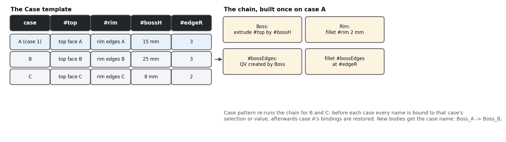
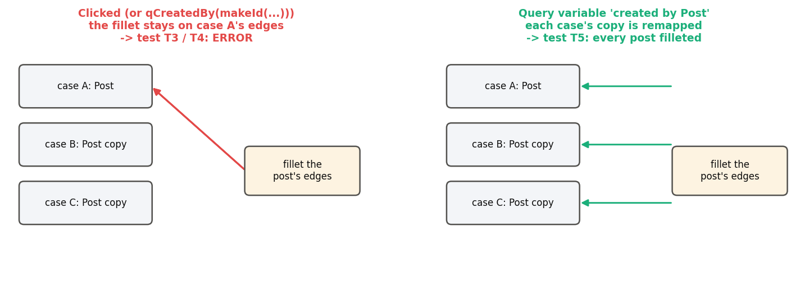
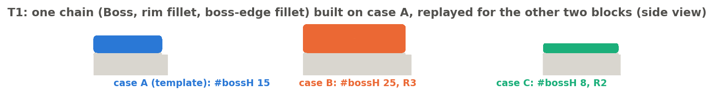

# Case pattern, explained

*Case template and Case pattern (Onshape document **Case_Pattern**). Written 2026-09-25 against the code as it
stands that day. Draft for review. The design note `case_pattern/DESIGN.md` has the full history.*

---

## 1. The idea: "apply to each" for the feature tree

You build a chain of features once, against **named inputs** -- query variables such as `#top`, `#rim` and values
such as `#bossH`, `#edgeR` -- for one case. Then you list further cases, each with its own selections and values, and
**Case pattern** re-runs the chain for every case. Bodies the chain creates get the case name as a suffix (`Boss_A`
-> `Boss_B`).

It is not Onshape's Pattern: nothing is moved by a transform. Each case re-runs the features with the names bound to
that case's geometry. Evan Reese's Query Pattern rebinds one seed variable; Case pattern rebinds up to 8 query
variables and 4 values per case. The closest analogue elsewhere is CATIA's PowerCopy.

**How a case runs.** Before a case, every name is set to that case's selection or value. The listed features run
inside a pattern frame (Onshape's own mechanism), which remaps **FeatureList-style references** -- a native Query
variable "created by <listed feature>" -- onto that case's copies. Afterwards case 1's bindings are restored, so the
features after the pattern see case 1 again.

## 2. The one rule: reference in-list geometry through a query variable

A feature in the list that needs geometry **another listed feature made** must get it through a native Query
variable "created by" that feature. A clicked selection -- or a `qCreatedBy(makeId(...))` query -- always points at
case 1's copy, so every other case modifies case 1 instead (tests T3, T4 must error; T5, done right, works).

## 3. Case template

| Parameter | Meaning |
|---|---|
| **Case 1 name** | The template's own case (default "A"); its suffix is swapped for each case's name. |
| **Inputs** | Up to 8: a query-variable name and case 1's selection (body, face, edge, vertex or mate connector). |
| **Case values** | Up to 4: a name, a type (Length / Angle / Area / Volume / Number / Text) and case 1's value. |
| **Input slots** | Read-only list of the inputs, as the case rows show them. |
| **Further cases** | One row per extra case: its name, a selection for each input, a value for each value. |
| **Debug > Print bindings** | Print what each name is bound to. |

The rows update themselves when you edit the template (add an input, change a type). Errors name what is missing:
"Case 1 selection for #x selects nothing", "Name #x is used twice", "Case name "B" is used twice"...

## 4. Case pattern

| Parameter | Meaning |
|---|---|
| **Case template** | Exactly one Case template. |
| **Features to repeat** | The chain built on the template's names (in tree order). |
| **Keep** | Which new bodies to keep per case: parts, surfaces, curves and points, mate connectors, planes (on); sketches (off). |
| **Name separator** | Between the name and the case (default `_`). |

**Messages.** Warning "Not built: B: input 1 (#top) selects nothing; C: feature 2 failed (...)" -- the other cases
are still built. Error "No case was built" when all fail. Info when the template has no further cases, and when
bodies kept Onshape's default name ("edit this feature to refresh case 1's names").

## 5. Example (Case pattern tests, T1)

Three blocks: A (60 x 40), B (90 x 30) and C (a pentagon, r 35). Template inputs `#top`, `#rim`; values `#bossH`
(A 15, B 25, C 8 mm) and `#edgeR` (A 3, B 3, C 2). The chain: Boss (extrude `#top` by `#bossH`), a 2 mm rim fillet,
a query variable `#bossEdges` = edges created by Boss, and a fillet of `#bossEdges` at `#edgeR`. Result: each block
gets its own boss at its own height, filleted at its own radius. (In the studio case B is currently named
"Foobar!", so its boss is `Boss_Foobar!`.)

Also tested: T2 -- a Move face as the first repeated feature (Query Pattern's open bug) works; T3 / T4 -- clicked or
`qCreatedBy` references in the list error, as they must; T5 -- the same done through a query variable works.

## 6. Limits (from DESIGN.md 6b, meant for users)

- **Sketches** in the list are re-solved per case, but constraints to the origin or default planes are not reapplied,
  and references picked on input geometry stay on case 1. Build sketches on geometry derived from the inputs. Untested live.
- **Cases run in order and see earlier results**: case B can consume what case C selects.
- **A failed case cannot undo its edits to existing geometry**; only its new bodies are removed.
- **Edits to geometry outside the list** (a fillet on an existing block, Move face) are retried outside the frame
  on one refusal code only; fillet and move face are verified, others (delete face, chamfer, shell, draft, booleans
  into existing parts) are not.
- **Not in a pattern**: sheet metal and derived features; thin extrude and cut list behave differently.
- **Cost**: (cases + 1) x the chain on every rebuild.
- **Names** of case bodies refresh only when the Case pattern dialog is edited; **rows** update only when the
  template is edited.

## 7. The code

`case_pattern/case_pattern.fs` holds both features: `caseTemplate` (binds the names, publishes a hidden signature
the pattern reads) and `casePattern` (per case: bind, push the pattern frame, run each listed feature, record new
bodies, pop, name; restore case 1). Case 1's body names are cached by the pattern's editing logic, because names
cannot be read during regeneration (correction 36). Tests: `devtools/onshape/build_case_pattern_tests.py` builds the
"Case pattern tests" studio (T1-T5).

## Appendix: unclear items

1. `DESIGN.md` is behind the code: it lists per-case values as later work (built) and describes matching case
   bodies by feature id (the code matches by list position and creation order).
2. The template stores selections as picked (no robust freeze); how that behaves after later splits is not tested.
