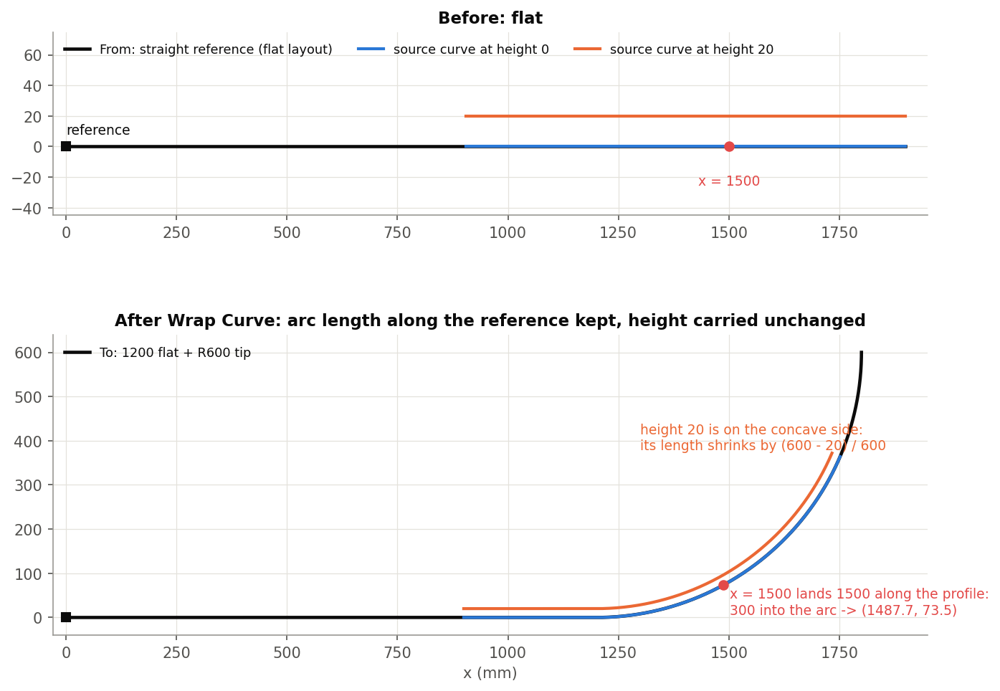
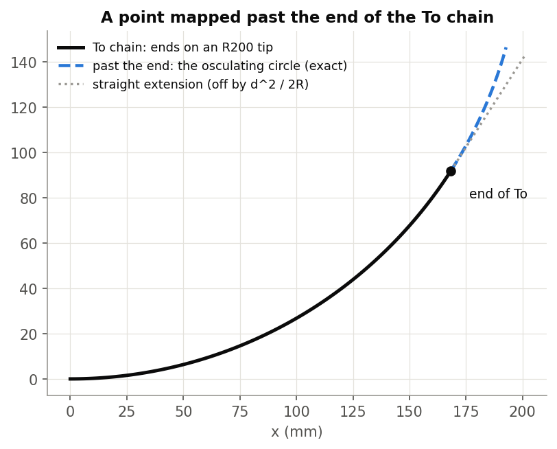
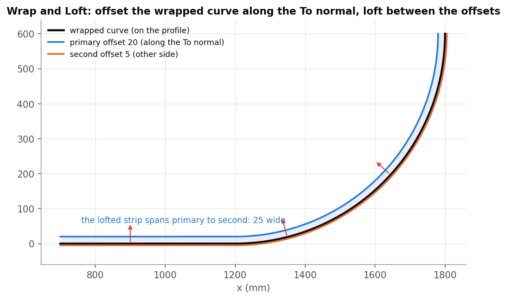
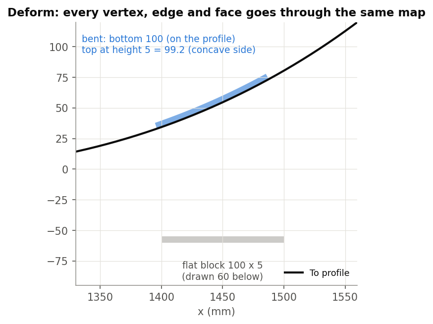
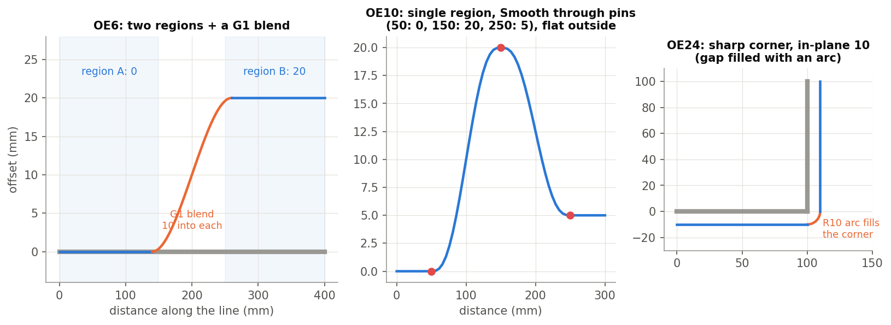
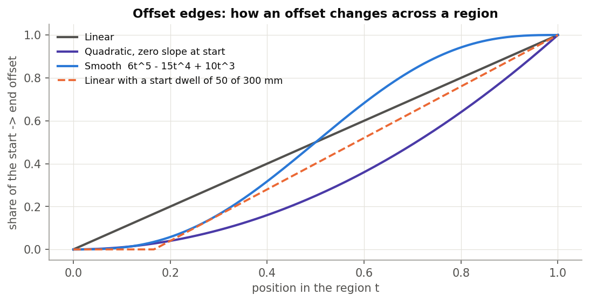

# Curve mapping, explained

*Wrap Curve, Wrap and Loft, Deform and Measure curve distance (Onshape document **curveMapping_public**), plus
Offset edges (document **example_1**). Written 2026-09-26 against the code as it stands that day. Draft for review.*

*Only the public versions are documented. The public tabs share one engine (`curveMappingCore`, in the internal
curveMapping document) pinned by version. A re-pin to a newer engine version is in the working copy but not pushed
at the time of writing, so behaviour may move slightly once it is.*

1. **The idea**: the bending map that carries flat geometry onto a curved profile.
2. **The features**: Wrap Curve, Wrap and Loft, Deform, Measure curve distance, Offset edges.
3. **The code**: files and tests.

Figures are in `img/` (made by `img/src/figs.py`):
- fig01-fig04 are computed with the bending map itself on an analytic tip (a 1200 mm flat + an R600 arc);
- fig05 is Offset edges' test geometry.

---

# Part 1: The idea

## 1.1 The bending map

Skis are laid out flat (planform, graphics, inserts) but built on a curved profile (rocker, camber, tips). The map
takes geometry drawn against a **From** chain (usually straight) and puts it on a **To** chain (the profile). It does
this the way a real layer bends.

For every point P:

1. Project P onto From. That gives its arc length s along From, measured from From's reference point.
2. Express P in From's frame at s: along (t), normal / height (n), across / width (b).
3. Find the point the same arc length s along To, from To's reference point. It is a pure shift: no scaling.
4. Rebuild P there with the same (t, n, b) in To's frame.

What that means physically:

- **Length along the reference is kept.** A station 1500 mm along the flat layout lands 1500 mm along the profile.
- **Height and width carry over unchanged.** Ribs stay perpendicular to the profile.
- **Layers at height h** stretch or shrink by (R − h) / R around a bend of radius R, as real bending does. Worked
  example: a point at x = 1500, height 0, lands 300 mm into the R600 arc, at (1487.7, 73.5). A curve 20 mm up, on
  the concave side, comes out shorter by 20/600.

Native Onshape's Wrap only maps a plane onto a cylinder or cone. Project and Split drop geometry along a direction,
which foreshortens it. Neither keeps arc length along a general profile.

## 1.2 Frames

- **Frenet** (default). The To chain's normal is seeded at its most curved point and carried along with minimal
  rotation. So it does **not** flip at inflections: an S-shaped profile keeps one consistent "up".
- **Binormal**. The normal comes from a plane you give (a planar face, or a mate connector's Z): N = ref x T. Every
  reference edge must lie in that plane.

**Flip normal** mirrors the height coordinate when "up" comes out on the wrong side.

## 1.3 Past the ends, and straight stretches

- **Past the end.** A point that maps beyond the end of To continues along the **osculating circle** there, not a
  straight line. A straight extension would be off by d²/2R (0.25 mm at 10 mm past an R200 tip).
- **Straight stretches.** Where both references are straight over a source edge's span, the edge is copied and moved
  rigidly (exact): arcs stay arcs and weights are kept.

---

# Part 2: The features

## 2.1 Wrap Curve

**Wrap flat curves onto the profile by arc length**: a planform outline, graphic or inlay lines, insert and edge
lines. Each source curve is sampled, every sample is mapped, and the samples are fitted into spline spans. A span
breaks where the To chain is not tangent-continuous.

| Parameter | Meaning |
|---|---|
| **From data** | From edge(s) (G1 chain, up to 10), From reference (vertex, mate connector or plane). |
| **To data** | To edge(s), **Flip** (reverse To), To reference, **Flip normal**. |
| **Source curves** | The curves to wrap. |
| **Frame orientation** | Frenet (default) / Binormal (from a face or mate connector, or a world axis). |
| **Details** | Sampling: control-point based (x3) or length based (10 mm). Target degree (3), keep source degree, max control points (15), tolerance (0.01 mm). **Break spans at curvature jumps and corners** changes topology. |
| **Debug** | Print curves, show frames, show source (cyan) and wrapped (magenta) points. |

**Output.** One wire. Console only: fitting fell back to a lower degree, or a span can't be fitted and the output has a
gap.

**Limits.**

- Only To can be flipped; From's direction comes from its chain.
- An off-centre From reference, or unequal chain lengths, push points past an end, where they extrapolate.
- Samples are uniform in each source curve's parameter.
- Older models may need Flip normal toggled after the 2026-09-23 change to transported frames.

## 2.2 Wrap and Loft

**Wrap, then offset along the profile normal and loft a strip**, for example the sidewall or core-edge reference
surfaces that follow rocker and camber.

- **Planar shortcut.** When the source edges lie in one plane, From edge(s) disappears from the dialog. The From
  path is then made by projecting the To chain onto that plane. The result wraps rather than drapes: a plan point
  287.6 mm past the tip arc's start lands 287.6 mm along it, not at the tip end.
- **Offsets.** A primary offset along the To normal (20 mm), optionally flipped. Optionally a **second direction** on
  the other side; the strip then spans primary to second.
- **Welds.** Where two source curves meet, the later one adopts the first one's offset direction, so their offset
  edges meet without a gap. Without it, a 1 deg normal jump at a line / arc seam opened about 0.35 mm at a 20 mm
  offset.
- **Clustering fix** (on by default) merges spans shorter than 0.25 mm.
- **Exact ruled surface** (off) builds an exact ruled B-spline from the wrapped and offset curves where possible,
  instead of a loft. It changes face identities.

**Outputs.**

- One sheet: one face per source curve, unioned.
- Optionally the wrapped, primary and second wires (Keep output curves).
- An info message suggests the clustering fix when it is off and slivers were found.

## 2.3 Deform

**Bend a whole body, or selected faces, onto the profile**: a flat-modelled insert, a core feature, a tip protector.

1. All vertices are mapped in one batch.
2. Each edge is mapped (the rigid fast path where possible), sampled and refit with its ends snapped to the mapped
   vertices.
3. Each face is rebuilt as a fill surface through its mapped boundary, optionally with mapped guide points.
4. The faces are unioned; a solid input is closed into a solid.

| Parameter | Meaning |
|---|---|
| **Mode** | Bodies (one solid or sheet) / Faces. |
| **From / To / Frame orientation** | As in Wrap Curve. |
| **Setup** | Sampling, degree, max control points, tolerance. **Use face guide points** (u / v multiplier 3) helps fills follow the face. **Keep wires**. |
| **Debug** | Create the wires / faces / bodies stages; show frames. |

**Output.** A new body; the source stays. Diagnostics go to the console only.

**Limits.**

- **Every face becomes a fill surface**: planes and cylinders are not kept as such.
- Inner loops may fail.
- It is the heaviest feature here.
- A failed face is reported on the console only. Check the result for a missing face, or a sheet where a solid was
  expected.

## 2.4 Measure curve distance

An inspection tool, not using the map. It samples a **From** curve at N points or at a spacing, measures to a **To**
curve, and writes a table.

- **Closest**: the nearest distance.
- **Normal dist** (default): measured in the plane through the sample that contains the measurement direction.
- **Along axis**: world X / Y / Z, or a custom direction.

Rows are kept in a stored table keyed by feature. The rows of a deleted Measure feature stay until **Clear
accumulated data** is toggled on, regenerated and toggled off. Its directional modes are not verified in Onshape yet.

## 2.5 Offset edges

**Offset one chain by amounts that vary along its length**, in two directions of a transported frame. The chain may be
a sidecut or an edge line, including sharp corners.

- **Regions.** Each region has an extent (distances from the reference point, or two picked points), a start and end
  offset, and a type: Linear, Quadratic (zero slope at one end) or Smooth (6t^5 − 15t^4 + 10t^3). Dwells hold the
  offset flat for a length at either end.
- **Blends.** Neighbouring regions are blended over a distance into each, matched to G0 / G1 / G2.
- **Single region.** A **Single region** layout takes interior offsets ("pins") instead, with a transfer type, and
  stays flat beyond the first and last pin.

**Directions, physically.** For a chain that lies in a plane:

- **"Normal offset"** moves **out of that plane**: the tests show a line in XY offset along +Z.
- **"Binormal offset"** moves **within the plane**, toward or away from the curve's centre of curvature.

The names are the reverse of the usual Frenet naming. Describe results by these physical directions.

**Arcs.** **Source arcs** chooses:

- **Convert to splines** (default).
- **Keep as arcs**: a constant offset of an arc is a concentric arc. A varying offset becomes a best-fit pair of
  arcs, with an info message giving the count and worst deviation. OE5: R100 with 0 → 10 gives arcs R98.1 and R91.5.

**Corners.** At a sharp (G0) corner an in-plane offset is treated:

- a gap is filled with an arc (OE24: R10);
- overlapping legs are trimmed (OE23).

**Outputs.** One wire. Warnings:

- no regions;
- overlapping regions;
- dwell or blend clamped;
- a region consumed by its blends;
- max control points raised.

**Examples (Offset edges tests).**

- OE6: two regions at 0 and 20 with a G1 blend.
- OE10: pins 50: 0, 150: 20, 250: 5.
- OE9b: Smooth 0 → 20 gives 10 at the middle.
- OE12 / OE18: a helix, with the frame roll recorded.
- OE13-OE17: the warning cases.

---

# Part 3: The code

| File | What |
|---|---|
| `curveMapping_public/wrapCurve.fs` | Wrap Curve. |
| `curveMapping_public/wrapAndLoft.fs` | Wrap and Loft (planar shortcut, welds, clustering, ruled / loft). |
| `curveMapping_public/deform.fs` | Deform. |
| `curveMapping_public/measureBetweenCurves.fs` | Measure curve distance. |
| engine `curveMappingCore` (internal document) | Paths, transported frames, projection, the map, sampling, fitting, fast path. |
| `example_1/refSurfCreation/offsetEdges.fs` | Offset edges (uses the same core). |

**Tests.** `devtools/onshape/build_offset_edges_tests.py` / `check_offset_edges_tests.py` cover OE1-OE24 in
example_1's "Offset edges tests" studio; all passed on 2026-09-26. The public Wrap Curve, Wrap and Loft and Deform
have no test studio.

---

# Appendix: open items

1. **UI text** for Wrap Curve and Wrap and Loft still says Frenet "can flip at inflections"; it no longer does.
   Deform's text is corrected.
2. **Offset edges direction names** are swapped relative to their physical meaning (2.5).
3. **Pending re-pin** of the public tabs to a newer engine version (uncommitted at the time of writing).
4. **Deform** turns every face into a fill.
5. **Measure curve distance**: its directional modes are unverified, and deleted features' rows persist.
6. The public features have **no tests**.
