# Curve tools, explained

*Clean wire, Map curve, Merge curve, Evaluate profiles, Fillet wire and Recognize arcs (Onshape document **Curve_tools**). Written
2026-09-25 against the code as it stands that day. Draft for review.*

Three passes, each building on the one before:

1. **The ideas** -- what goes wrong with the curves a ski model produces, and the few rules every tool here follows.
2. **The features** -- what each does, what every parameter means, what it publishes, how to read its messages.
3. **The code** -- files, tests, where the notes are.

The appendix lists things in the code and notes that looked unclear or contradictory.

Figures are in `img/` (made by `img/src/figs.py`); pictures of real results are rendered from the example studios
and live in `docs/decks/<feature>/shots/`.

---

## Contents

- [Part 1: The ideas](#part-1-the-ideas)
  - [1.1 Why model-made curves need cleaning](#11-why-model-made-curves-need-cleaning)
  - [1.2 Chains](#12-chains)
  - [1.3 Exact where possible, fitted where not](#13-exact-where-possible-fitted-where-not)
  - [1.4 Joints and slivers](#14-joints-and-slivers)
  - [1.5 Sampling where the curve bends](#15-sampling-where-the-curve-bends)
  - [1.6 Ends, published the same way everywhere](#16-ends-published-the-same-way-everywhere)
- [Part 2: The features](#part-2-the-features)
  - [2.1 Clean wire](#21-clean-wire)
  - [2.2 Map curve](#22-map-curve)
  - [2.3 Merge curve](#23-merge-curve)
  - [2.4 Evaluate profiles](#24-evaluate-profiles)
  - [2.5 Fillet wire](#25-fillet-wire)
  - [2.6 Outputs for Extract variables](#26-outputs-for-extract-variables)
  - [2.7 Recognize arcs](#27-recognize-arcs)
- [Part 3: The code](#part-3-the-code)
- [Appendix: unclear items](#appendix-unclear-or-contradictory-items)

---

# Part 1: The ideas

## 1.1 Why model-made curves need cleaning

The curves a ski model produces -- intersection curves, projections, outlines, chains picked edge by edge -- come
out correct but messy:

- **Slivers.** Edges a tenth of a millimetre long where two faces nearly meet. A loft or fill through them wiggles
  or refuses.
- **Near-tangent kinks.** Joints that turn 0.3 or 0.4 degrees: not a real corner, not quite smooth.
- **Rational splines and control-point bloat.** Intersections come back as heavy, rational curves with hundreds of
  control points.
- **Fold-backs.** A projection of a curve that climbs a tip can turn back on itself.

Native Edit curve / Composite + Approximate helps only partly: it makes everything rational, samples a fixed 200
points (a 0.1 mm sliver gets none), ignores corners, and under-fits silently when it runs out of control points.
Every tool here is built to avoid those four problems.

## 1.2 Chains

A **chain** is a set of edges joined end to end (G0), put in order and turned so that arc length increases with
world X -- the ski's length direction. Every tool reads its input as one or more chains, so "start" and "end", "run
1" and "run 13" always mean the same direction: from tail to tip along X.

## 1.3 Exact where possible, fitted where not

- **Lines stay lines** (degree-1 curves).
- **Arcs stay arcs** -- emitted as sketch arcs, so Onshape reports their radius when you click them. A rational
  NURBS that happens to be a perfect circle never shows a radius; designers need it to.
- **Everything else is fitted**: a B-spline through well-placed points, with the end tangents taken from the true
  curve so neighbours join smoothly. The fit's end derivatives are scaled by the chord length -- a unit vector would
  bulge the curve by about 0.45 mm.
- **An arc or line only where its end tangents agree** (since 2026-09-25). A piece is emitted as an exact arc or line
  only if its end directions match the true tangents of the curve it stands for; otherwise it stays a fitted spline.
  Before, a near-circle spline could come out as an arc whose ends kinked against its neighbours. **Recognize arcs**
  (2.7) is the explicit tool for turning splines into arcs.

## 1.4 Joints and slivers

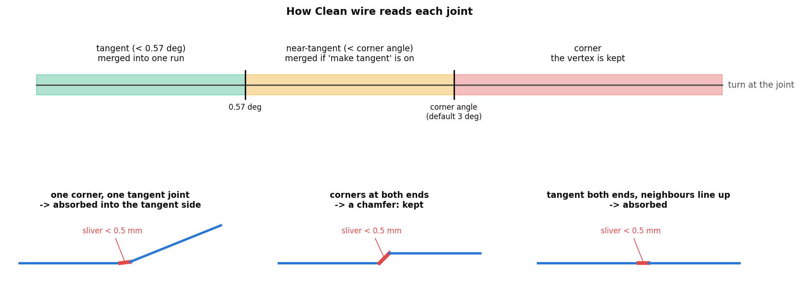

Each joint is classed by how much the curve turns there:

| Turn | Class | What happens |
|---|---|---|
| < 0.57 deg (0.01 rad) | tangent | merged into one run |
| < the corner angle (default 3 deg) | near-tangent | merged if "Make nearly tangent joints tangent" is on, otherwise a corner |
| larger | corner | the vertex is kept |

The 3 deg default keeps the ski's 4.8 deg ramp creases as corners.

An edge shorter than the **sliver length** (0.5 mm) is judged by its own two joints: a corner at one end and a
tangent joint at the other -> absorbed into the tangent side; corners at both ends -> a chamfer, kept; tangent at
both ends -> absorbed if its neighbours line up, kept if they are offset from each other (a jog). A real line or arc
at least one sliver long always keeps its own run.

## 1.5 Sampling where the curve bends

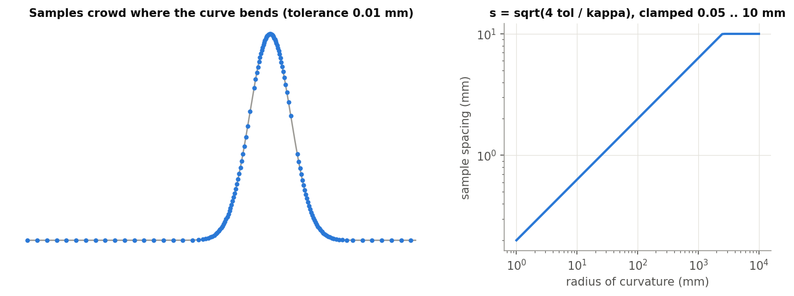

A chord between two samples misses the curve by about kappa s^2 / 8 (the sagitta). Spending half the fit
tolerance on that gives the sample spacing

    s = sqrt(4 tol / kappa)

clamped to 0.05 mm .. 10 mm (and at most half an edge), with 3 to 200 samples per edge. Straight stretches get few
samples, tight bends many, and no edge is ever skipped.

## 1.6 Ends, published the same way everywhere

Clean wire, Map curve and Merge curve all publish the ends of their result under the same keys: `startVertex`,
`endVertex`, `startEdge`, `endEdge` (start = the tail end, by 1.2). A later feature can pick "the tip end of the
cleaned shelf wire" by name, and that name survives upstream changes. Fillet wire and Evaluate profiles publish
their own keys (2.6).

---

# Part 2: The features

## 2.1 Clean wire

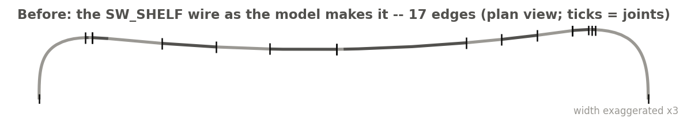
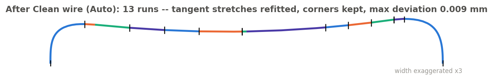

**What it does.** Rebuilds one open wire with fewer edges and control points: every tangent stretch becomes one
spline, real corners stay vertices, exact lines and arcs pass through unchanged. On the example (the SW_SHELF wire
in the Test_1 studio) 17 edges become 13 runs, within 0.009 mm of the original.

**Two modes.**

- **Auto** (the usual choice): the joints are classed by 1.4 and the runs made automatically. A read-only **Runs**
  list shows each run -- its edges, "exact copy" or "fit", control points and deviation -- and refreshes as you
  change the settings.
- **Manual**: you group edges yourself, each group with its own approximation. **Auto-populate groups** fills the
  list from what Auto would do, as a starting point.

**Parameters.**

- **Mode** -- Manual / Auto.
- **Wire** -- a wire body or the edges of one chain. Closed loops are refused.
- **Name** -- names the result.
- *Auto:* **Runs** (read-only), **Corner angle** (3 deg), **Make nearly tangent joints tangent** (on), **Sliver
  length** (0.5 mm), **Fit control points to tolerance** (button: fits every run with no cap and sets the maximum
  to what the largest run needed).
- *Manual:* **Auto-populate groups** (button), **Groups** (edges, name, and Global / Max control points / Tolerance
  each), **Break at** (vertices or mate connectors).
- **Approximation parameters** -- degree 3, tolerance 0.01 mm, maximum 30 control points.
- **Maximum deviation** (read-only) -- the result's largest distance from the source; **Show deviation** draws it
  as a comb.
- **Show runs**, **Delete input wire**.
- **Projection** -- optionally cleans the plan view too: the plan is cleaned, extruded into a wall along the plane
  normal, and the 3D wire dropped onto the wall, so it sits exactly on the cleaned plan and keeps its heights.
- **Reduction** (read-only) -- control points and edges before / after.

**Messages.**

| Message | Meaning |
|---|---|
| Warning "Short of tolerance: ..." | A fitted run misses the source by more than the tolerance. Raise its control points, or split the stretch. |
| Info "N edge(s) -> M; K corner(s) inside a group were fitted through" | Normal result (Manual). |
| Warning "...came out as N bodies instead of one" | A joint did not close exactly; the gaps are listed. |
| Error "closed loops are not supported" / "not one chain" | Pick one open chain. |

**Good to know.** In Manual every joint is already a break, so **Break at** mostly checks that your breaks do not
conflict with your groups. Manual groups point at the source's edges, so they go stale when the source is
renumbered upstream -- Auto-populate recovers them. Reference the result body or its keys downstream, never its
edge ids.

## 2.2 Map curve

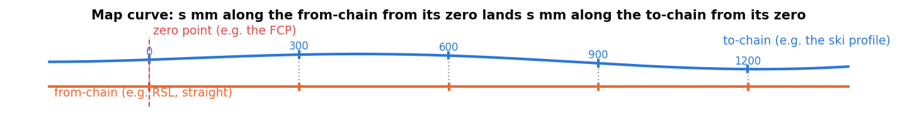

**What it does.** Carries a span from one chain onto another, keeping **arc length from a reference point**: a point
s mm along the from-chain from its zero lands s mm along the to-chain from its zero. Ski use: the same stations on
the RSL and on the ski profile, measured from a mate connector at the FCP. There is no native equivalent -- trim and
split work by position, not by distance along the curve.

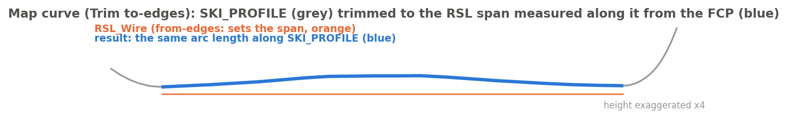

**Modes.**

- **Trim to-edges to the from span** -- copies the to-edges and cuts them exactly at the two arc lengths. Nothing is
  refitted, so arcs stay arcs. (The example: SKI_PROFILE trimmed to the RSL span, zero at the FCP.)
- **Deform from-edges onto to-edges** and **Deform and merge to one curve** -- today (phase 1) these give the
  to-chain over the from span, resampled and refitted; carrying geometry that lies *off* the from-chain is phase 2.

**Parameters.**

- **Mode** (above). **From edges**, **To edges** (the to-edges are never modified).
- **Reference point** -- *Shared* (one **Zero point**, mate connector or vertex) or *Separate* (a zero for each chain).
- **Projection** -- *World X*: the zero lands where each chain crosses the point's X (falls back to the closest point
  if a chain does not span it); *Closest point*.
- **Flip to-chain** -- when the two chains run opposite ways at the zero.
- **Spacing & approximation** (not used by Trim), **Output** (one wire per link / one body per run), **Name**, **Debug**.

**Tangent gate** (since 2026-09-25, tests M1 / M2 in "Arc tangency tests"): the mapped result is an arc only when
the host is a true arc. Mapped onto a near-circle *spline* host it stays a spline (M1) -- before, it came out as an
arc with kinked ends; onto a sketch arc R500 it is an arc R500 (M2). Some edges therefore change type in models built
before that date.

**Messages.** Error "chains point in opposite directions ... Tick Flip to-chain"; error "from-edges run X mm past the
start / end of the to-edges"; info "the from/to-edges do not span the zero point's X; closest point used"; info
"Merged result is a spline; arc radius not preserved".

## 2.3 Merge curve

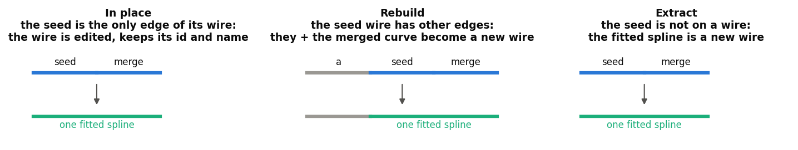

**What it does.** Absorbs one edge into a neighbouring edge as a single fitted spline -- the Edit curve /
Composite + Approximate recipe as one feature -- and decides which body survives:

- **In place** -- the seed is the only edge of its wire: the wire is edited and keeps its id and name.
- **Rebuild** -- the seed wire has other edges: those plus the merged curve become a new wire (info notice).
- **Extract** -- the seed is not on a wire: the fitted spline is the output.

The ends are snapped to the neighbours' exact end points, so the result still chains with them.

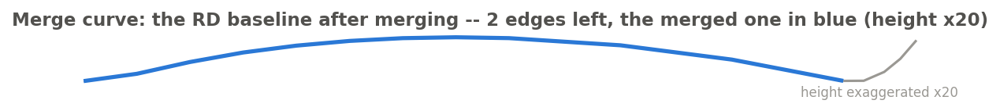

**Parameters.** **Seed edge** (the one edited), **Merge edge** (must meet the seed end to end), **Keep start
derivative** / **Keep end derivative** (on), **Approximation** (degree, tolerance, maximum 100 control points),
**Output name** (pre-filled with the seed wire's name), **Note arc loss** (on), **Debug**.

**Good to know.** The result is always a spline -- a merged line or arc loses its type (the info notice says so).

## 2.4 Evaluate profiles

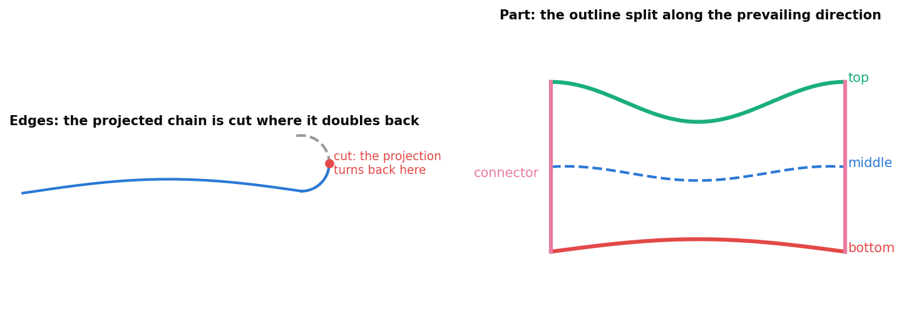

**What it does.** Two jobs:

- **Edges**: project a chain onto a planar face, cut it where the projection turns back on itself, and emit it as
  a clean wire. The cut is found by scanning 400 samples outward from the middle for the first place the curve stops
  advancing along the prevailing direction, then bisecting to it.
- **Part**: outline a solid or surface on the face and split the outline into **top**, **bottom** and **middle**
  profiles (plus the **connectors** joining them) relative to a prevailing direction. The two longest runs that
  follow the direction are top and bottom (top = higher, reading world Z first); the middle is their average at
  matching stations along the direction.

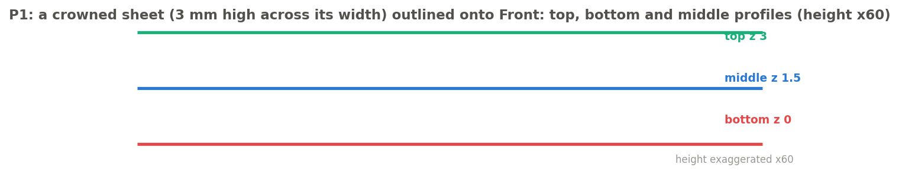

**Output** (both modes, since 2026-09-25):

| Output | What you get |
|---|---|
| One curve | one fitted spline |
| One per input curve | the projected edges exactly (a projected B-spline IS the projection, not a fit), cut at the fold-back |
| Efficient | collinear lines merged into one line, co-circular arcs kept exact, freeform edges merged and refitted only across **tangent** junctions (within 0.57 deg) -- a real corner stays a joint (P12: a 28 deg corner keeps 2 edges; P13: a tangent joint gives 1). Before 2026-09-25 edges whose chords lay within 45 deg were merged, rounding off real corners. |

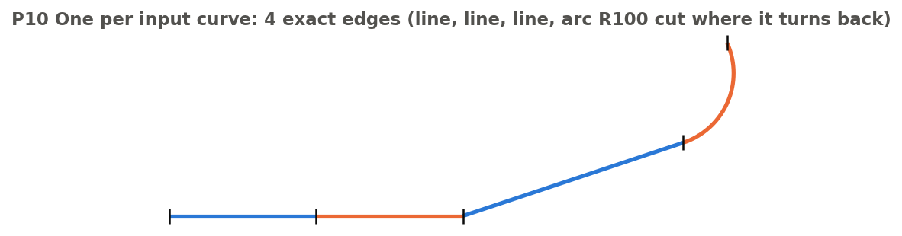
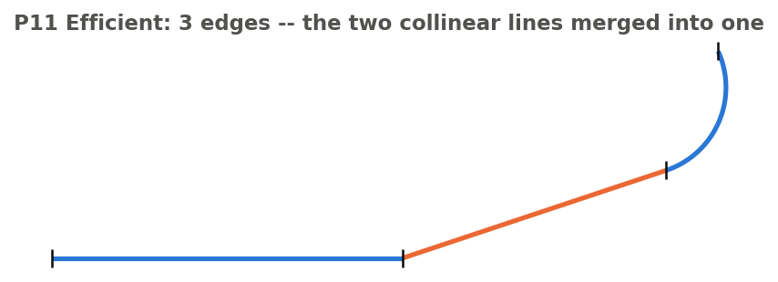

**Short edges.** An outline edge shorter than **Merge edges shorter than** (0.01 mm) is merged into its neighbours
(lines stay lines, arcs stay arcs). On RD 20FOU 28 a 1.7 um outline edge made SW_Fill fail; with it merged the
fill works.

**Parameters.** **Profile from** (Edges / Part), **Name**; *Edges:* **Edges to project**; *Part:* **Part or surface
to outline**, **Return** (Top / Bottom / Middle / Periphery / All profiles / Full), **Merge edges shorter than**;
**Project onto** (a planar face); **Prevailing direction** + flip (not for Periphery; default: the chord for
Edges, the longest in-plane extent for Part); **Output**; **Approximation** (60 samples, degree 3, 0.01 mm, 24
control points); **Debug**.

**Messages.** Error "Nothing projected"; "not a single connected chain"; a surface seen edge-on -> "Project its
edges instead"; "does not separate into a top and a bottom profile"; info "Merged N outline edge(s) shorter than
...".

## 2.5 Fillet wire

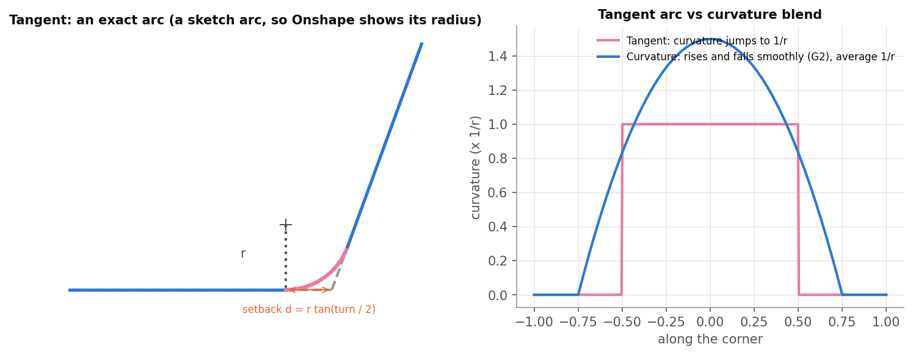
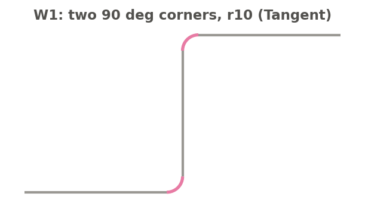

**What it does.** Rounds chosen corners of a wire or edge chain with a radius -- there is no native wire fillet.

- **Tangent**: an exact arc, emitted as a sketch arc (Onshape shows its radius). Set back d = r tan(turn / 2) from
  the corner on straight edges; on curved edges the two set-backs are solved so the arc touches both. A 3D corner
  (edges not in one plane) cannot take an arc and is skipped with a notice.
- **Curvature**: a G2 blend matching position, tangent and curvature of both edges, sized so its average curvature
  is 1/r. Works on 3D corners.

A wire body is edited in place: it is split at each tangent point and only the corner pieces are replaced, so the
rest keeps its identity. Edges produce a new wire.

**Parameters.** **Curves**, **Continuity** (Tangent / Curvature), **Radius**, **Apply to all corners** (off), **Corners**
(filled by clicking the corner points in the view; each can have its **Own radius**), **Join into one wire** (off),
**Advanced** (Corner angle 0.5 deg, Print corners). Filleted corners show magenta, unfilleted blue.

**Messages.** Warning "N corner(s) not filleted: ..." with the reason -- radius too large, no circle touches both
edges, edges not in one plane (use Curvature), edges too short, or two fillets overlapping on the edge between
them. Info "N corner(s) found. Click them..." when nothing is picked.

## 2.6 Outputs for Extract variables

| Feature | Keys (besides `output` and `inputs`) |
|---|---|
| Clean wire | ends (1.6), `breakVertices` (run counts and deviation are shown in the dialog: Runs, Maximum deviation, Reduction) |
| Map curve | ends, `spanStart`, `spanEnd`, `toStart`, `toEnd`, `stationCount` |
| Merge curve | ends, `mergedEdge`, `degree`, `controlPointCount` |
| Evaluate profiles | `top`, `bottom`, `middle`, `periphery`, `connectors` (empty when not requested), `length`, `trimmedStart`, `trimmedEnd` |
| Fillet wire | `filletEdges`, `cornerCount`, `filletCount`, `skippedCount` |

## 2.7 Recognize arcs

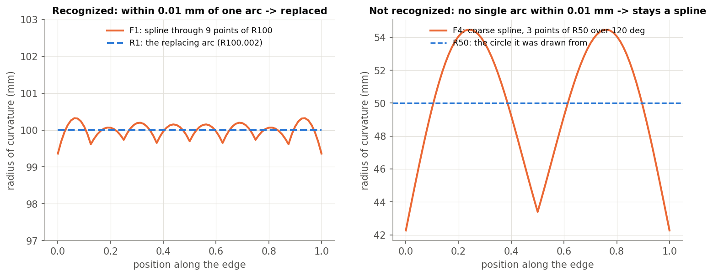

**What it does.** Finds spline edges that **one** circular arc represents within a tolerance, reports them, and
optionally rebuilds the input with true (sketch) arcs in their place -- so Onshape shows a radius where it showed a
spline. One arc, never a biarc: the question is "is this spline really an arc", not "how would arcs approximate it".

**Test per spline edge** (64 samples): open and not straight; the circle through both ends and the best interior
sample is within the tolerance of every sample (in and out of plane); both end directions within **Max end tangent
change** of the circle's. The replacing arc passes exactly through the edge's ends, so the wire stays connected; its
end directions are the circle's, so a joint can gain up to that angle as a kink -- every candidate's change is
reported. Lines and arcs pass through unchanged.

**Parameters.** **Edges or wires**; **Tolerance** (0.01 mm); **Max end tangent change** (0.05 deg); **Replace with
arcs** (on; off = report and highlight only) -> **Name**, **Delete input** (wire bodies only); **Highlight matches**
(green).

**Outputs.** The rebuilt wire(s); keys `recognizedCount`, `candidateCount`, `arcEdges`; an info line with the counts
and each candidate's deviation and tangent change. Error "Select edges or wire bodies."

**Examples** ("Arc tangency tests" studio, 9/9 pass): R1 a spline through 9 points of R100 -> an arc R100.002; R2 a
line / spline-on-R200 / line chain -> line, arc R200, line, joints within 0.05 deg; R3 an S-curve and R5 a coarse
3-point spline -> not arcs (the figure: its radius swings 42-54 mm around R50); R4 report only -> no body.

---

# Part 3: The code

## 3.1 Files

| File (tab) | What |
|---|---|
| `curve_tools/curve_core.fs` | Shared machinery: `buildChain`, batched sampling, joint welding, the exact emitters (`emitArcCurve`, lines) and `approximateFamily`, `wireEnds` (the end keys). Also imported by driven_offset (by Curve_tools version). |
| `clean_wire.fs` | `classifyJoints` (1.4), `buildRuns`, `runSamples` / `spacingFor` (1.5), `emitRun` / `emitFittedRun`, projection wall + `opDropCurve`, `reportAutoRuns`. |
| `map_curve.fs` | `resolveZeroPoints`, `resolveChain` (World-X / closest), `trimToEdges` (`opSplitEdges`, no refit), `mapSamples` / `buildRuns` / `emitRuns`. |
| `merge_curve.fs` | `planMergeTarget` / `placeMergedCurve` (in place / rebuild / extract), `opEditCurve`, end snapping. |
| `evaluate_profiles.fs` | `scanForReversals` / `refineReversals`, `partProfiles` (outline split), `middleProfile`, `mergeShortEdges`, `emitGrouping` + `retainedEdges` (Edges output) and `emitFromEdges` / `buildMergedRuns` (Part output). |
| `recognize_arcs.fs` | `examineEdge` (the single-arc test), rebuild with sketch arcs, report. |
| `fillet_wire.fs` | `chainCorners`, `solveArc` (Tangent), `solveBlend` (Curvature), `rejectOverlaps`, split-and-edit in place, the corner-picking manipulator. |

## 3.2 Tests

- **Evaluate profiles tests** studio: P1-P11 (`devtools/onshape/build_evaluate_profiles_tests.py`). P3 must error
  (edge-on); P9-P11 check the Edges Output modes.
- **Arc tangency tests** studio: R1-R5 (Recognize arcs), P12 / P13 (Evaluate profiles Efficient), M1 / M2 (Map
  curve tangent gate) -- `devtools/onshape/build_ / check_arc_tangency_tests.py`, 9/9 on 2026-09-26.
- **Fillet wire tests** studio: W1-W6 (`devtools/onshape/check_fillet_wire.py`).
- **Tests** studio: `curve_tools_tests.fs` (a harness feature: Clean wire ends / runs, Merge curve, Map curve trim).
- **Test_1** studio: the worked examples (Clean wire Auto on SW_SHELF, Map curve SKI_PROFILE -> RSL, Merge curve on
  the RD baseline tip, an Extract variables).

## 3.3 Notes

- `driven_offset/research_clean_wire.md` (design and history of Clean wire), `research_map_curve.md`,
  `research_merge_curve.md`.
- Corrections log: #39 (sketch arcs so Onshape sees arcs), and the notice policy (only errors turn a feature red).
- Memory: `fillet-wire.md`, `cleanwire-sliver-rule.md`, `evaluate-profiles-surfaces-merge.md`.

---

# Appendix: unclear or contradictory items

1. **The research notes predate the code.** `research_clean_wire.md` gives a 5 deg corner default (code: 3 deg), a
   sliver length of max(0.5 mm, 50 x tol) (code: a fixed 0.5 mm parameter), and says ungrouped edges in Manual are
   auto-classified (code: copied unchanged). The `clean_wire.fs` header still lists "Suggest groups" as not done,
   but Auto-populate exists. `research_map_curve.md` describes a warning for opposite chains (code: an error).
2. **Map curve's Deform modes are phase 1** (see 2.2). The dialog does not say so.
3. **Fillet wire promised more than it has:** unfilletable corners shown suppressed, a per-corner achieved radius,
   and start / end keys -- none exist yet.
4. **Fillet wire tests W2 and W6 were edited by hand** (W2 joined, three corners; W6 Curvature r 30), so their
   checks now fail by design; realigning them is waiting on a decision.
5. **Clean wire's keys were trimmed 2026-09-25** (tools review): `run1..N`, `curveCount`, `inputCount` and
   `maxDeviation` are no longer published; this explainer follows the working copy, which is not yet pushed at the
   time of writing.
6. **Merge curve's defaults** leave out the approximation parameters, so a feature inserted through the API must
   pass them (the dialog is unaffected).
7. **Evaluate profiles' header** (`evaluate_profiles.fs` lines 13-40) is the original stub spec and only partly
   describes the feature.
