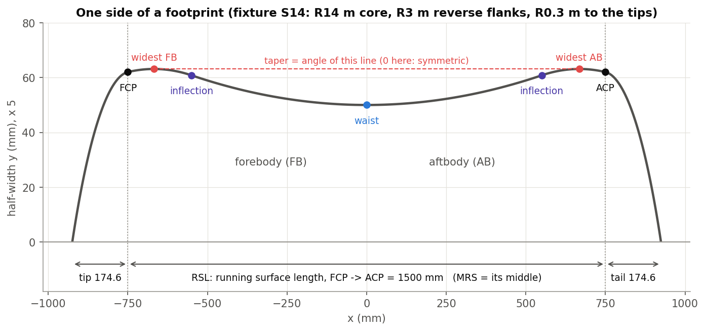
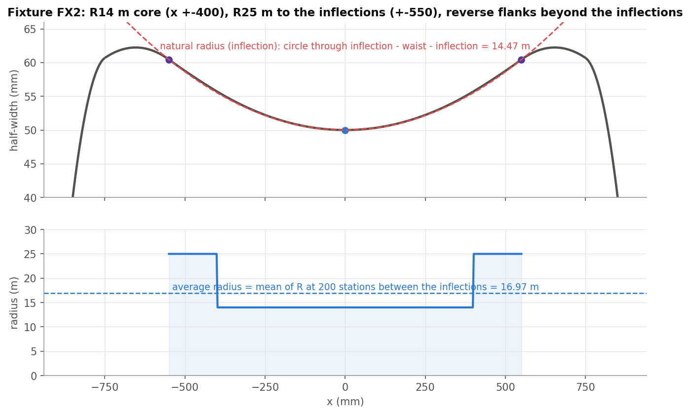
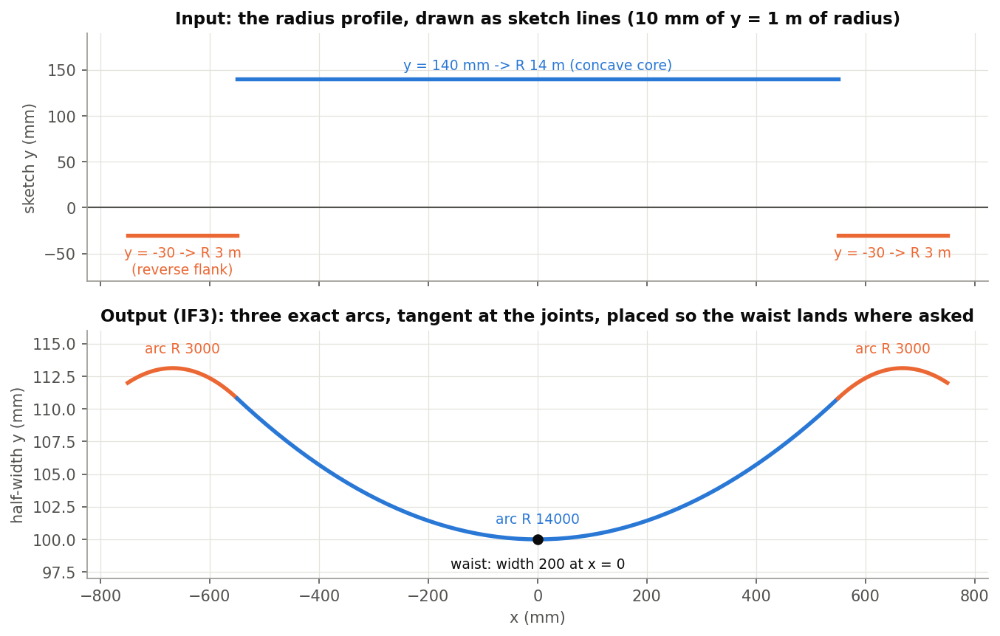
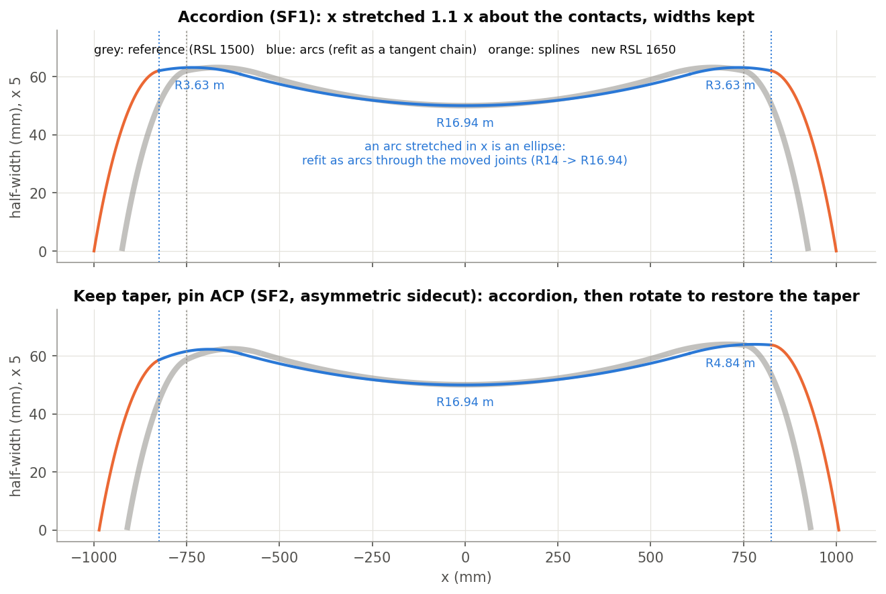
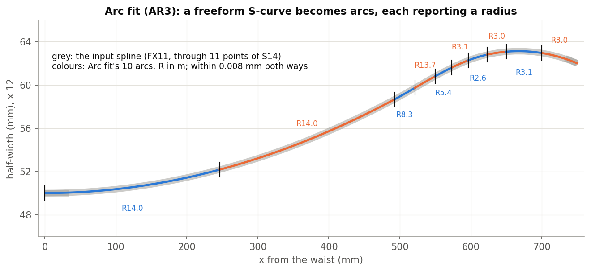
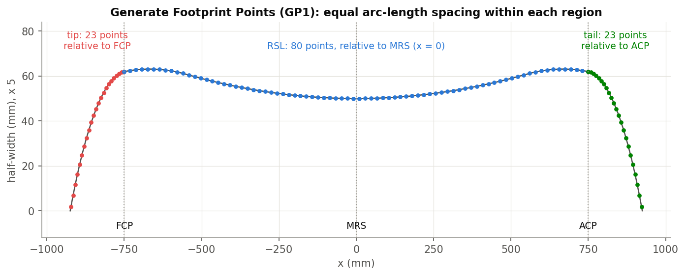

# Footprint, explained

*Integrate footprint, Analyze footprint, Scale Footprint, Arc fit and Generate Footprint Points (Onshape document
**footprint**). Written 2026-09-26 against the code as it stands that day. Draft for review. Every number below
comes from the "Footprint tests" studio. Those fixtures are exact analytic sidecuts; all 25 cases pass today.*

1. **The idea**: what a footprint is and the words used for it.
2. **The features**: design one, measure one, scale one, make it manufacturable, export it.
3. **The code**: files and tests.

Figures are in `img/` (made by `img/src/figs.py` from geometry read out of the test studio). Plan views exaggerate
the width 5x.

---

## Contents

- [Part 1: The idea](#part-1-the-idea)
  - [1.1 A footprint and its words](#11-a-footprint-and-its-words)
  - [1.2 Radii that report a radius](#12-radii-that-report-a-radius)
  - [1.3 Average and natural radius](#13-average-and-natural-radius)
- [Part 2: The features](#part-2-the-features)
  - [2.1 Integrate footprint](#21-integrate-footprint)
  - [2.2 Analyze footprint](#22-analyze-footprint)
  - [2.3 Scale Footprint](#23-scale-footprint)
  - [2.4 Arc fit](#24-arc-fit)
  - [2.5 Generate Footprint Points](#25-generate-footprint-points)
- [Part 3: The code](#part-3-the-code)
- [Appendix](#appendix-open-items)

---

# Part 1: The idea

## 1.1 A footprint and its words

The footprint is the ski's outline seen from above: its **sidecut**. It lies in the world XY plane, with X along
the ski and Y the half-width. The +Y side is the one the features work on.

| Term | Meaning |
|---|---|
| **FCP / ACP** | Forebody / aftbody contact points: where the ski touches the snow at the tip and tail end. |
| **RSL** | Running surface length, FCP to ACP. **MRS** is its middle. |
| **FB / AB** | Forebody (the tip half) / aftbody (the tail half). |
| **Tip / tail** | The outline beyond the contact points; tip length = FCP to the tip end along X. |
| **Waist** | The narrowest point between the two widest points. |
| **Widest points** | The widest point of each half: the tip and tail widths. |
| **Inflection** | Where the sidecut's curvature changes sign. Inside the inflections the sidecut is concave (the waist region); outside, the flanks curve the other way ("reverse"). |
| **Taper angle** | The angle between the ski's centreline and the line joining the two widest points; positive when the tip is wider. |
| **Sidecut radius** | The radius of curvature of the outline. |

The fixture used throughout is **S14**:

- waist half-width 50 at x = 0;
- an R14 m core to x = +-550;
- reverse R3 m flanks to the contacts at +-750;
- R0.3 m out to y = 0.

## 1.2 Radii that report a radius

Designers read a sidecut by its radii: click an edge and Onshape should say "R 14000". Onshape shows a radius only
for a true **circle** edge; a rational spline that is exactly circular still reports no radius.

So wherever a footprint feature makes a circular piece, it builds it as a **sketch arc** and extracts it into the
wire. Integrate footprint, Scale Footprint and Arc fit all do this. Transitions that are not circular stay splines.

## 1.3 Average and natural radius

Two numbers summarise a sidecut's radius, and they answer different questions:

- **Average radius**: the mean of R = 1 / curvature at 200 evenly spaced X stations between the two inflection
  points. It does not depend on how the outline is split into edges (test AF3 splits AF2's chain into 13 edges and
  gets the same 16.97 m).
- **Natural radius**: the radius of one circle through three points. "Inflection" uses inflection, waist,
  inflection; "widest" uses widest, waist, widest. It reflects the width change, weighted toward the waist.

On FX2 (an R14 m core with R25 m either side), the average is 16.97 m and the natural (inflection) radius is 14.47 m.
A gap like that is expected, not an error.

---

# Part 2: The features

## 2.1 Integrate footprint

**Design a sidecut from its radius.** You draw the radius along the ski as sketch lines: by default 10 mm of sketch
height = 1 m of radius, so a line at y = 140 mm means R 14 m.

- Above y = 0 the sidecut is concave (the waist region).
- Below y = 0 it curves the other way (reverse flanks).
- A profile edge may not cross y = 0.

The feature integrates the curvature twice into the outline, then places it so the waist lands where you asked:
either at a waist location, or with an overall taper angle. The waist gets the width you asked for.

**Exact where it matters.** The integration uses the true tangent angle phi:

- dphi/dx = 1 / (R cos phi) and dy/dx = tan phi;
- the older small-angle y'' = 1/R made parabolas, not circles.

Where R is constant, the outline has a closed form: sin phi = sin phi0 + (x - x0)/R. So a horizontal profile line
becomes an **exact circular arc** and reports its radius. Where R changes (a sloped profile line), the outline is
integrated numerically (RK4) and fitted as a spline that joins the arcs tangentially.

| Parameter | Meaning |
|---|---|
| **Spline method** | APPROX (approximate) / FIT: how the transition splines are made. |
| **Build Mode** | PER_REGION (one curve per same-sign region) / PER_EDGE (one per profile edge). Arcs are always their own edge. |
| **Unify curves** | One curve for everything (ignored when there are arcs). |
| **Strict** | Force every piece into arcs or lines. They come out as rational curves that do **not** report a radius; test IF7. |
| **Waist/Taper Angle Calculations** | WAIST (default): **Waist location** is the world X of the narrowest point (65 mm). TAPER: **Overall taper angle** (0.25 deg). |
| **Waist width** | Full width at the waist (95 mm). |
| **Radius Profile(s)** | The profile sketch edges (construction edges ignored). |
| **Contact points** | FCP decides which end is the forebody, for the taper sign. ACP is not used yet. |
| **Integration definition** | Y-axis scaling: 10 / 20 / 50 / 100 mm of sketch per metre of radius. |
| **Spline approximation parameters** | Degree, maximum control points, tolerance (also the solver's tolerance). |
| **Debug & details** | Samples per profile edge (50); Group output (one wire). |

**Examples (Footprint tests).**

- IF1: one line at y = 140 -> one exact arc R14000 with centre (0, 14100), waist width 200.
- IF2: lines at 25 / 14 / 25 m -> three exact arcs, tangent at the joints.
- IF3: an R14 core with R3 reverse flanks (the figure) -> the widest points land exactly at x = +-667.857.
- IF5: taper 0.25 deg instead of a waist location; the end heights give exactly 0.25 deg.
- IF6: sloped transitions -> an exact R14000 core plus two spline transitions, tangent within 0.05 deg.

**Output.** One wire on the +Y side. No keys, no messages.

**Limits.**

- The solvers stop silently on their last iterate if they don't converge.
- The Recalculate? checkbox does nothing.

## 2.2 Analyze footprint

**Measure any sidecut.** Give it the footprint edges, the RSL line and the FCP / ACP (a plane, vertex or mate
connector each; the point on the RSL line nearest each pick is used). It fills a read-only **Footprint Data** panel
in the dialog:

- the sidecut dimensions "tip-waist-tail" (full widths);
- waist width and location, taper angle, tip and tail length;
- Radius calculations: average, natural (widest), natural (inflection);
- Widest & Inflection points: each as a distance from its contact point, plus inflection-to-widest.

**How.**

1. The edges become B-splines.
2. The waist is the narrowest point within +-20 % of the span around the MRS.
3. The widest point is found on each side.
4. Each inflection is found by walking in from the widest point to the waist, looking for a curvature sign change.
   The search covers inside edges and across joints; if none is found it falls back to the widest point.
5. Then the natural and average radii and the taper.

**Outputs.**

- An info line every regeneration: "Tip-waist-tail ... mm | average radius ... | natural radius (inflection) ...".
- Optional **Sketch key points**: construction lines for the waist, both widest points and both inflections.
- Variables for Extract variables: `tipWidth`, `waistWidth`, `tailWidth`, `waistX`, `tipLength`, `tailLength`,
  `taperAngle`, `sidecutRadius` (the average radius).

**Examples.**

- AF1 (S14): inflections at x = +-550, average radius 14.00 m, natural (inflection) 14.00 m, natural (widest)
  17.00 m, taper 0.
- AF2 / AF3 (FX2, 7 or 13 edges): average 16.97 m, natural (inflection) 14.47 m.
- AF6: asymmetric flanks, so the tail is wider and the taper is -0.0662 deg.
- AF4 has the tip at +X and AF5 is not centred; both are measured correctly.
- AF7: raw sketch arcs (always counter-clockwise) are measured correctly.

**Caveat.** The panel is filled by the dialog, so after the geometry changes it is stale until you open the feature
or press Recalculate. The info line and the variables are always current.

## 2.3 Scale Footprint

**Derive a footprint for a new length**, for example to grow a ski family. Give it the reference footprint (both
sides), the reference RSL line and a new RSL line. The tip and tail are moved to the new contacts and scaled in Y to
the new contact widths.

| Scale mode | What happens between the contacts |
|---|---|
| **Accordion (X only)** | Stretch in X about the FCP. Widths are unchanged (unless a target width is given). |
| **Keep taper angle** | Accordion, then rotate about a pin (ACP width or MRS width) to restore the reference taper. |

**Arcs stay arcs.** A circle stretched in X is an ellipse. So each run of arcs is refit as arcs through the *moved*
joint points: each new arc starts tangent to the previous one, which makes the chain tangent by construction. The one
free angle (the first arc's start tangent) is chosen to stay closest to the stretched original. SF1 (x 1.1): the R14
m core becomes R16.94 m and the R3 m flanks R3.63 m, each reporting its radius. A spline sidecut is instead stretched
exactly: its control points move and its knots are kept (SF5: within 0.001 mm).

| Parameter | Meaning |
|---|---|
| **Reference footprint edges** | All of the reference, +Y and -Y. |
| **Reference RSL line / New RSL line** | The FCP is the lower-X end of each. |
| **Symmetry mode** | Symmetric (mirror +Y to -Y) / Asymmetric (each side on its own, -Y settings repeated). |
| **Scale mode**, **Pin location** | As above. |
| **Spline options** | Degree, Strict arcs, tolerance, maximum control points. |
| **Specify target width** | Target waist width (full): Accordion scales Y; Keep taper shifts Y. |
| **Enforce tangency at tip (FCP) / tail (ACP)** | Move one tip / tail control point so the tip joins the sidecut tangentially. |
| **Keep reference curves** | Keep the input. |
| **Debug** | Colour input / output by type (arc green, spline blue); skip the wire merge; print the arc chain. |

**Outputs.** Two open wires, +Y and -Y. Keys: `positiveSide`, `negativeSide`, and `lengthScale` (new RSL / old RSL).

**Examples.**

- SF1: accordion of S14 to RSL 1650. Contacts at +-825 at y 61.999; the tip end moves from -924.567 to -999.567;
  the waist stays (0, 50); the -Y side is the mirror.
- SF2: keep taper with the ACP pinned, on an asymmetric sidecut. The taper stays -0.0662 deg (accordion alone would
  give -0.0602) and the ACP width stays 63.666.

**Note.** The "Scale radius" mode (retarget the average radius) was removed on 2026-09-25: it missed its target
(test SF3).

## 2.4 Arc fit

**Turn freeform edges into lines and circular arcs** within a position tolerance, for CAM and for radius callouts.

**How.**

1. An edge that already is a circle or line is kept whole.
2. Other edges are cut into seed segments (two knot spans each).
3. Each segment is fitted with a line, a **biarc** (two tangent arcs matching the source's end tangents) or a
   3-point arc.
4. A segment that misses the tolerance is split at its worst point, down to the minimum length or maximum depth.
5. Neighbours are merged while the merge stays in tolerance.
6. The result is emitted as a sketch and extracted to one wire.

| Parameter | Meaning |
|---|---|
| **Edges to fit** | Coplanar edges, **in chain order**. |
| **Position tolerance** | Largest allowed deviation (0.01 mm); also the join tolerance. |
| **Plane tolerance** | How far off one plane the edges may be (0.01 mm). |
| **Minimum segment length** | 1 mm. |
| **Tangency tol** | Has no effect today. |
| **Validation samples per arc** | 16: where the deviation is checked. |
| **Max subdivision depth** | 8. |
| **Output type** | Curves / Sketch / Curves and sketch. |
| **Debug** | Console diagnostics. |

**Output.** The wire, key `output`. No messages or fit report.

**Examples.**

- AR1: the S14 wire (5 exact arcs) -> the same 5 arcs, R 0.3 / 3 / 14 / 3 / 0.3 m.
- AR2: a spline through 9 points of an R14 arc -> one arc R14000.
- AR3 (figure): a spline S-curve -> 10 arcs, within 0.008 mm both ways.
- AR4: tiny knot spans at the inflection -> still one wire, no gaps.

**Limits.**

- Arcs are tangent to each other within one input edge, but not across input edges.
- A very tight tolerance drives every segment to the maximum depth, which is slow.

## 2.5 Generate Footprint Points

**Export the sidecut as point tables** for CNC, specs and spreadsheets. The +Y outline is split at the FCP and ACP
into tip, RSL and tail. Each region is sampled at equal arc-length spacing, and points are stored relative to that
region's origin (tip -> FCP, RSL -> MRS, tail -> ACP).

| Parameter | Meaning |
|---|---|
| **Geometry Selection Type** | FACE (the footprint face; its edges are collected) / EDGES (edges or wires). |
| **RSL Line** | FCP to ACP. |
| **Tip toward +X** | Off: the tip is the lower-X end. On: the higher-X end. |
| **Include Points** | Not used. |
| **Table Formatting** | Units (mm / inch / cm), decimal places (labelled "sig figs"), units in cells or not, number of tip / RSL / tail points (23 / 80 / 23) and a flip for each. |
| **Additional options** | Retain the tip / RSL / tail curves, retain the FCP / ACP planes, create a sketch from the points. |

**Outputs.**

- A "Footprint Points" table.
- Stored point lists that the table reads: `tipEdgePoints`, `rslEdgePoints`, `tailEdgePoints`, `tableFormat`. These
  are attributes on the origin; keep their names and format stable.
- Keys `tipCurve`, `rslCurve`, `tailCurve` when the curves are kept.

**Examples.**

- GP1 (S14, RSL -750..750): 23 tip points from -924.567 to -750, 80 RSL points, 23 tail points, all on the curve,
  spacing equal to 0.2 %.
- GP2: tip at +X.
- GP3: an RSL inside the flanks, so the edges are split at the planes.

---

# Part 3: The code

| File | What |
|---|---|
| `integrateFootprint.fs` | Integrate footprint (dialog, emit arcs + splines). |
| `fpt_geometry.fs` | Radius-profile sampling, the exact integrator, the waist / taper solvers. |
| `analyzeFootprint.fs`, `predicates.fs` | Analyze footprint and its read-only data panel. |
| `fpt_analyze.fs` | Waist, widest and inflection finders, natural and average radius, taper, tip / tail. |
| `footprint_math.fs` | Signed planar curvature. |
| `scaleFootprint.fs` | Scale Footprint, including the tangent arc-chain refit. |
| `arcFit.fs` | Arc fit; also used by Integrate (Strict) and Scale (Strict arcs). |
| `getFootprintPoints.fs` | Generate Footprint Points and the "Footprint Points" table. |

`footprintAnalytics.fs` (an older analyzer) and `footprint_config.fs` are unused.

**Tests.** `devtools/onshape/build_footprint_tests.py` builds the "Footprint tests" studio from analytic fixtures
(FX1-FX12). `check_footprint_tests.py` measures every case: AF1-7, GP1-3, AR1-4, IF1-8, SF1/2/5. It passed 25/25 on
2026-09-26.

---

# Appendix: open items

1. **Integrate footprint's ACP** is selected but not used. Implement or remove it?
2. **Arc fit's Tangency tol** has no effect, and joints across input edges are not made tangent. Implement G1 or
   remove the parameter?
3. **Generate Footprint Points' Include Points** is not used. Its "sig figs" is really decimal places.
4. **Integrate footprint's waist location** is an absolute world X, not measured from the ski centre.
5. **Analyze footprint's panel** goes stale; the variables and the info line do not.
6. **Integrate footprint** reports no message when a solver doesn't converge.
