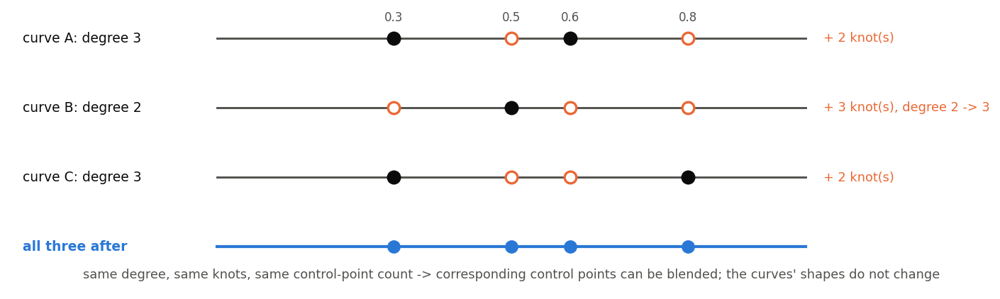
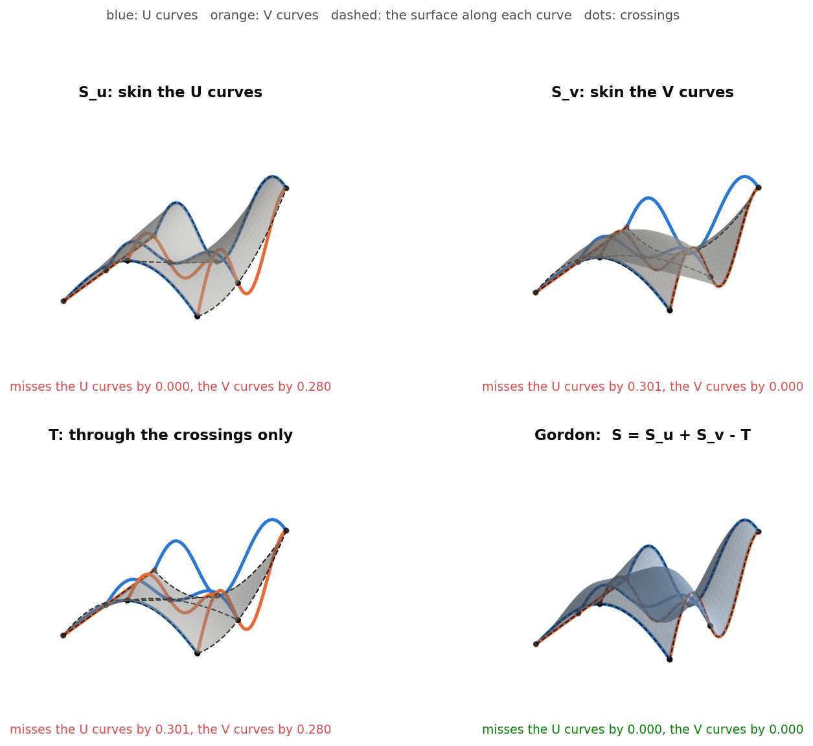
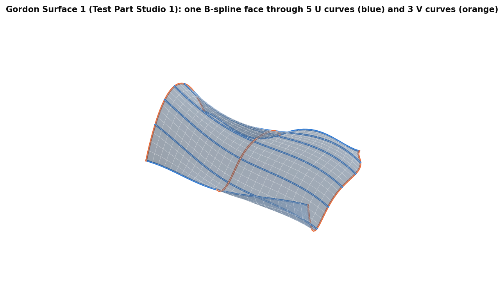
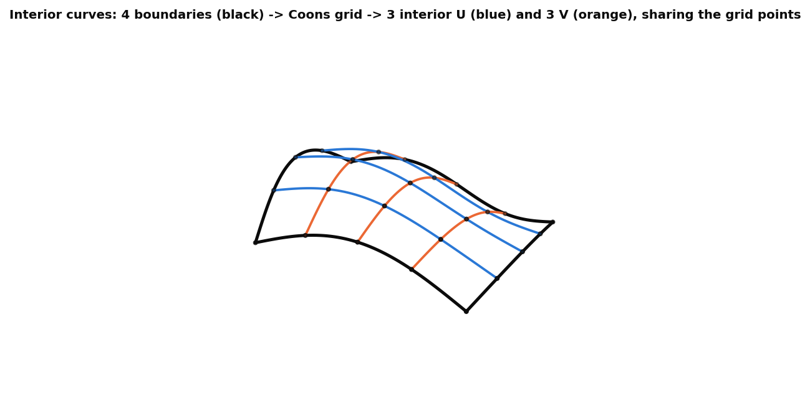
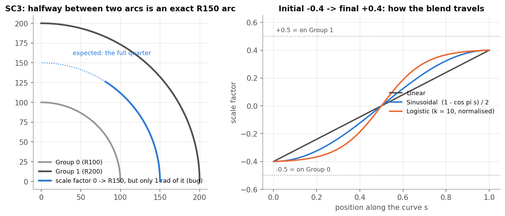
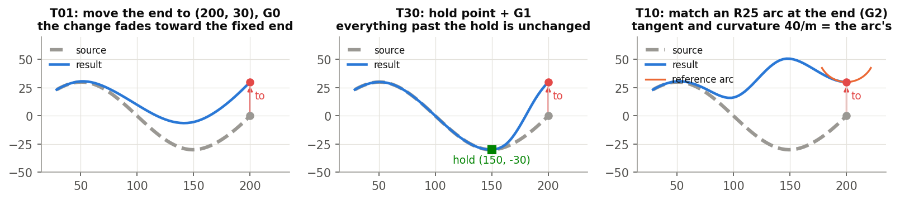
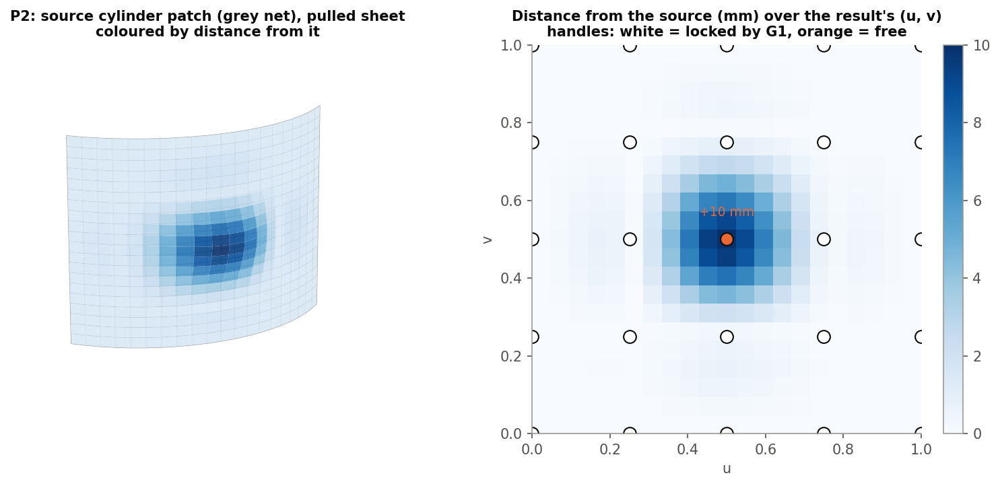

# Gordon surface tools, explained

*Gordon Surface, Interior curves, Scaled Curve, Modify curve end, Pull surface, Simplify surface and
makeCurvesCompitable (Onshape document **gordonSurface**). Written 2026-09-26 against the code as it stands that day.
Draft for review.*

These are NURBS curve and surface tools for freeform surfacing that native Onshape does poorly. They were written
for snowboard-binding surfacing and follow Piegl & Tiller's *The NURBS Book*. The "Gordon tools tests" studio covers
Modify curve end, Scaled Curve and Pull surface: 40 cases, all passing on 2026-09-26. Gordon Surface, Interior
curves and Simplify surface have no test fixture yet.

1. **The idea**: compatible curves, and how a Gordon surface passes through a whole network.
2. **The features**: each tool, its dialog, and an example.
3. **The code**: files and tests.

Figures are in `img/` (made by `img/src/figs.py`; data read from the document).

---

## Contents

- [Part 1: The idea](#part-1-the-idea)
  - [1.1 Compatible curves](#11-compatible-curves)
  - [1.2 A surface through a curve network](#12-a-surface-through-a-curve-network)
- [Part 2: The features](#part-2-the-features)
  - [2.1 Gordon Surface](#21-gordon-surface)
  - [2.2 Interior curves](#22-interior-curves)
  - [2.3 Scaled Curve](#23-scaled-curve)
  - [2.4 Modify curve end](#24-modify-curve-end)
  - [2.5 Pull surface](#25-pull-surface)
  - [2.6 Simplify surface](#26-simplify-surface)
  - [2.7 makeCurvesCompitable](#27-makecurvescompitable)
- [Part 3: The code](#part-3-the-code)
- [Appendix](#appendix-bugs-and-open-items)

---

# Part 1: The idea

## 1.1 Compatible curves

B-spline curves can be blended control point by control point only when they share a **degree** and a **knot
vector**, and therefore a control-point count. Making curves compatible does two things, neither of which changes
their shape:

1. Raise every curve to the highest degree (exact degree elevation).
2. Insert the union of all interior knots into every curve (exact Boehm knot insertion).

Compatibility underpins every tool here that builds a surface from curves ("skinning"). To skin, interpolate the
j-th control point of every section through the section positions, and the columns become the surface's control
net.

## 1.2 A surface through a curve network

A loft passes through one family of curves. A **Gordon surface** passes through two crossing families, U and V,
including every interior curve. It is built from three simple surfaces:

- **S_u** skins the U curves. It reproduces them, but misses the V curves.
- **S_v** skins the V curves. It reproduces them, but misses the U curves.
- **T** interpolates only the grid of crossing points. It misses both families.

**S = S_u + S_v − T** reproduces every curve of both families: along a U curve, S_v and T agree, so they cancel,
leaving S_u, and likewise along a V curve. It is the generalised Coons patch.

Once the three surfaces are made compatible, the sum is done control point by control point, giving one B-spline
face. The figure shows it on an analytic network: each partial surface misses one family by about 0.3, while the
Gordon sum misses neither.

---

# Part 2: The features

## 2.1 Gordon Surface

**One B-spline face through a U x V curve network.**

| Parameter | Meaning |
|---|---|
| **U-Curves** | Up to 10 edges, **in section order**; the pick order is used. |
| **V-Curves** | The same for the crossing family. |
| **Debug and details** | Create the S_u / S_v / tensor surfaces as separate sheets. Show curves (on by default: U cyan, V magenta). Print curve / surface data. Degree in u and v (3). |

**How.**

1. Each family is made compatible.
2. Every U-V crossing is found: a coarse 21 x 21 search, then refinement. The parameter at which each curve meets
   the others is averaged.
3. S_u, S_v and T are built by skinning.
4. The three surfaces are made compatible, and their control points are summed.

**Output.** One sheet, "Gordon surf". No keys, no messages.

**Example** (Test Part Studio 1, Gordon Surface 1): one face through 5 U curves and 3 V curves (the figure).

**Rules and limits.**

- Every U curve must cross every V curve, in order. A near miss is not reported: the midpoint of the closest pair is
  used.
- Crossing parameters are averaged, so when curves cross at uneven parameters the surface passes through the
  network only approximately.
- The degree is limited to (number of curves − 1).
- Rational inputs (arcs) are read with their weights ignored.
- A curve domain other than [0, 1] is assumed not to occur.
- No closed or periodic networks.

## 2.2 Interior curves

**Seed a Gordon network.** From four boundary chains U0, U1, V0, V1 forming a closed loop, it makes interior U and
V curves that are guaranteed to cross. They are the rows and columns of a bilinear **Coons** patch:

P(u, v) = (1−v)U0(u) + vU1(u) + (1−u)V0(v) + uV1(v) − (the bilinear corner term).

| Parameter | Meaning |
|---|---|
| **U0, U1, V0, V1** | The boundary chains (several edges each are joined). |
| **Interior U / V curve count** | 3 each (1-15). The dialog spells it "cure count". |
| **Debug & Details** | Print curve data. Its "Scaled tolerance" and "Scaled curve degree" are not used. |

**Output.** Wires `interiorU_i` and `interiorV_i`. Error: "Boundary curves don't form a closed loop at v0".

**Limits.**

- Each curve is fitted through only count + 2 points, so 3 x 3 gives 5 points per curve, which is coarse.
- The spacing is uniform in parameter, not in length.
- It is a prototype, and no test covers it.

## 2.3 Scaled Curve

**A curve between two rails whose position varies along its length**, for example from 30 % to 70 % of the way
across. At each position s, the result is (1 − f) x Group 0 + f x Group 1, where f runs from the initial to the final
scale factor along a transition shape. The scale factors are entered on [−0.5, 0.5]: −0.5 is on Group 0, 0 is
halfway, +0.5 is on Group 1.

| Parameter | Meaning |
|---|---|
| **Group 0** + **Flip?** | The first rail (edges joined into one); Flip reverses it. |
| **Group 1** | The second rail. |
| **Initial / Final curve scalefactor** | Start and end position, [−0.5, 0.5], default 0. |
| **Transition Type** | Linear / Sinusoidal / Logistic: how the position travels from initial to final. |
| **Curve name** | Names the wire. |
| **Project onto surface?** | + face: drop the result onto a face. |
| **Debug & Details** | Show endpoints and curves; print; output samples (15), tolerance (0.001 mm), degree (3); per-rail input samples and tolerance. |

**Examples.**

- SC0: lines y = 0 and y = 100 give the midline y = 50.
- SC3: arcs R100 and R200 give an exact R150 arc (within 0.00062 mm).
- SC2: output degree 5 when asked.

**Bug.** On arc inputs the result covers only the **first radian** of each arc. SC3's R150 result is 150.0 mm long
instead of a quarter circle's 235.6 mm. The arc's parameter is its angle, but the rails are sampled on [0, 1]. SC3
passes because it checks the radius only.

**Limits.**

- The rails are matched by parameter, not by length, so uneven parameterisation skews the blend.
- Orientation is not automatic; use Flip.
- No closed curves.
- Projection can move the ends.

## 2.4 Modify curve end

**Move one end of a curve, an edge chain or a wire to a new point**, blending the change back toward the fixed end
or a hold point. Optionally, match the moved end to a reference.

**How.** The feature edits the curve's control points directly; it does not resample.

1. **Merge.** A chain is merged into one curve; lines are raised to degree 3.
2. **Hold.** A **hold** (a picked point, or a distance from the modified end) inserts knots so the held part depends
   only on control points that are then locked. The held part is therefore **exactly unchanged**.
3. **Blend.** Each free control point moves by w x (To − From), where w follows the transition shape by arc length
   from the hold to the end. The last control point moves the full amount.
4. **Continuity at the fixed end or hold.** G1 locks one more control point and G2 two more, so tangent and curvature
   there are kept **exactly**.
5. **End match.** The end is rebuilt in closed form to the reference:
   - an **edge**: its tangent and curvature at the nearest point;
   - a **face**: the tangent is the approach direction projected into the face;
   - a **mate connector**: its Z axis is the tangent, its X axis gives the bend side.

   With Match = G2, **End curvature** chooses: match the reference, zero, or a radius.

| Parameter | Meaning |
|---|---|
| **Edges or wire to modify** | An edge, a chain (any pick order) or a wire; open, unbranched. |
| **Modified end** | The end to move (empty = the chain's end, with a note). |
| **To point** | Where it goes (empty = the end stays, or snaps onto the reference). |
| **Hold part of the curve** | Hold by **Point** (pick) or **Distance** (arc length from the modified end, 50 mm). |
| **Parameters** | **Transition type** (Logistic). **Continuity at fixed end / hold point** (G0 / G1 / G2). **Endpoint continuity ref?** with Endpoint continuity ref. (edge, face or mate connector), **Opposite direction**, **Match** (G0 / G1 / G2), **End curvature** (Match / Zero / Radius) and **End radius** (100 mm). Offset frame no longer has any effect. |
| **Project onto surface?** | + face: only the part after the hold is projected and refit. It stays G1 at the hold; end curvature cannot be kept. |
| **Debug, Details** | Spline degree and tolerance, Max control points (the cap for a merged chain), Sampling multiple (projection), print. |

**Outputs.**

- One wire. With a hold, also a point at the hold.
- Keys `movedVertex` (at To) and `holdVertex` (the hold, or the fixed end).
- Notes in one info line, for example:
  - no Modified end picked;
  - the hold is at the fixed end, so it has no effect;
  - a G0 hold leaves a corner;
  - the reference is far from the new end;
  - the end handle was shortened to avoid a loop;
  - projection keeps only G1.

**Errors.**

- the selection branches, is several chains, or is closed;
- the hold point is missing or at the modified end;
- the hold distance is longer than the curve;
- in Radius mode, the curvature side is undefined.

**Examples (Gordon tools tests).**

- T01: the end moved from (200, 0) to (200, 30), with both ends exact.
- T30: a hold point at (150, −30) with G1; the held part is unchanged.
- T10: the end matched to an R25 arc with G2, giving curvature 40/m, as the arc.
- Also covered:
  - T13: a mate connector with radius 50 (20/m toward its X);
  - T15 / T16: no To point, the end snaps onto a line;
  - T20 / T21: wires, and edges picked in reverse;
  - T33: hold by distance;
  - T38: hold, arc G2 and projection together;
  - T23 / T24 / T36 / T37: the error cases.

## 2.5 Pull surface

**Push and pull a face with handles.** A U x V grid of arrow handles sits on the face; drag the free ones along the
normal. The result is a new sheet built from the face's **own control net**, not a resampled copy.

- **Locks.** At every edge, 1 (G0), 2 (G1) or 3 (G2) rows of control points are locked. Edge curves and their
  cross-derivatives depend only on those rows, so G0 / G1 / G2 with the neighbouring surfaces holds **along the whole
  edge**. Weights never change.
- **Offsets.** Every free control point moves along the face normal. The amount is interpolated smoothly between the
  handles and solved so that the surface passes through each handle's offset.
- **Refinement.** Knots are added exactly when any offset is non-zero, so there are enough control points to move.

| Parameter | Meaning |
|---|---|
| **Face** | The face to pull (it is not replaced). |
| **U / V curve count** | Handles each way, edges included (2-20, default 4). |
| **Continuity** | G0 / G1 / G2 along the edges. G1 needs at least 5 handles each way before any is free, G2 at least 7. |
| **Active offsets** | U, V and Offset per handle; filled by dragging; 0 removes one. |
| **Debug** | Iso-curves, keep U / V curves and grid points, show the handle grid and offset vectors, print. |
| **Approximation** | Degree (a minimum, up to 5); Tolerance (how exactly the face is read). |

**Output.** A new sheet `pullSurf` (key `output`). Notes include:

- no handle is free (too few for the continuity);
- holes are not kept;
- the solve fell back to the raw offsets;
- a trimmed face holds its trimmed edges only approximately.

**Examples.**

- P2: a 5 x 5 grid, G1, +10 mm at the centre of a cylinder patch. The centre moves exactly 10 mm, the boundary 0 mm,
  and the normals along the whole boundary are unchanged.
- P1: G0, 4 x 4.
- P3: a planar control case.

## 2.6 Simplify surface

**Rebuild a heavy face as a lighter cubic B-spline** within a tolerance, for imported, derived or fitted faces. It
can replace the face in place.

- **AUTO** mode samples iso-curves at the source's Greville stations: one per source control point across u, where
  the averages of its knots put them. For each iso-curve, a binary search finds the fewest control points within
  tolerance of the true face. The curves are then made compatible and skinned.
- **MANUAL** uses uniform stations and a fixed control-point count.
- End derivatives (G0 / G1 / G2) are kept along v.

| Parameter | Meaning |
|---|---|
| **Face** | The face to simplify. |
| **Tolerance** | 0.01-100 mm (default 1 mm). |
| **Continuity** | G0 / G1 / G2 (its G2 mode has no effect). |
| **Mode** | AUTO / MANUAL (+ U and V counts). |
| **Replace face** | Replace the source face instead of making a new sheet. |
| **Debug print** | Console. |

**Limits.**

- The error is checked only along the station curves.
- Making the curves compatible re-inflates the control-point count toward the most complex station.
- G1 needs about 6 control points at least.
- No test fixture.

## 2.7 makeCurvesCompitable

A developer utility: make the selected edges compatible (1.1) and print a before / after report of degrees,
control-point counts and knots. Optionally it creates the compatible wires `compatibleBSpline_i`. Their shapes are
unchanged. The name is misspelled and the description is empty.

---

# Part 3: The code

| File | What |
|---|---|
| `gordonSurface.fs` | Gordon Surface: crossings, skinning, tensor surface, surface compatibility, sum. |
| `gordonCurveCompat.fs` | Curve compatibility (degree elevation, knot union) and the makeCurvesCompitable feature. |
| `interiorCurves.fs` | Interior curves (feature symbol `myFeature`). |
| `scaledCurve.fs` | Scaled Curve; chain joining used by the others. |
| `modifyCurveEnd.fs` | Modify curve end: hold, blend, end conditions, projection. |
| `pullSurface.fs` | Pull surface: control-net edit, locks, handle solve. |
| `simplifySurface.fs` | Simplify surface. |
| `constEnums.fs`, `debugTools.fs` | Shared enums, bounds, printing. |

The shared `tools/` library supplies degree elevation, knot insertion, arc length, Frenet frames and the transition
functions.

**Tests.** `devtools/onshape/build_gordon_tests.py` builds "Gordon tools tests", and `check_gordon_tests.py` checks
it. Cases: T01-T40 for Modify curve end, SC0-SC3 for Scaled Curve, P1-P3 for Pull surface. All passed on 2026-09-26.

**Icons.** Gordon Surface, Modify curve end, Pull surface and Scaled Curve have icons. The other three don't; their
decks use a generic mark.

---

# Appendix: bugs and open items

1. **Scaled Curve on arcs** covers only the first radian of each arc (2.3). The test SC3 checks only the radius; it
   should also check the extent.
2. **Dead parameters.**
   - Gordon Surface: Sample factor, Sampled spline tol.
   - Interior curves: Scaled tolerance, Scaled curve degree, and the hidden Blend Mode.
   - Modify curve end: Offset frame.
   - Simplify surface: G2 mode.
3. **Gordon Surface** does not report a U / V pair that doesn't cross; the midpoint of the closest points is used.
4. **Typos in the UI.** "Interior U cure count"; "Desription" (Scaled Curve, Interior curves); Scaled Curve's Group 1
   tolerance description says "Group 0"; "makeCurvesCompitable".
5. **No fixture** for Gordon Surface, Interior curves or Simplify surface.
6. The test names **T04 / T05** ("G2 best effort / exact") refer to an option that no longer exists.
