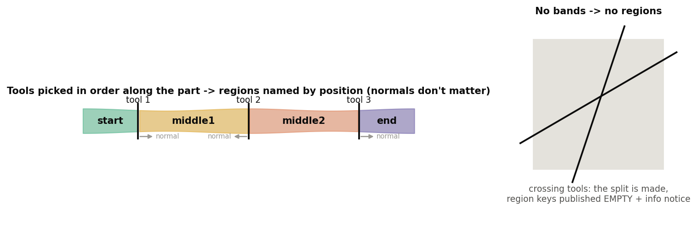

# Reference-side features, explained

*Mutual Trim+, Split+, Offset+ and Thicken+ (Onshape document **Reference_Side_Features**). Written 2026-09-25
against the code as it stands that day. Draft for review.*

Three passes, each building on the one before:

1. **The idea** -- one rule shared by all four features, with pictures. No code.
2. **The features** -- what each does, what every parameter means, what it publishes, how to read its messages.
3. **The code** -- files, the shared helpers, tests, and where the notes are.

The appendix lists things in the code and notes that looked unclear or contradictory.

Figures are in `img/`, made by `img/src/figs.py` (`python docs/explainers/reference_side/img/src/figs.py`).

---

## Contents

- [Part 1: The idea](#part-1-the-idea)
  - [1.1 Why a flip is fragile](#11-why-a-flip-is-fragile)
  - [1.2 Reading a side: signed distance](#12-reading-a-side-signed-distance)
  - [1.3 Choosing a good reference](#13-choosing-a-good-reference)
  - [1.4 What the reference does not change: output orientation](#14-what-the-reference-does-not-change-output-orientation)
- [Part 2: The features](#part-2-the-features)
  - [2.1 Mutual Trim+](#21-mutual-trim)
  - [2.2 Split+](#22-split)
  - [2.3 Offset+](#23-offset)
  - [2.4 Thicken+](#24-thicken)
  - [2.5 Outputs for Extract variables](#25-outputs-for-extract-variables)
- [Part 3: The code](#part-3-the-code)
- [Appendix: unclear items](#appendix-unclear-or-contradictory-items)

---

# Part 1: The idea

## 1.1 Why a flip is fragile

Every Onshape feature that keeps, removes, offsets or thickens toward "one side" names that side with a **flip**:
the opposite-direction arrow, "keep front / back", "Thickness 1 / Thickness 2". A flip is a statement about a
**normal** or a **curve direction**, not about the model.

Normals and curve directions change freely upstream. A loft re-orders its profiles, an offset surface is rebuilt,
a mirror reverses orientation, a sketch is redrawn from the other end. The feature downstream still regenerates
without error, but now keeps the other half, offsets the wrong way, or thickens outward instead of inward. On a
ski model with 200 features this is found late, if at all.

The four features here replace the flip with a **reference**: a body, face, edge, vertex or mate connector that
lies **on the side you mean**. "Keep the side the reference is on", "offset toward the reference", "thicken toward
the reference" are statements about geometry. They stay true whatever the inputs' orientations do.

Every reference-side feature still has its flip box. With a reference it means *toward* (on) or *away* (off).
Without a reference it behaves exactly like the built-in, so each one is a drop-in replacement.

## 1.2 Reading a side: signed distance

For a reference P and a surface, take the closest point C on the surface and the surface normal n there:

    s = (P - C) . n

s > 0 means P is on the side the normal points to, s < 0 the other side. The feature reads s **for this surface,
with its normal as it is today**, and then decides "along the normal" or "against it" from the sign. If the normal
flips upstream, s flips with it, and the decision in the model stays the same.

A reference within 1 um of the surface (`REFERENCE_SIDE_MARGIN`) is "on" it and has no side. The feature then
stops with a message asking for something clearly to one side, rather than guessing.

A mate connector counts as its origin point. Any other reference is measured as the whole entity, closest point
to closest point.

## 1.3 Choosing a good reference

The side is read **at the closest point**, so the reference should be close to the region it is meant to
describe:

- **Best: a mate connector or vertex a few mm to tens of mm from the surface, on the side you mean.** For ski
  models a mate connector at MRS (for example x 885, z 0) works for most "inside the ski" decisions.
- **Avoid a far plane.** On a curved part, the closest point of a plane 50 mm below the ski can land at the tip,
  where the surface has turned; the reading there is not the one meant in the middle. This happened on the
  Reference_Side topsheet example: "Below ski" plane as the keep reference for Mutual Trim+ gave "reference
  cannot be placed"; a mate connector at MRS fixed it.
- **Avoid references that lie on a tool.** A reference exactly on a splitting plane has no side of it.

Rule of thumb used in all examples: *a local reference inside the region to keep*.

## 1.4 What the reference does not change: output orientation

The reference decides **which side**: which piece is kept, which way an offset or a thicken goes. It does **not**
re-orient the surfaces the feature outputs. Every output sheet keeps the orientation its input had:

- Split+ pieces face the way the split surface faced.
- A Mutual Trim+ result keeps its inputs' orientation (one merged body shares one orientation).
- An Offset+ surface faces the way its source faced, whichever side it was offset to.

On the topsheet_surf example the topsheet surface faces **down**, into the ski (normal z about -0.9). All three
Split+ pieces, and the Offset+ copy 2 mm below it, face down as well, although the references sit on either side.

That matters downstream. The features after ours are usually **built-ins**, and they still name their side by the
normal: Thicken's Thickness 1, Offset surface's direction, an extrude "up to" a surface, Move face, the built-in
Split's front / back. If an input upstream flips, our output flips with it, and those built-ins flip too -- the very
fragility these features remove on their own step.

**Decided 2026-09-25, not built yet:** an option to orient output sheets by the reference as well
(`opFlipOrientation` flips a whole sheet body): each output body turned so its normal points **toward** the
reference (or away). Then built-ins downstream see a stable normal too. The decisions that go with it:

- **Sheets only.** Split+ surface pieces, Mutual Trim+ results, Offset+ surfaces. Solids have no free orientation
  (their normals always point outward), so Thicken+ outputs and solid Split+ pieces are unaffected.
- **Per body.** A merged Mutual Trim+ result is one body and gets one orientation for both of its halves.
- **Default off.** A new parameter's default is written into every saved instance (correction 25), so a default of
  on would silently flip the surfaces of existing models.
- Form still open: an option on the three features, or a separate "orient to reference" feature for any surface.

**Until then:** prefer the reference-side features downstream as well (Thicken+ instead of Thicken, Offset+ instead
of Offset surface), since they read the side from the reference and do not care which way the normal points.

---

# Part 2: The features

All four live in the **Reference_Side_Features** document and publish their results for Extract variables
(2.5). Each has a collapsed **Debug** group that prints the side it read for every surface, tool or chain, which
is the first thing to switch on when a result looks wrong.

## 2.1 Mutual Trim+

**What it does.** Onshape's Mutual trim: two surfaces trim each other along their (extended) intersection, and on
each one side is kept. Here the kept side is the one the **Keep side reference** is on, decided separately for
each surface.

**How the side is decided.** Each surface is split into two pieces by the other one. The reference, and a point
on each piece, get a signed distance **to the other surface** (the one that did the splitting). The piece on the
reference's side is "near". Plain distance from the reference to the pieces is only a fallback: on a leaning
wall, the upper piece can reach closer to a point that is clearly below the cut (right panel above). Deciding by
side of the splitter got that case right; deciding by distance did not.

**Parameters** (top to bottom):

- **First surface** -- one sheet body.
- **Keep side nearest reference** (first surface) -- on: keep the side the reference is on ("the inside"); off: the
  other side. Without a reference: the split's own front / back, as the built-in.
- **Second surface** and its **Keep side nearest reference** -- the same for the second surface.
- **Keep side reference** -- body, face, edge, vertex or mate connector on the keep side of *both* surfaces. Empty =
  the built-in behaviour.
- **Merge** (default on) -- union the two trimmed surfaces into one body.
- **Debug > Print side distances** -- for each surface: which side was kept and whether it was decided by side of
  the other surface (normal case) or by distance (fallback).

**Messages.**

| Message | Meaning |
|---|---|
| Info "boolean union no-op" | The surfaces do not intersect; nothing was trimmed. |
| Error "The keep side reference cannot be placed on either side of the first/second surface" | The pieces did not straddle the other surface, and the reference is equally far from both. Pick a closer reference inside the region to keep. |

**Example (test M1).** A horizontal sheet (z 0) and a vertical sheet (x 7800), reference in the upper-right
quadrant: the result is an L of 10 000 mm2 with centroid 12.5 mm into the kept quadrant; each surface keeps a
5000 mm2 face.

## 2.2 Split+

**What it does.** Onshape's Split, extended three ways:

1. **Several targets and several tools.** Every target is split by every tool, in the order the tools were
   picked; the pieces of one split are the targets of the next.
2. **Keep one side by reference.** With *Keep both sides* off, each tool keeps the side the reference is on (or
   the other side). What survives is the region on the reference's side of **every** tool, whatever the tools'
   normals.
3. **Named regions.** Every piece is placed by which side of each tool it lies on, and the regions are published by
   position, not by index.

**Split type.**

- **Part** -- splits whole bodies (solids, surfaces, curves). Uses the std split for each tool.
- **Face** -- splits only the picked faces; nothing is removed. The reference, if given, only names the two regions
  of a one-tool split.

**Tools.** Surfaces, faces (construction planes included) and mate connectors (their XY plane). Mate connector and
construction plane tools are infinite; surfaces cut as they are.

**Parameters.**

- **Split type** -- Part / Face.
- **Parts, surfaces, or curves to split** (Part) or **Faces to split** (Face).
- **Entities to split with** -- the tools, in pick order. *Pick them in order along the part*: region names depend
  on it.
- **Keep tools** -- keep sheet-body tools after the split.
- **Trim to face boundaries** (Part) -- a single-face tool cuts only within its own boundary, as the built-in.
- **Keep both sides** (Part, default on) -- off: keep one side per tool.
- **Side reference** -- shown for a Face split or when one side is kept.
- **Keep side nearest reference** (Part, one side) -- on: the reference's side of each tool; off: the other side.
  Without a reference: on keeps each tool's front (the side its normal points to), off its back.

**Regions.** Named along the tools:

| Tools | Regions |
|---|---|
| 1 | `near` / `far` (from the reference), or `front` / `back` without one |
| 2 | `start` (beyond tool 1, away from tool 2), `middle`, `end` |
| 3+ | `start`, `middle1` .. `middleN-1`, `end` |

"Forward" for each tool is the side the next tool is on, so orientation never matters. When tools **cross inside the
part** (a normal way to cut out a corner) or were picked out of order, no piece fits a band: the split is still made
as asked, the region keys are published **empty**, and an info notice says why.

**Messages.**

| Message | Meaning |
|---|---|
| Error "A tool is also a target" | The same body is in both lists. |
| Error "The keep side reference lies on tool k" | The reference has no side of that tool. Move it. |
| Error "Nothing is left" | No part of the targets is on the kept side of every tool. |
| Info "Split done; regions not published: ..." | Crossing or out-of-order tools (see above). The split itself is fine. |

**Examples (tests S1-S10).**

- S1-S4: a cube and a small cube, tools z = 0 and x = x0, reference at (x0 + 30, 0, 30). Whatever the tools' normals
  (as drawn or flipped), *keep reference side* leaves 1 body, the upper quarter; *other side* leaves 2 bodies.
- S6: a sheet split by planes at x 1980 (normal +X) and 2020 (normal -X): 3 pieces, 2 cut edges, regions
  `start / middle / end` at x 1965 / 2000 / 2035. The opposite normals do not change the names.
- S9: top and front faces of a cube, Face split by x 3180 / 3220: 2 faces per region, the cube goes from 6 to 10 faces.
- Live (topsheet_surf studio): the topsheet split at Station A (x 300) and B (x 1500) gives `start` (x -19..300),
  `middle` (300..1500) and `end` (1500..1799).

## 2.3 Offset+

**What it does.** Offsets surfaces, or curves, **toward the side a reference is on** (or away with the box off).

**Surface mode.** The std offset surface, once per selected body. Each body is offset toward the reference's side
of *that body*, so surfaces of opposite orientation all move the same way in the model (test O1: a top sheet at
z 50 and a bottom sheet at z -50 drawn reversed, both offset 10 toward the centre, land at z +-40).

**Curve mode.** Each connected chain of the selected curves becomes one wire. The offset direction at each point
comes from a **frame**:

| Frame | Direction | Use it for |
|---|---|---|
| **Transport frame** (default) | Carried along the chain without twisting (rotation-minimizing). With a reference, it starts pointing from the chain toward the reference and is carried from there. | 3D chains; a helix offset "toward the axis" stays inside all the way round (test C7). |
| **Surface normal** | From a surface at each point: *Along surface normal* lifts the curve off the surface; *Along surface* keeps it in the surface, perpendicular to the curve. | Curves lying on a topsheet or core surface. |
| **Plane** | In the plane perpendicular to a direction (default world Z). | A plan-view offset of a 3D curve. |

**Corners** (where two edges meet at an angle):

- The offsets **separate** on the outside: the gap is closed with an arc about the corner point, radius = the
  offset distance (as the std offset curve's round fill).
- The offsets **overlap** on the inside: both are trimmed back to where they cross.
- Joints within 0.5 deg are smooth: both sides share one end point and tangent, so the wire stitches.

The result is fitted per source edge, with both end tangents pinned to the true offset tangent.

**Parameters.**

- **Offset type** -- Surface / Curve.
- **Faces and surfaces to offset** (Surface) or **Curves and edges to offset** (Curve).
- **Frame** (Curve) -- as above; *Surface* asks for the **Surface** and **Direction**, *Plane* for the **Plane normal**.
- **Distance**.
- **Side reference** -- empty = the flip alone.
- **Offset toward reference** -- on: toward; off: away. Without a reference: a plain flip.
- **Fit** group (Curve): **Samples per edge** (24), **Max station spacing** (5 mm; bounds the error between
  stations), **Fit tolerance** (0.001 mm).

**Messages.**

| Message | Meaning |
|---|---|
| Info "Corners: N rounded, M trimmed." | Normal result on a chain with corners. |
| Warning "N corner(s) could not be closed ... The wire has a gap at each." | A corner sharper than the offset allows, or skew 3D pieces. Reduce the distance, or split the chain there. |
| Error "The side reference is not to either side of chain k in this frame" | The reference lies along the curve or on the surface. Move it off to one side. |
| Error "The curve runs along the plane / surface normal" | No offset direction exists there in that frame. |

**Example (test C8).** A Z-shaped chain (7200,0) > (7300,0) > (7300,100) > (7400,100), plane frame, 10 mm toward
a reference below it: one corner rounded, one trimmed, length 280 + 5 pi = 295.708 mm.

## 2.4 Thicken+

**What it does.** Onshape's Thicken, with the two thicknesses named **Toward reference** and **Away from
reference** instead of by the face normal. The side is decided per surface body, so two surfaces of opposite
orientation still both thicken toward the reference. Everything else is the std feature, including the
**New / Add / Remove / Intersect** boolean step and merge scope, unchanged.

**Curvature check** (Advanced, default on). A thicken of t fails where the surface is concave toward that side
with a radius smaller than t: the offset passes the centre of curvature and turns inside out (right panel above).
Before thickening, each face is sampled on a 9 x 9 grid; the first place that fails is shown as a red point, and
the error gives its location and radius -- instead of the kernel's bare "thicken failed".

**Parameters.**

- **Creation type** (New / Add / Remove / Intersect) and **Merge scope** -- the std boolean step.
- **Faces and surfaces to thicken**.
- **Side reference** -- best a mate connector or vertex near the surface, on the side meant. Empty = along the
  face normals (std Thickness 1).
- **Toward reference**, **Away from reference** -- the two thicknesses.
- **Swap sides** -- exchange them.
- **Keep tools** -- keep the input surfaces.
- **Advanced > Check curvature**, **Print details** (side per surface, tightest concave radius per side).

**Messages.**

| Message | Meaning |
|---|---|
| Error "Both thicknesses are zero." | |
| Error "The side reference lies on surface k" | Move the reference off the surface. |
| Error "Surface k is concave with radius r mm at (x, y, z) ... the thicken would fold there." | Reduce that side's thickness below r, or swap sides. The red point marks the place. |

**Examples (tests T1-T6).** Two sheets of opposite normals, Toward 5 / Away 0: both thicken toward the
reference. T4 (a half cylinder r 10 thickened 15 mm toward its axis) **must** error with the curvature message; T5 (5 mm) gives a 5 mm shell.
T6: 5 mm up from a cube's top, Add: one part, volume 1 018 000 mm3, `towardFaces` is the face at z 55.

## 2.5 Outputs for Extract variables

Each feature publishes its results with the Variable_tools producer library, so **Extract variables** can turn
them into named variables and query variables later in the tree. Every feature always publishes `output` (the
result bodies) and `inputs`; the rest:

| Feature | Keys |
|---|---|
| Mutual Trim+ | `trimEdges` (the trim curve: fillet here), `keptFaces1`, `keptFaces2`, `trimEdgeCount` |
| Split+ | each region (`near`/`far`, `front`/`back`, `start`/`middle*`/`end`) and `<region>Edges`; `outside`, `inside` (+ `Edges`); `splitEdges` (one edge per cut); `cut` / `startCut`, `endCut` / `cut1..N`; `splitFaces`; `pieceCount`, `regionCount` |
| Offset+ | `startVertex`, `endVertex`, `startEdge`, `endEdge` (start = the end at the source's start), `cornerArcs`, `boundaryEdges` (surfaces); `roundedCorners`, `trimmedCorners`, `openCorners` |
| Thicken+ | `towardFaces`, `awayFaces`, `sideFaces` (each tracked through the boolean) |

Every key is present on every regeneration, empty when it does not apply, so an Extract variables entry never
breaks because a key disappeared. Split+ publishes **one** edge per cut: keeping both sides leaves two coincident
edges per cut, and an extrude or fillet on both fails.

The surfaces these keys point at keep their inputs' orientation: the reference picks the side, not the normal
(section 1.4). Orienting output sheets by the reference is decided but not built yet.

---

# Part 3: The code

## 3.1 Files

| File (tab) | What |
|---|---|
| `reference_side/reference_side_utils.fs` | The shared rule: `referenceProbe` (mate connector -> its origin), `facesOf`, `signedSideOf` (1.2), `sideSign` (+1 / -1 / 0 with the 1 um margin), `referencePointNear`, `chainEnds` (start/end keys), `fmtMM`. |
| `mutual_trim_plus.fs` | std mutualTrim mechanism (opSplitFace with mutual imprint, `qSplitBy` labels, flood fill bounded by the imprint) + `sideToDelete` (side of the splitter, distance fallback). |
| `split_plus.fs` | `opSplitPart` per tool with `keepTypeFor` (KEEP_FRONT keeps the side the tool normal points to); Face mode via `opSplitFace`; `classifyRegions`, `oneEdgePerCut`, `cutsPerTool`. |
| `offset_plus.fs` | Surface: `opExtractSurface` with a per-body sign. Curve: `pathStations` -> `directionField` (transport / surface / plane) -> corners (`cornerArcs`, `polylineCrossing`) -> `fitPiece` -> `opExtractWires`. |
| `thicken_plus.fs` | Per-body `sideSign` -> `opThicken` thickness1/2; `checkCurvature` (9 x 9 grid of `evFaceCurvatures`); `classifyFaces` against a copy taken before the thicken; std `processNewBodyIfNeeded`. |

All import `reference_side_utils` and Variable_tools **V1** `extract_outputs`.

## 3.2 Facts the design rests on (verified 2026-09-23 with the eval API)

- `opSplitPart` KEEP_FRONT keeps the side the tool face's normal points to.
- A target wholly on the discarded side of an (extended) tool is **deleted**; a miss with KEEP_FRONT / KEEP_ALL is
  SPLIT_NO_CHANGE (info), not an error.
- `opThicken` with Keep tools off consumes its input faces, so Thicken+ measures against a copy made first, and
  deletes that copy before the boolean step (which takes every body created under the feature id as a tool).

## 3.3 Tests

In-tree, in the **Reference side tests** Part Studio: real feature instances named by case and expected result
(S1-S10 Split+, O1-O2 surface offsets, C1-C8 curve offsets, M1-M2 Mutual Trim+, T1-T6 Thicken+; T4 must error).

    PYTHONPATH=. python devtools/onshape/build_reference_side_tests.py    # (re)build the instances
    PYTHONPATH=. python devtools/onshape/check_reference_side_tests.py    # 30/30 on 2026-09-24

Real-geometry examples are in the **topsheet_surf** studio (the user's derive of Design_Master bodies).

## 3.4 Notes

- Corrections log: #28 (decide against the splitter, not by distance), #34 (face split halves via `qSplitBy`),
  #40 (std boolean step in a custom feature).
- Memory: `reference-side-and-variable-tools.md` (history, examples, output taxonomy).

---

# Appendix: unclear or contradictory items

1. **Split+ region placement uses a point per piece** (`piecePoint`: a face's point nearest its centroid, else the
   body centroid). For a strongly curved piece that straddles its own tool's extension, the centroid rule could
   misplace it; not seen in tests. Mutual Trim+ has the same soft spot and falls back to distance.
2. **Offset+ curve mode, Plane frame without a reference**: the direction is `cross(axis, tangent)`, so a chain
   drawn from the other end offsets the other way. That is the built-in behaviour the
   reference is meant to replace, but worth stating in the dialog description.
3. **Surface mode publishes the curve keys as 0 / empty** (`roundedCorners` etc.). Correct under the "every key
   always present" rule, but the key descriptions say "Curve offsets only" rather than "0 for surfaces".
4. **Imports:** all four tabs are on Variable_tools V1 `extract_outputs`; Curve_tools' fillet_wire is on V2. Same
   producer microversion, so no difference in behaviour; noted for the next re-pin.
