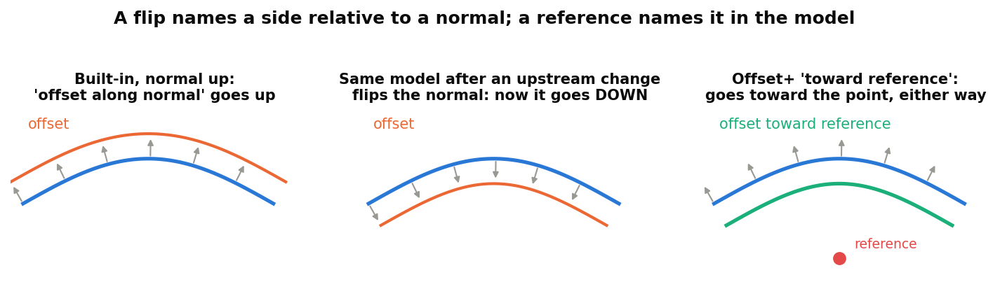
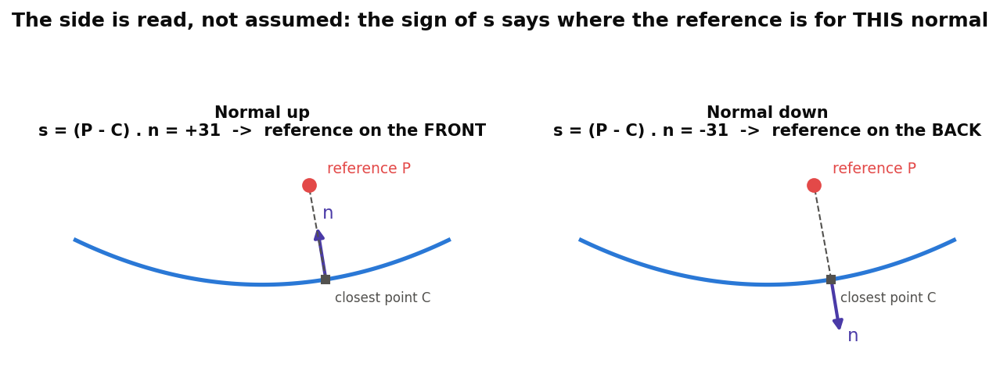
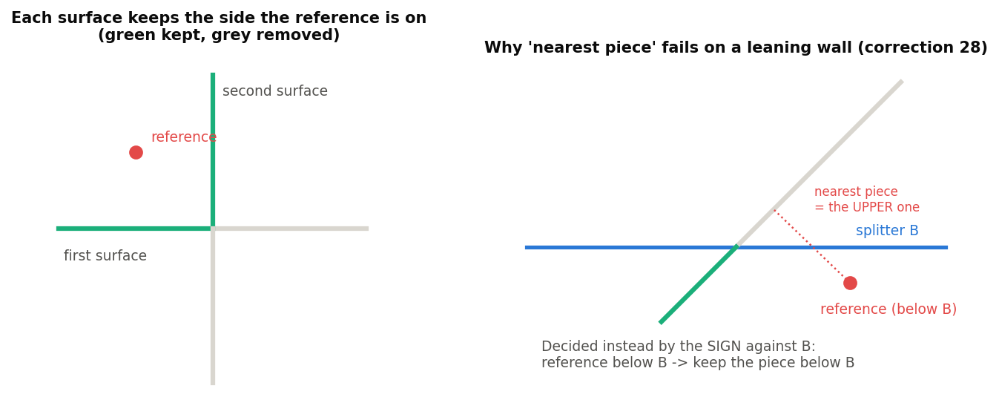
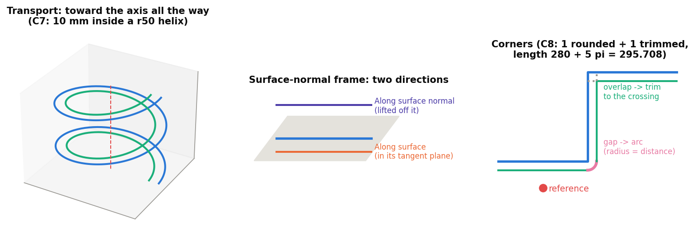
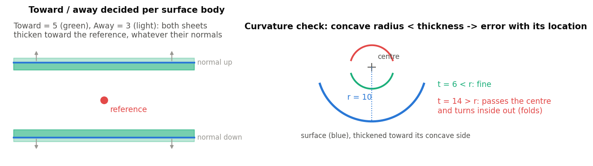
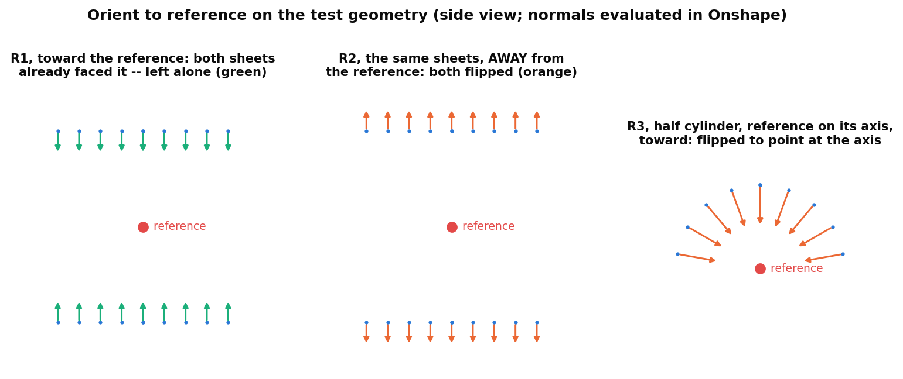

# Reference-side features, explained

*Mutual Trim+, Split+, Offset+, Thicken+ and Orient to reference (Onshape document **Reference_Side_Features**). Written 2026-09-25
against the code as it stands that day. Draft for review.*

Three passes, each building on the one before:

1. **The idea** -- one rule shared by all four features, with pictures. No code.
2. **The features** -- what each does, what every parameter means, what it publishes, how to read its messages.
3. **The code** -- files, the shared helpers, tests, and where the notes are.

The appendix lists things in the code and notes that looked unclear or contradictory.

Figures are in `img/`, made by `img/src/figs.py` (`python docs/explainers/reference_side/img/src/figs.py`).

---

## Contents

- [Part 1: The idea](#part-1-the-idea)
  - [1.1 Why a flip is fragile](#11-why-a-flip-is-fragile)
  - [1.2 Reading a side: signed distance](#12-reading-a-side-signed-distance)
  - [1.3 Choosing a good reference](#13-choosing-a-good-reference)
  - [1.4 What the reference does not change: output orientation](#14-what-the-reference-does-not-change-output-orientation)
- [Part 2: The features](#part-2-the-features)
  - [2.1 Mutual Trim+](#21-mutual-trim)
  - [2.2 Split+](#22-split)
  - [2.3 Offset+](#23-offset)
  - [2.4 Thicken+](#24-thicken)
  - [2.5 Outputs for Extract variables](#25-outputs-for-extract-variables)
  - [2.6 Orient to reference](#26-orient-to-reference)
- [Part 3: The code](#part-3-the-code)
- [Appendix: unclear items](#appendix-unclear-or-contradictory-items)

---

# Part 1: The idea

## 1.1 Why a flip is fragile

Every Onshape feature that keeps, removes, offsets or thickens toward "one side" names that side with a **flip**:
the opposite-direction arrow, "keep front / back", "Thickness 1 / Thickness 2". A flip is a statement about a
**normal** or a **curve direction**, not about the model.

Normals and curve directions change freely upstream. A loft re-orders its profiles, an offset surface is rebuilt,
a mirror reverses orientation, a sketch is redrawn from the other end. The feature downstream still regenerates
without error, but now keeps the other half, offsets the wrong way, or thickens outward instead of inward. On a
ski model with 200 features this is found late, if at all.

The four features here replace the flip with a **reference**: a body, face, edge, vertex or mate connector that
lies **on the side you mean**. "Keep the side the reference is on", "offset toward the reference", "thicken toward
the reference" are statements about geometry. They stay true whatever the inputs' orientations do.

Every reference-side feature still has its flip box. With a reference it means *toward* (on) or *away* (off).
Without a reference it behaves exactly like the built-in, so each one is a drop-in replacement.

## 1.2 Reading a side: signed distance

For a reference P and a surface, take the closest point C on the surface and the surface normal n there:

    s = (P - C) . n

s > 0 means P is on the side the normal points to, s < 0 the other side. The feature reads s **for this surface,
with its normal as it is today**, and then decides "along the normal" or "against it" from the sign. If the normal
flips upstream, s flips with it, and the decision in the model stays the same.

A reference within 1 um of the surface (`REFERENCE_SIDE_MARGIN`) is "on" it and has no side. The feature then
stops with a message asking for something clearly to one side, rather than guessing.

A mate connector counts as its origin point. Any other reference is measured as the whole entity, closest point
to closest point.

## 1.3 Choosing a good reference

The side is read **at the closest point**, so the reference should be close to the region it is meant to
describe:

- **Best: a mate connector or vertex a few mm to tens of mm from the surface, on the side you mean.** For ski
  models a mate connector at MRS (for example x 885, z 0) works for most "inside the ski" decisions.
- **Avoid a far plane.** On a curved part, the closest point of a plane 50 mm below the ski can land at the tip,
  where the surface has turned; the reading there is not the one meant in the middle. This happened on the
  Reference_Side topsheet example: "Below ski" plane as the keep reference for Mutual Trim+ gave "reference
  cannot be placed"; a mate connector at MRS fixed it.
- **Avoid references that lie on a tool.** A reference exactly on a splitting plane has no side of it.

Rule of thumb used in all examples: *a local reference inside the region to keep*.

## 1.4 What the reference does not change: output orientation

The reference decides **which side**: which piece is kept, which way an offset or a thicken goes. It does **not**
re-orient the surfaces the feature outputs. Every output sheet keeps the orientation its input had:

- Split+ pieces face the way the split surface faced.
- A Mutual Trim+ result keeps its inputs' orientation (one merged body shares one orientation).
- An Offset+ surface faces the way its source faced, whichever side it was offset to.

On the topsheet_surf example the topsheet surface faces **down**, into the ski (normal z about -0.9). All three
Split+ pieces, and the Offset+ copy 2 mm below it, face down as well, although the references sit on either side.

That matters downstream. The features after ours are usually **built-ins**, and they still name their side by the
normal: Thicken's Thickness 1, Offset surface's direction, an extrude "up to" a surface, Move face, the built-in
Split's front / back. If an input upstream flips, our output flips with it, and those built-ins flip too -- the very
fragility these features remove on their own step.

**Fix: Orient to reference** (section 2.6, built 2026-09-25). A separate feature placed after any of these (or
after any built-in that makes surfaces): it flips each selected surface body with `opFlipOrientation` so its normal
points **toward** the reference (or away), and draws the normals while its dialog is open. Built-ins downstream then
see a stable normal too. How it was decided:

- **A standalone feature, not an option on each feature.** One small feature, it works on surfaces from built-ins as
  well, and the existing dialogs stay as they are.
- **Sheets only.** Solids have no free orientation (their normals always point outward), so Thicken+ outputs and
  solid Split+ pieces never need it; selecting a solid's face is an error.
- **Per body.** A merged Mutual Trim+ result is one body and gets one orientation for both of its halves.

Alternatively, use the reference-side features downstream as well (Thicken+ instead of Thicken, Offset+ instead of
Offset surface): they read the side from the reference and do not care which way the normal points.

---

# Part 2: The features

All four live in the **Reference_Side_Features** document and publish their results for Extract variables
(2.5). Each has a collapsed **Debug** group that prints the side it read for every surface, tool or chain, which
is the first thing to switch on when a result looks wrong.

## 2.1 Mutual Trim+

**What it does.** Onshape's Mutual trim: two surfaces trim each other along their (extended) intersection, and on
each one side is kept. Here the kept side is the one the **Keep side reference** is on, decided separately for
each surface.

**How the side is decided.** Each surface is split into two pieces by the other one. The reference, and a point
on each piece, get a signed distance **to the other surface** (the one that did the splitting). The piece on the
reference's side is "near". Plain distance from the reference to the pieces is only a fallback: on a leaning
wall, the upper piece can reach closer to a point that is clearly below the cut (right panel above). Deciding by
side of the splitter got that case right; deciding by distance did not.

**Parameters** (top to bottom):

- **First surface** -- one sheet body.
- **Keep side nearest reference** (first surface) -- on: keep the side the reference is on ("the inside"); off: the
  other side. Without a reference: the split's own front / back, as the built-in.
- **Second surface** and its **Keep side nearest reference** -- the same for the second surface.
- **Keep side reference** -- body, face, edge, vertex or mate connector on the keep side of *both* surfaces. Empty =
  the built-in behaviour.
- **Merge** (default on) -- union the two trimmed surfaces into one body.
- **Debug > Print side distances** -- for each surface: which side was kept and whether it was decided by side of
  the other surface (normal case) or by distance (fallback).

**Messages.**

| Message | Meaning |
|---|---|
| Info "boolean union no-op" | The surfaces do not intersect; nothing was trimmed. |
| Error "The keep side reference cannot be placed on either side of the first/second surface" | The pieces did not straddle the other surface, and the reference is equally far from both. Pick a closer reference inside the region to keep. |

**Example (test M1).** A horizontal sheet (z 0) and a vertical sheet (x 7800), reference in the upper-right
quadrant: the result is an L of 10 000 mm2 with centroid 12.5 mm into the kept quadrant; each surface keeps a
5000 mm2 face.

## 2.2 Split+

*Rewritten 2026-09-27 (Reference_Side v7): start / end tools, an inside reference, Keep both / inside / outside.
Split+ features made before this need re-picking.*

**What it does.** Onshape's Split at a **start tool** and, optionally, an **end tool**, with every piece named
**inside** or **outside** -- so the names mean the same thing whatever the tools' normals, and you never depend on
the order Onshape returns several tools in.

- **Inside** is the region on the inside of every tool:
  - with an **inside reference**: the side of each tool the reference is on;
  - two tools, no reference: **between** the two cuts;
  - one tool, no reference: the tool's front (the side its normal points to) -- an info notice says so.
- **Outside** is everything else: **start** (beyond the start tool) and **end** (beyond the end tool).

**Split type.**

- **Part** -- splits whole bodies (solids, surfaces, curves).
- **Face** -- splits only the picked faces; nothing is removed.

**Tools.** A surface, a face (construction planes included) or a mate connector (its XY plane), one per field.
Mate connector and construction plane tools are infinite; surfaces cut as they are.

**Parameters.**

- **Split type** -- Part / Face.
- **Parts, surfaces, or curves to split** (Part) or **Faces to split** (Face).
- **Start tool** / **End tool** (optional).
- **Inside reference** -- geometry in the region you call inside. Needed with one tool to name the sides.
- **Bodies to keep** (Part) -- **Both** (default), **Inside** or **Outside**. The split keeps every piece; the
  other region is then deleted.
- **Trim to face boundaries** (Part) -- a single-face tool cuts only within its own boundary, as the built-in.
- **Keep tools** -- keep sheet-body tools after the split.

**Cut edges.** Every cut leaves two coincident edges, one per piece. The one published is the edge on a piece that
is **kept**: the inside piece, or the outside piece when you keep only the outside.

**Outputs** (every key always present, empty when it does not apply): `inside`, `outside`, `start`, `end` and each
`<region>Edges` (edges except the cuts; a surface's boundary edges); `startCut`, `endCut`; `splitEdges` (every
cut); `splitFaces` (the caps on solids); `output` (the pieces kept) and `pieceCount`.

**Messages.**

| Message | Meaning |
|---|---|
| Error "The start and end tools are the same" | Pick a different end tool. |
| Error "A tool is also a target" | The same body is picked as a target and a tool. |
| Error "The inside reference lies on the start / end tool" | The reference has no side of that tool. Move it. |
| Error "The start and end tools meet or cross ... pick an inside reference" | Without a reference, 'between' is not defined. |
| Error "Nothing is left: no piece lies inside / outside" | Keep removed everything. |
| Info "Inside is the start tool's front ..." | One tool and no reference: the names follow the tool's normal. |
| Info "... piece(s) lie beyond both tools" | Crossing tools: such pieces count as outside, in neither start nor end. |

**Inside a Case pattern.** Pass the tools as Define case inputs, and the inside reference as an input or a shared
reference -- never click them inside the repeated features (Case pattern explainer, rule 1).

**Examples (tests S1-S10).**

- S1-S3: a cube cut at z = 0, reference above. Keep inside leaves the upper half whether the tool's normal points up
  (S1) or down (S2); keep outside leaves the lower half (S3).
- S4: the same, keep both: `inside` = upper half, `start` = lower half, `startCut` = the 4 cut edges on the upper half.
- S5-S7: a sheet cut at x 1580 (normal +X) and x 1620 (normal -X), no reference: `inside` x 1600, `start` x 1565,
  `end` x 1635, one cut edge per tool; keep inside leaves the middle piece, keep outside the two ends.
- S9: top and front faces of a cube, Face split by x 3180 / 3220: 2 faces per region, the cube goes from 6 to 10 faces.

## 2.3 Offset+

**What it does.** Offsets surfaces, or curves, **toward the side a reference is on** (or away with the box off).

**Surface mode.** The std offset surface, once per selected body. Each body is offset toward the reference's side
of *that body*, so surfaces of opposite orientation all move the same way in the model (test O1: a top sheet at
z 50 and a bottom sheet at z -50 drawn reversed, both offset 10 toward the centre, land at z +-40).

**Curve mode.** Each connected chain of the selected curves becomes one wire. The offset direction at each point
comes from a **frame**:

| Frame | Direction | Use it for |
|---|---|---|
| **Transport frame** (default) | Carried along the chain without twisting (rotation-minimizing). With a reference, it starts pointing from the chain toward the reference and is carried from there. | 3D chains; a helix offset "toward the axis" stays inside all the way round (test C7). |
| **Surface normal** | From a surface at each point: *Along surface normal* lifts the curve off the surface; *Along surface* keeps it in the surface, perpendicular to the curve. | Curves lying on a topsheet or core surface. |
| **Plane** | In the plane perpendicular to a direction (default world Z). | A plan-view offset of a 3D curve. |

**Corners** (where two edges meet at an angle):

- The offsets **separate** on the outside: the gap is closed with an arc about the corner point, radius = the
  offset distance (as the std offset curve's round fill).
- The offsets **overlap** on the inside: both are trimmed back to where they cross.
- Joints within 0.5 deg are smooth: both sides share one end point and tangent, so the wire stitches.

The result is fitted per source edge, with both end tangents pinned to the true offset tangent.

**Parameters.**

- **Offset type** -- Surface / Curve.
- **Faces and surfaces to offset** (Surface) or **Curves and edges to offset** (Curve).
- **Frame** (Curve) -- as above; *Surface* asks for the **Surface** and **Direction**, *Plane* for the **Plane normal**.
- **Distance**.
- **Side reference** -- empty = the flip alone.
- **Offset toward reference** -- on: toward; off: away. Without a reference: a plain flip.
- **Fit** group (Curve): **Samples per edge** (24), **Max station spacing** (5 mm; bounds the error between
  stations), **Fit tolerance** (0.001 mm).

**Messages.**

| Message | Meaning |
|---|---|
| Info "Corners: N rounded, M trimmed." | Normal result on a chain with corners. |
| Warning "N corner(s) could not be closed ... The wire has a gap at each." | A corner sharper than the offset allows, or skew 3D pieces. Reduce the distance, or split the chain there. |
| Error "The side reference is not to either side of chain k in this frame" | The reference lies along the curve or on the surface. Move it off to one side. |
| Error "The curve runs along the plane / surface normal" | No offset direction exists there in that frame. |

**Example (test C8).** A Z-shaped chain (7200,0) > (7300,0) > (7300,100) > (7400,100), plane frame, 10 mm toward
a reference below it: one corner rounded, one trimmed, length 280 + 5 pi = 295.708 mm.

## 2.4 Thicken+

**What it does.** Onshape's Thicken, with the two thicknesses named **Toward reference** and **Away from
reference** instead of by the face normal. The side is decided per surface body, so two surfaces of opposite
orientation still both thicken toward the reference. Everything else is the std feature, including the
**New / Add / Remove / Intersect** boolean step and merge scope, unchanged.

**Curvature check** (Advanced, default on). A thicken of t fails where the surface is concave toward that side
with a radius smaller than t: the offset passes the centre of curvature and turns inside out (right panel above).
Before thickening, each face is sampled on a 9 x 9 grid; the first place that fails is shown as a red point, and
the error gives its location and radius -- instead of the kernel's bare "thicken failed".

**Parameters.**

- **Creation type** (New / Add / Remove / Intersect) and **Merge scope** -- the std boolean step.
- **Faces and surfaces to thicken**.
- **Side reference** -- best a mate connector or vertex near the surface, on the side meant. Empty = along the
  face normals (std Thickness 1).
- **Toward reference**, **Away from reference** -- the two thicknesses.
- **Swap sides** -- exchange them.
- **Keep tools** -- keep the input surfaces.
- **Advanced > Check curvature**, **Print details** (side per surface, tightest concave radius per side).

**Messages.**

| Message | Meaning |
|---|---|
| Error "Both thicknesses are zero." | |
| Error "The side reference lies on surface k" | Move the reference off the surface. |
| Error "Surface k is concave with radius r mm at (x, y, z) ... the thicken would fold there." | Reduce that side's thickness below r, or swap sides. The red point marks the place. |

**Examples (tests T1-T6).** Two sheets of opposite normals, Toward 5 / Away 0: both thicken toward the
reference. T4 (a half cylinder r 10 thickened 15 mm toward its axis) **must** error with the curvature message; T5 (5 mm) gives a 5 mm shell.
T6: 5 mm up from a cube's top, Add: one part, volume 1 018 000 mm3, `towardFaces` is the face at z 55.

## 2.4b Enclose+

*Added 2026-09-27.* Onshape's Enclose makes solids from the volume surfaces and caps close off. It has no notion of
"inside": every pocket the inputs close off from the outside becomes solid, interior walls dropped (measured: a
tube capped at z -20 / +20 with an extra plane at z 0 still gives one solid). Construction planes are infinite.

| Parameter | Meaning |
|---|---|
| **Surfaces** | the surfaces bounding the part (sheets or faces) |
| **Caps** | optional: construction planes and mate connectors (infinite), faces or surfaces |
| **Inside point** | vertex or mate connector: keeps only the solid containing it (a stray pocket is dropped); a point in no solid is an error (a gap). Empty: every solid is kept |
| **Mirror plane** | optional: the surfaces are one half. The half is enclosed against the plane, mirrored and united; the union merges faces split by the plane where they lie on one plane or cylinder (a mirrored free-form surface keeps a seam edge). A point on the mirrored side is mirrored too |
| **Keep tools** | keep the input surfaces (planes and mate connectors are never deleted) |

**Outputs:** `output` (the part), `surfaceFaces`, `capFaces`, `seamEdges` (edges left on the mirror plane).

**Tests:** E1 (tube + plane caps: 400000 mm3, 6 faces), E2 (half tube + mirror: one part, 6 faces -- the split faces
merged), E3 (a stray pocket dropped), E4 (point outside: error).

## 2.5 Outputs for Extract variables

Each feature publishes its results with the Variable_tools producer library, so **Extract variables** can turn
them into named variables and query variables later in the tree. Every feature always publishes `output` (the
result bodies) and `inputs`; the rest:

| Feature | Keys |
|---|---|
| Mutual Trim+ | `trimEdges` (the trim curve: fillet here), `keptFaces1`, `keptFaces2`, `trimEdgeCount` |
| Split+ | `inside`, `outside`, `start`, `end` and each `<region>Edges`; `startCut`, `endCut`; `splitEdges` (one edge per cut, on a kept piece); `splitFaces`; `pieceCount` |
| Offset+ | `startVertex`, `endVertex`, `startEdge`, `endEdge` (start = the end at the source's start), `cornerArcs`, `boundaryEdges` (surfaces). Corner counts are in the notice only. |
| Thicken+ | `towardFaces`, `awayFaces`, `sideFaces` (each tracked through the boolean) |
| Orient to reference | `flipped` (the surfaces it flipped), `unchanged` (already facing the right way), `flippedCount`; `output` = every selected surface |

Every key is present on every regeneration, empty when it does not apply, so an Extract variables entry never
breaks because a key disappeared. Split+ publishes **one** edge per cut: keeping both sides leaves two coincident
edges per cut, and an extrude or fillet on both fails.

The surfaces these keys point at keep their inputs' orientation: the reference picks the side, not the normal
(section 1.4). Orient to reference (2.6) fixes the normal when a built-in downstream needs it.

## 2.6 Orient to reference

**What it does.** Turns surfaces so their normals point **toward** a reference (or away from it). Each selected
surface body is read against the reference exactly as in the other features (signed distance at the body's point
nearest the reference, 1.2) and flipped with `opFlipOrientation` when its normal points the wrong way; surfaces
already facing the right way are left alone. Use it before any feature that picks its side by the normal -- the
built-in Thicken, Offset surface, extrude "up to", Move face, the built-in Split's front / back -- so that feature
keeps working whatever happens upstream (1.4).

**Parameters.**

- **Surfaces to orient** -- surface bodies, or faces of them (a face orients its whole surface body).
- **Reference** -- geometry on the side the normals should face; best a mate connector or vertex near the surfaces
  (1.3).
- **Normals toward reference** (the arrow, default on) -- on: every normal points toward the reference; off: away.
- **Show normals** (default on) and **Arrow length** (10 mm) -- while the dialog is open, arrows along each face's
  normal on a 3 x 3 grid of points, drawn after orientation: **green** = that surface already faced the right way,
  **orange** = this feature flipped it.
- **Debug > Print sides** -- each surface's signed distance to the reference and whether it was flipped.

**Messages.**

| Message | Meaning |
|---|---|
| Info "Flipped N of M surface(s); K already faced toward / away from the reference." | The normal result. |
| Error "A solid's faces cannot be flipped" | A solid (or one of its faces) was selected. Solids always face outward. |
| Error "The reference lies on surface k" | The reference has no side of that surface. Move it off. |

**Examples (tests R1-R4).** Two sheets at z +-50 with opposite normals and a reference between them: *toward*
leaves both alone (they already face it) and *away* flips both (figure: R1, R2). A half cylinder r 10 with the
reference on its axis: every normal ends up pointing at the axis (R3). A solid's face must error (R4).

---

# Part 3: The code

## 3.1 Files

| File (tab) | What |
|---|---|
| `reference_side/reference_side_utils.fs` | The shared rule: `referenceProbe` (mate connector -> its origin), `facesOf`, `signedSideOf` (1.2), `sideSign` (+1 / -1 / 0 with the 1 um margin), `referencePointNear`, `chainEnds` (start/end keys), `fmtMM`. |
| `mutual_trim_plus.fs` | std mutualTrim mechanism (opSplitFace with mutual imprint, `qSplitBy` labels, flood fill bounded by the imprint) + `sideToDelete` (side of the splitter, distance fallback). |
| `split_plus.fs` | `opSplitPart` per tool with `keepTypeFor` (KEEP_FRONT keeps the side the tool normal points to); Face mode via `opSplitFace`; `classifyRegions`, `oneEdgePerCut`, `cutsPerTool`. |
| `offset_plus.fs` | Surface: `opExtractSurface` with a per-body sign. Curve: `pathStations` -> `directionField` (transport / surface / plane) -> corners (`cornerArcs`, `polylineCrossing`) -> `fitPiece` -> `opExtractWires`. |
| `orient_to_reference.fs` | Per-body `sideSign` against the reference -> `opFlipOrientation` on the bodies facing the wrong way; `showNormals` (debug arrows on a 3 x 3 face grid). |
| `thicken_plus.fs` | Per-body `sideSign` -> `opThicken` thickness1/2; `checkCurvature` (9 x 9 grid of `evFaceCurvatures`); `classifyFaces` against a copy taken before the thicken; std `processNewBodyIfNeeded`. |

All import `reference_side_utils` and Variable_tools **V1** `extract_outputs`.

## 3.2 Facts the design rests on (verified 2026-09-23 with the eval API)

- `opSplitPart` KEEP_FRONT keeps the side the tool face's normal points to.
- A target wholly on the discarded side of an (extended) tool is **deleted**; a miss with KEEP_FRONT / KEEP_ALL is
  SPLIT_NO_CHANGE (info), not an error.
- `opThicken` with Keep tools off consumes its input faces, so Thicken+ measures against a copy made first, and
  deletes that copy before the boolean step (which takes every body created under the feature id as a tool).

## 3.3 Tests

In-tree, in the **Reference side tests** Part Studio: real feature instances named by case and expected result
(S1-S10 Split+, O1-O2 surface offsets, C1-C8 curve offsets, M1-M2 Mutual Trim+, T1-T6 Thicken+, R1-R4 Orient to
reference; T4 and R4 must error).

    PYTHONPATH=. python devtools/onshape/build_reference_side_tests.py    # (re)build the instances
    PYTHONPATH=. python devtools/onshape/check_reference_side_tests.py    # 34/34 on 2026-09-25

Real-geometry examples are in the **topsheet_surf** studio (the user's derive of Design_Master bodies).

## 3.4 Notes

- Corrections log: #28 (decide against the splitter, not by distance), #34 (face split halves via `qSplitBy`),
  #40 (std boolean step in a custom feature).
- Memory: `reference-side-and-variable-tools.md` (history, examples, output taxonomy).

---

# Appendix: unclear or contradictory items

1. **Split+ region placement uses a point per piece** (`piecePoint`: a face's point nearest its centroid, else the
   body centroid). For a strongly curved piece that straddles its own tool's extension, the centroid rule could
   misplace it; not seen in tests. Mutual Trim+ has the same soft spot and falls back to distance.
2. **Offset+ curve mode, Plane frame without a reference**: the direction is `cross(axis, tangent)`, so a chain
   drawn from the other end offsets the other way. That is the built-in behaviour the
   reference is meant to replace, but worth stating in the dialog description.
3. **Resolved 2026-09-25:** Offset+ no longer publishes the corner counts (`roundedCorners` etc.); they are in the
   feature notice only (the producers' over-published keys were trimmed).
4. **Imports:** all four tabs are on Variable_tools V1 `extract_outputs`; Curve_tools' fillet_wire is on V2. Same
   producer microversion, so no difference in behaviour; noted for the next re-pin.
