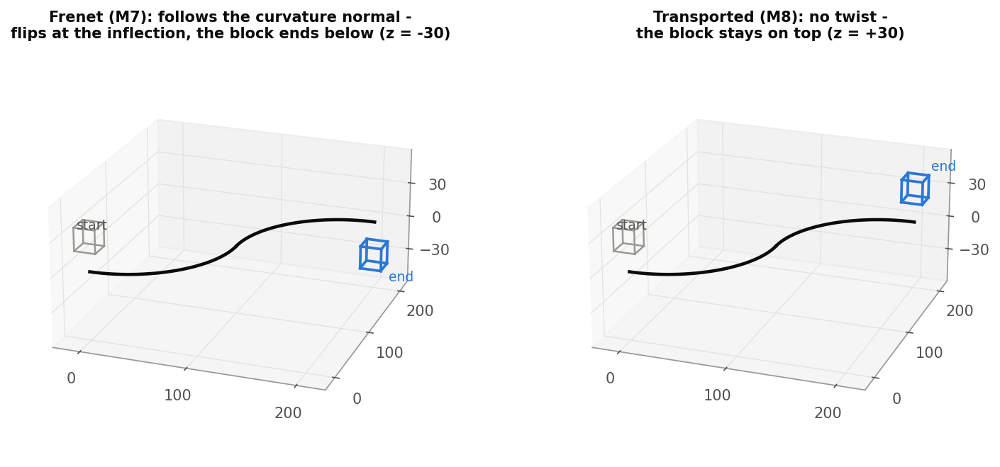
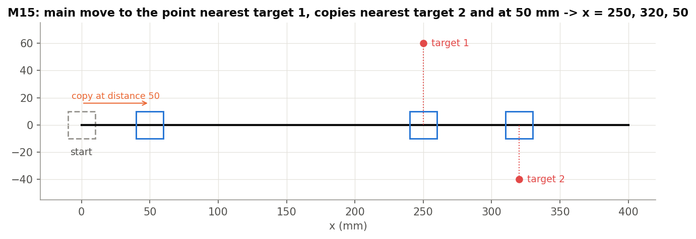
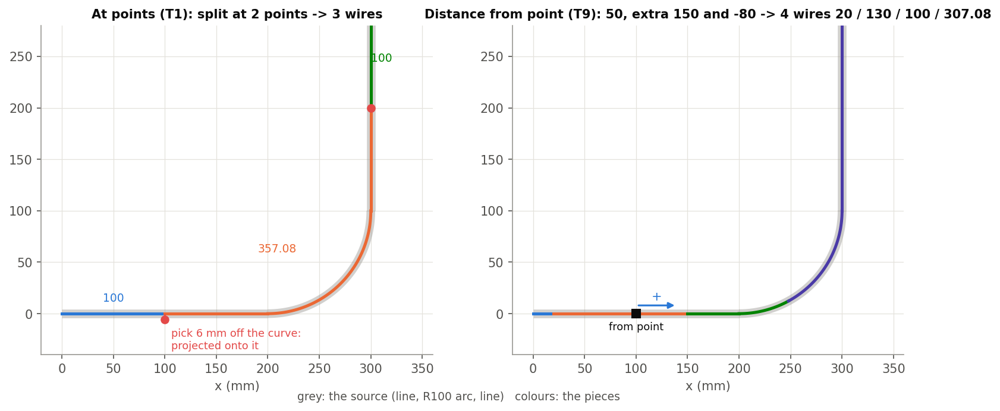

# Small tools, explained

*Move Along Edge, Trim curve + and the reference copy of Trim curve (Onshape document **smallTools**). Written
2026-09-26 against the code as it stands that day. Draft for review. Examples come from the "Move along edge tests"
studio (21 cases) and the "Trim curve + tests" studio (9 cases); all pass as of 2026-09-26.*

Figures are in `img/` (made by `img/src/figs.py` from the test studios).

---

## 1. Move Along Edge

**Move or copy things along a curve**: bodies, mate connectors, sketch edges or sketch vertices. The path is an
edge, a connected chain, or a wire. Say how far along it to go, or which target to move to the point nearest to.
Native Transform cannot follow a curve by arc length, and Curve pattern makes evenly spaced instances, not one move
to a named place.

**How it moves.**

- **Start.** The entity's reference point is projected onto the path. The reference point is the picked vertex,
  else a mate connector's origin, else the centroid.
- **End.** The start plus a signed distance along the path, or the path point nearest the target (where the target
  crosses the path, the crossing is used).
- **Past an end.** An open path is extended straight along its end tangent; a closed path wraps around.
- **Apply.** Move and rotate maps the whole frame. Translate only shifts the reference point. Rotate only applies
  the same turn about the reference point, without moving it.
- **Orientation.**
  - **Tangent only** (default).
  - **Transported (no twist)**: a rotation-minimising frame.
  - **Curve normal (Frenet)**: follows the curvature normal, so it flips at an inflection and is arbitrary on a line.

  The figure shows Frenet against transported on the same S-curve (M7 / M8).

| Parameter | Meaning |
|---|---|
| **Entities to move** | Bodies, mate connectors, sketch edges, sketch vertices. |
| **Edges or wire to move along** | The path. Its positive direction is the first selected edge's own direction. |
| **Provide Reference Point** | + **Reference Vertex**: use this point instead of the centroid. |
| **Move to** | **Distance** (+ **Distance to move**, 25 mm, signed; **Flip direction**, also via the on-screen arrow) / **Nearest point to** (+ **Target**). |
| **Apply** | Move and rotate / Translate only / Rotate only. |
| **Orientation** | Tangent only / Transported (no twist) / Curve normal (Frenet). Hidden for Translate only. |
| **Copy Bodies?** | Copy instead of move; the source stays. |
| **Naming** | N/A / New name / Prefix / Suffix, + **Name text**. |
| **Mate connectors as points** | Output a point at each connector's new position instead of moving the connector. |
| **Additional copies** | (Copy on) more copies, each at its own Distance or Nearest target, from the **same** start, each with its own naming. |

**Outputs.**

- The moved entities, or copies. Sketch edges become wires, and sketch vertices become points.
- Keys `output`, `inputs`, `initial_copy`, `copy_1` ... `copy_n`.
- A moved body keeps its identity, so downstream references survive.

**Messages.**

- Info: rotate-only on points has no effect.
- Info: mate connectors can't be named.
- Warning: source names missing; edit the feature once to refresh them.

**Examples.**

- M1: a cube moved 100 along a line.
- M2: moved 278.54 along a wire, ending on its arc at 45 deg.
- M3: copies at 100 / 50 / 150 / 250 with different naming.
- M6: a closed loop, where 900 wraps around an 800 perimeter.
- M9: flipped, moving back past the path start.
- M15 (figure): nearest to target 1, with copies nearest target 2 and at 50.
- M16: nearest to a line crossing the arc.
- M17-M19: translate only / rotate only.

**Limits.**

- Nearest ignores Flip.
- Names refresh only when the feature is edited.
- Frenet is unstable on straight paths.

## 2. Trim curve +

**Trim or split wires at exact arc-length positions.** Native Trim curve trims only up to one entity. Every wire,
including a multi-edge one, is read as one path. Each cut is a position along its total length, applied with an exact
edge split.

| Parameter | Meaning |
|---|---|
| **Operation** | **Split** (default, remembered) / **Trim**. |
| **Curves to adjust** | Wire bodies (not sketch). |
| **Cut location** | See the list below. |
| **Return single wire** | (Split) Keep one wire with more edges, split in place. Off: each piece becomes its own wire and the source is deleted, so downstream references to the source break. |
| **Keep opposite side** | (Trim) By default the end-side piece is kept. |
| **Debug** | Print the inflection solve; print the cuts. |

**Cut location.**

- **At points** (default): the **Cut points**. A pick off the curve is projected onto it; the preview draws a dashed
  line.
- **Up to entity**: where the curve meets an entity.
- **Distance from point**: a **From point** and a signed **Distance** (+ **Opposite direction**). In Split, add
  **Additional distances** and **Also split at reference point**.
- **Even division**:
  - **Between two points**: segments; this also cuts at both points.
  - **Every distance from point**: spacing and count, away from the midpoint by default.
- **At inflections**: click the red dots, or take the one nearest each end.

**Outputs.**

- `output` and `inputs`.
- `cut_1` ... `cut_n`: the vertex at each cut; two vertices per cut when split into separate wires.
- `cutVertices`, and `piece_1` ... `piece_m` (bodies, or edges when split in place).
- The variable `cutCount`.

**Preview.**

- Red dots at the cuts.
- A blue arrow for the positive direction.
- Magenta for what Trim removes.

**Errors.**

- "runs past the end of the curve" (Distance mode).
- No valid cut.
- A non-planar curve, or no inflections, in inflection mode.
- Inflection mode with more than one curve or a multi-edge wire.

**Examples (lengths in mm).**

- T1 (figure): split at 2 points, one 6 mm off the curve, gives 3 wires of 100 / 357.08 / 100.
- T2: the same split in place gives 1 wire of 5 edges.
- T3: trim at a point keeps 457.08.
- T4: split 150 from a point, also at the point, gives 100 / 150 / 307.08.
- T5 / T6: signed and opposite distances.
- T7: a mate connector as the point.
- T8: 600 from the point runs past the end, so it errors.
- T9 (figure): 50, plus extra 150 and −80, gives 4 wires of 20 / 130 / 100 / 307.08.

**Limits.**

- Trim uses only the first cut.
- Distance mode's positive direction is the path direction, but Spacing mode goes away from the midpoint by default.
- Spacing cuts past an end are dropped silently; Distance cuts past an end error.
- Up to entity uses each edge's nearest point, so an entity that never touches the curve still cuts at the nearest
  point.
- Inflection mode works on one planar single-edge curve only, and picked indices shift if the geometry changes.
- Extend mode is not built yet.

## 3. Trim curve (reference copy)

`smallTools/OS_Trim.fs` is a verbatim copy of Onshape's own **Trim curve** (Move curve boundary, PTC's MIT-licensed
source), with only the version bumped. It is there to compare against Trim curve +. **Use the native feature**, not
this copy.

Its parameters:

- Trim / Extend.
- Curves to adjust.
- Extend: Blind (+ distance) or Up to entity, then an extension shape.
- Trim: Up to entity.
- Help point, and Opposite direction.

It has a drag arrow for a blind extend. It has no icon and no tests.

---

## The code

| File | What |
|---|---|
| `smallTools/Move_Along_Edge.fs` | Move Along Edge: path, reference point, arc-length placement, frames, copies, naming. |
| `smallTools/betterCurveTrim.fs` | Trim curve +: dialog, preview, cuts, keys. |
| `smallTools/curveTrimCore.fs` | Arc-length positions, cut fractions, inflections. |
| `smallTools/OS_Trim.fs` | The reference copy of native Trim curve. |

**Tests.**

- `devtools/onshape/build_move_along_edge_tests.py` / `check_move_along_edge_tests.py`: M1-M20 + M3b.
- `build_trim_curve_plus_tests.py` / `check_trim_curve_plus_tests.py`: T1-T9.

---

## Appendix: open items

1. Move Along Edge's positive direction is the first selected edge's own direction (kept by decision 2026-09-25).
2. Trim curve +'s `cut_k` / `piece_k` keys are numbered by geometry. A decision on naming is pending.
3. The Design_Master (RD) documents pin an older smallTools version, so they need a new version and an update.
