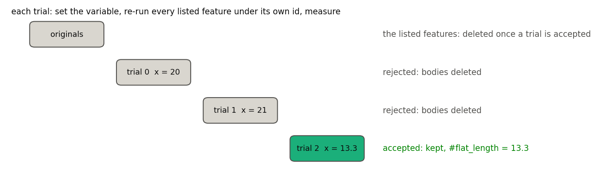
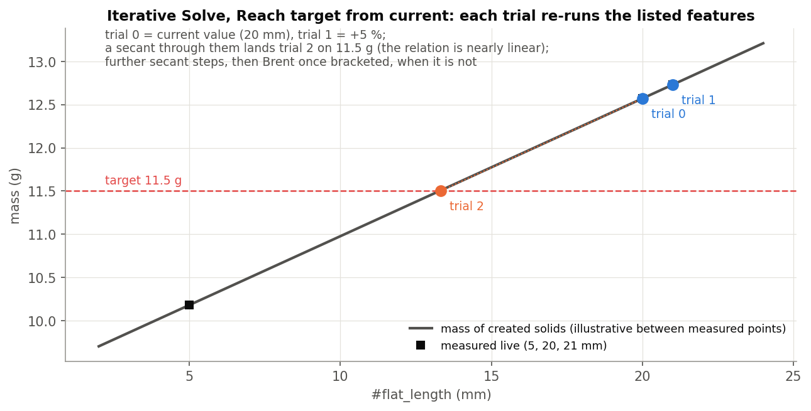

# Solvers, explained

*Iterative Solve and Part Volume (Onshape document **solvers**, now named "Stray_Weight_Concept_1" in Onshape).
Written 2026-09-26 against the code as it stands that day. Draft for review.*

1. **The idea**: find the value of one variable that makes a result hit a target, by re-running features.
2. **The features**: Iterative Solve's dialog, its methods and messages; Part Volume.
3. **The code**: files, and how it was verified.

Figures are in `img/` (made by `img/src/figs.py`).

---

# Part 1: The idea

## 1.1 Why

A design often has one number to set so that a result comes out right. For example: the flat length that makes a
stray-weight insert weigh 12 g, or the width that gives a volume. The usual trick is a Pattern with "Reapply
features" at 0 mm x N, nudging the variable each time. It is slow (about 6 % closer per pass; 10.20 g against a 10 g
target after 20 passes), and it keeps every pass's bodies.

**Iterative Solve** does it properly. It treats the listed features as a function of one variable, solves for the
value that hits the target, and keeps only the answer.

## 1.2 Trials

A **trial** is one evaluation of that function:

1. Set `#variable = x`.
2. Re-run every listed feature under its own id, as Pattern does.
3. Measure the result.

- **Rejected** trials' bodies are deleted.
- When a trial is **accepted**, its bodies stay, the listed features' original bodies are deleted, and the variable is
  set to the solution.
- If no trial succeeds, the feature errors and rolls back; the originals stay.

The solver owns the variable. If a listed feature reassigns it (a Pattern-style folder with its own update step),
the solver puts it back after that feature, with a note, so such folders work unchanged.

## 1.3 Methods

- **Reach target, starting from the current value.** It tries the current value, then the current value + the first
  step (5 %). Then it takes secant steps: x_new = x_b − r_b (x_b − x_a) / (r_b − r_a), where r = result − target. It
  switches to Brent's method once a pair of trials brackets the target. A failed trial is retried with half the step.
  In the figure, the relation is nearly linear, so trial 2 already lands on the target.
- **Reach target, both bounds.** It tries both bounds, which must bracket the target, then uses Brent.
- **First value meeting a condition.** It steps evenly from the lower to the upper bound and stops at the first value
  where the result is <, <=, > or >= the target.

If the first two trials give the same result, it stops: "the result does not depend on the iteration variable".

---

# Part 2: The features

## 2.1 Iterative Solve

| Parameter | Meaning |
|---|---|
| **Features to iterate** | The features to re-run, in tree order. |
| **Iteration variable** | The variable's name (no `#`); it must exist upstream. |
| **Variable type** | Length / Angle / Number. |
| **Lower / Upper bound** | The search range. They default to the **same** value, and the feature reports "The lower and upper bounds are equal" until you set them. |
| **Method** | Reach target, or First value meeting condition. |
| **Start from** | (Reach target) Current value of the variable (+ **First step (%)**, default 5) / Both bounds. |
| **Condition**, **Steps** | (First match) the condition and the number of steps (20). |
| **Result** | Variable (+ **Result variable**) / Mass of created solids (+ **Density**, g/cm^3) / Volume of created solids. Mass and volume can be stored under **Store result as**. |
| **Target from variables** | On: **Target variable** and **Tolerance variable**, re-read every trial. Off: a **Result type** and a typed **Target** and **Tolerance**. |
| **Max trials** | 30. |
| **Debug** | Watch variables; Feature trace (body counts per listed feature); Keep failed trial (stop at the first failure and keep it); **Run once at a value** (one probe, no search). |

Mass and volume count the trial's **solid** bodies only.

**Outputs.**

- The accepted trial's bodies.
- `#<iteration variable>` = the solution.
- The optional stored mass / volume variable.
- Info: "#x = ... after N trials; result ...". The console has one line per trial, and a table with Debug.

**Errors.**

- "The target lies beyond the lower / upper bound".
- "The bounds do not bracket the target".
- "No value between the bounds met the condition".
- "The first two trials gave exactly the same result: the result does not depend on the iteration variable".
- A trial at a bound failed.

The whole feature rolls back on any of these.

**Example (Stray_Weight).** Solve `#flat_length` so the mass of created solids hits a target. Measured live
2026-09-22: 20 mm gives 12.57 g, 21 mm 12.73 g, 5 mm 10.18 g. A 10 g target lies about 3.85 mm below a 5 mm lower
bound, so the feature reports "target lies beyond the lower bound". The Design_Master derive's 15 g and 20 g targets
converge at trial 2.

**Limits.**

- **Downstream references** made to the kept bodies point at `<solver>trial2<feature>`. They break if a later edit
  makes a different trial the accepted one. The fix, rebuilding under a fixed id, is not built.
- The kept trial also keeps construction and sketch bodies.
- Edits a listed feature makes to geometry outside the list are not undone when a trial is discarded.
- Cost: every trial re-runs the whole list.
- The length tolerance defaults to 25 mm and the angle tolerance to 0 (exact); set them.

## 2.2 Part Volume

Writes one solid's volume to a variable as a plain number in mm^3. It is typically the result variable for Iterative
Solve.

| Parameter | Meaning |
|---|---|
| **Part** | One solid. |
| **Variable Name** | The name to set (not checked; an empty name is not caught). |

The value is unitless and is also printed to the console. The feature has no description or messages.

---

# Part 3: The code

| File | What |
|---|---|
| `solvers/iterative_solve.fs` | The feature: dialog, trials, keep / discard, messages. |
| `solvers/solver_core.fs` | The methods: start-from-current secant, bracketed Brent, first match. |
| `solvers/Part_Vol.fs` | Part Volume. |

**Verified** live on 2026-09-22 (Stray_Weight, Design_Master derive). There is no test studio yet.

---

# Appendix: open items

1. There is no automated test studio for Iterative Solve.
2. The defaults are equal bounds (an error until edited, kept on purpose), a 25 mm length tolerance and a 0 deg
   angle tolerance.
3. Downstream persistent references break when the accepted trial number changes.
4. Part Volume doesn't check its variable name.
