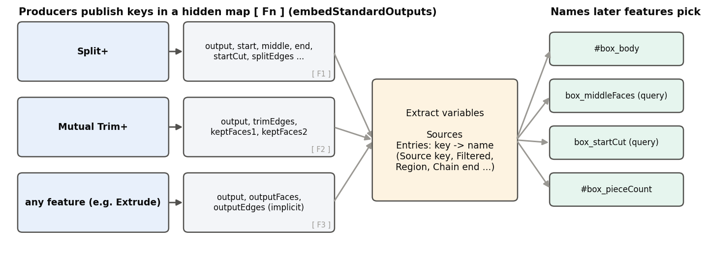
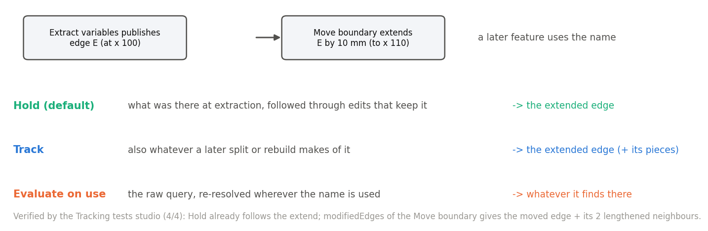

# Variable tools, explained

*Extract variables and the producer library behind it (Onshape document **Variable_tools**). Written 2026-09-25
against the code as it stands that day. Draft for review.*

1. **The idea** -- producers, the one consumer, and how a name keeps pointing at the right thing.
2. **The feature** -- Extract variables' dialog, entry types, messages.
3. **The code** -- files, versions, tests.

The appendix lists things that looked unclear. Figures are in `img/` (made by `img/src/figs.py`).

---

## Contents

- [Part 1: The idea](#part-1-the-idea)
  - [1.1 Why](#11-why)
  - [1.2 Producers and the consumer](#12-producers-and-the-consumer)
  - [1.3 Addresses: key and key@n](#13-addresses-key-and-keyn)
  - [1.4 Hold, Track, Evaluate on use](#14-hold-track-evaluate-on-use)
- [Part 2: Extract variables](#part-2-extract-variables)
- [Part 3: The code](#part-3-the-code)
- [Appendix](#appendix-unclear-or-contradictory-items)

---

# Part 1: The idea

## 1.1 Why

A variable-driven ski model needs dozens of named selections -- "the trim edge", "the middle region of the
topsheet", "the tip end of the shelf wire" -- so later features can pick them by name and keep working when the
model changes. Native **Query variable** features give one node per name, each picked by hand, and they can only
store what you can click. The tree fills with them, and anything computed (a region, a chain end, the two largest
faces) cannot be expressed at all.

**Extract variables** is one feature per block of the tree: it takes that block's features as sources and publishes
every name the block's consumers need -- ordinary `#variables` and native query variables -- in one node. It is our
port of Evan Reese's "Extract Variables" approach.

## 1.2 Producers and the consumer

- **Producers.** Our features end by publishing their results with one library call (`embedStandardOutputs`, in
  `extract_outputs.fs`): a small map stored in a hidden variable named after the feature. Every producer publishes
  the standard keys -- `output` (its result), `outputFaces`, `outputEdges`, `outputVertices`, `inputs` -- plus its own:
  Split+ its regions and cuts, Mutual Trim+ its trim edges, Clean wire its ends, and so on.
- **Any feature is a source.** A built-in (an Extrude) publishes nothing, but Extract variables still offers `output`
  and friends for it, as "what the feature created". Every source also offers `modifiedFaces` / `modifiedEdges` /
  `modifiedVertices`: what the feature changed in place -- the only way to reach what a Move boundary or Move face did.
- **The consumer.** Extract variables reads those maps and turns chosen keys into names.

A producer's keys are always present -- empty when they do not apply -- so an entry never breaks because a key
disappeared after an edit upstream.

## 1.3 Addresses: key and key@n

Sources are numbered in tree order. A key offered by one source is addressed by its bare name (`trimEdges`). A key
offered by several -- every source offers `output` -- is addressed `output@1`, `output@2`, ...; the bare name then
reports "ambiguous" and lists the choices. **Print keys** lists every address available.

## 1.4 Hold, Track, Evaluate on use

A published query can be kept three ways:

- **Hold** (default) -- the entities present when Extract variables ran, followed through later edits that keep
  them (an extend, a move). Verified: a Move boundary that extends the held edge by 10 mm -> the name gives the
  extended edge.
- **Track** -- also follows what later splits or rebuilds make of them.
- **Evaluate on use** -- the raw query, re-resolved wherever the name is used (Source key entries only). The most
  "live", and the easiest to get wrong: on RD 20FOU 28 a Ruled surface failed because the name re-resolved to
  something else downstream.

---

# Part 2: Extract variables

**Parameters.**

- **Sources** -- the features to read, any order (they are sorted by tree order).
- **Prefix** -- joined to every published name with `_` (`box` -> `#box_body`).
- **Add keys from sources** (button) -- appends one entry per address not yet listed (skipping the rarely wanted
  `outputFaces`, `outputVertices`, `inputs`, `modifiedFaces`, `modifiedVertices`).
- **Entries** -- one per published name. Each has a **Type**, a **Source key**, a **Published name** (empty = the
  address, `@` becomes `_`), **Show** (highlight it while editing, in the producer's colour), and for queries **Track**
  / **Evaluate on use**.
- **Print keys** -- list every address, with its description.
- **Manifest** -- optionally one map variable listing everything published (for API readers).

**Entry types.**

| Type | Publishes |
|---|---|
| Source key | the key as it is |
| Filtered | the key filtered by entity type, body type, owner name, and optionally only the largest N (by length / area / volume) |
| Closest to point | the entity of the key nearest a point (vertex or mate connector) |
| Shared edges | edges common to two keys (e.g. where two regions meet) |
| Chain end | the nearest or farthest free end of a chain, as a vertex, edge, or both |
| Edges between points | the edges of a chain between two points (the shorter way round a closed chain, or the other way) |
| Bridging curve input | the nearest chain end as edge + vertex in one query (for a bridging curve) |
| Region | faces flood-filled from the face nearest a point, bounded by a second key's edges; faces, boundary edges, or both |

Composed types (everything but Source key) are always held, never evaluated on use.

**Messages.** One notice per regeneration:

| Message | Meaning |
|---|---|
| Info "Published N name(s)." | Normal. Names that resolve to nothing are still published, and listed ("empty at this point in the tree: ..."). |
| Info "Nothing published yet: press Add keys..." | A new feature. |
| Warning "Entry k (key): reason." | That entry was not published: unknown or ambiguous key (the choices are listed), a value where geometry was expected, a missing point, a closed chain with no end, edges that are not one chain ... |
| Error (a name used twice) | Two entries publish the same name. |

**Example** (Variable_tools "Examples" studio, *Extract variables: box bands*). Sources: the Box and a split of
its faces into bands. Prefix `box`; entries publish the body (`output@1`), the two largest faces (Filtered, keep 2),
the edges at a corner (Closest to point), shared edges, two regions and a manifest -- "Published 6 name(s)". With
Show on, the published body and the band cuts are highlighted in the view.

**Tests** (Tracking tests studio, 4/4): held edge follows a 10 mm Move boundary extend; tracked edge is exactly
the moved edge; `modifiedEdges` of the Move boundary gives the moved edge and its 2 lengthened neighbours; a Ruled
surface on the tracked edge regenerates. Region tests (6/6, `variable_tools_tests`): a split cube's bounded faces,
boundary, both, the whole patch, and the error without a point.

---

# Part 3: The code

| File (tab) | What |
|---|---|
| `variable_tools/extract_outputs.fs` | The producer library: `embedStandardOutputs`, `extractableVariable`, `extractableQuery`, `optionalVariable`. The ONE tab producers in any document import, by Variable_tools version. |
| `extract_variables_utils.fs` | The consumer: `readSources`, addresses (`lookupKey`), `resolveEntry` and the composed types (`filteredEntities`, `chainEnd`, `edgesBetween`, `regionAround`), publishing (Hold / Track / Evaluate on use). |
| `extract_variables.fs` | The feature: dialog, Add keys editing logic, notices. |

Versions: V1 (producers pin its `extract_outputs`), V2 (Region entry, Track, modified* keys, Show). Producers
built against V1 need no re-pin: `extract_outputs` has not changed since.

Which features publish (and their keys): see each family's explainer -- Reference-side 2.5, Curve tools 2.6.

---

# Appendix: unclear or contradictory items

1. **`variable_tools/extract_variables_schema.md` is stale**: it still names the old driven_offset files, lists the
   2026-09-23 producers, and does not mention Track or the modified* keys.
2. **"7 entry types"** in older notes: there are 8 (Region was added 2026-09-24).
3. **"Body name contains"** (Filtered) reads part names during regeneration, which correction 36 says can fail; no
   test covers it.
4. **Adding a source can break existing entries**: every source offers `output`, so a second source turns the bare
   `output` into `output@1` / `output@2`, and entries using the bare name warn "ambiguous".
