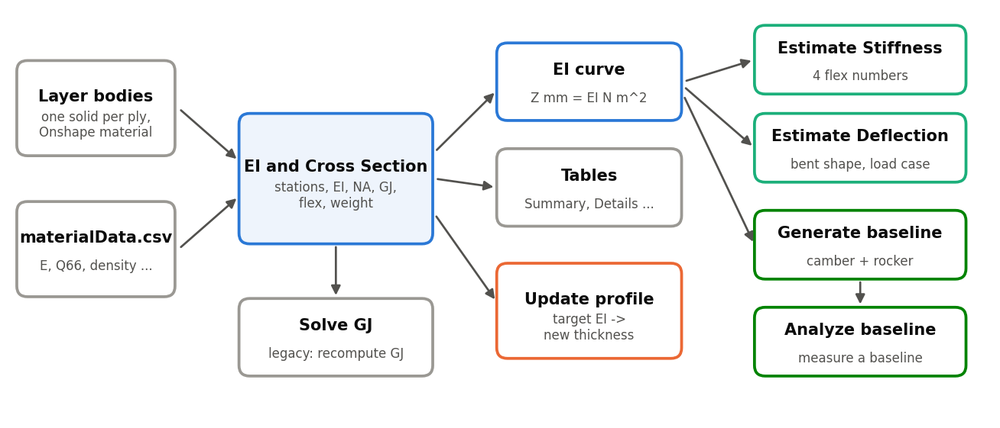
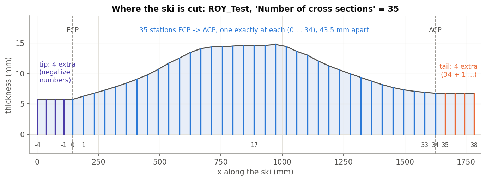
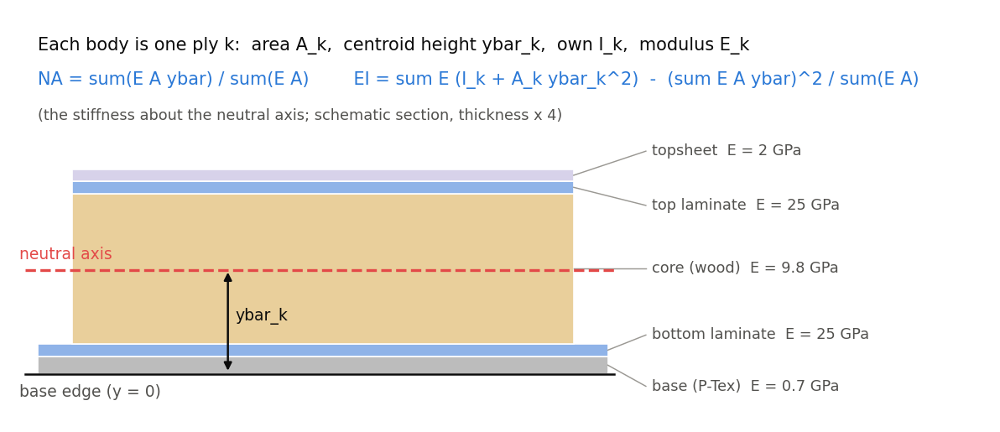
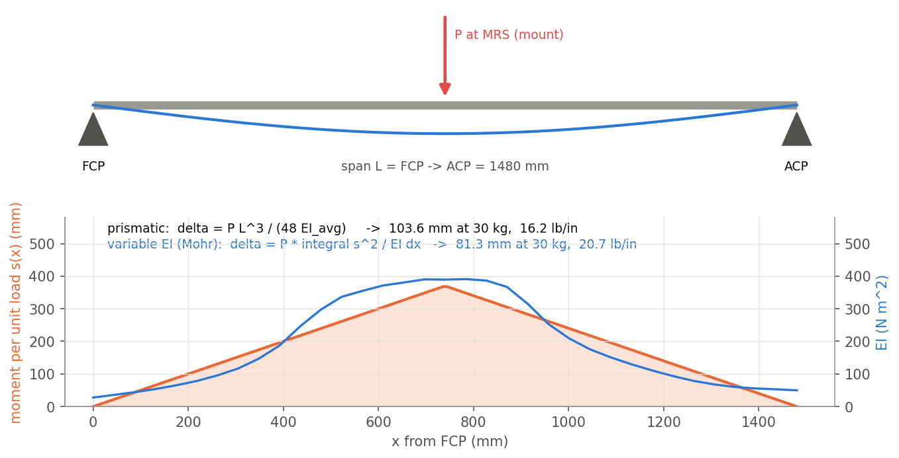
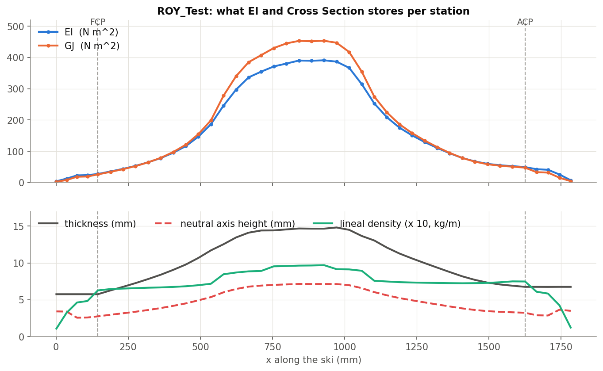
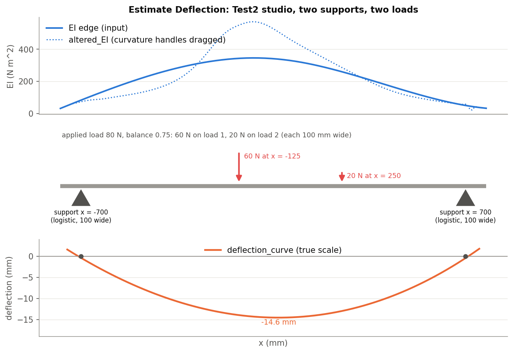
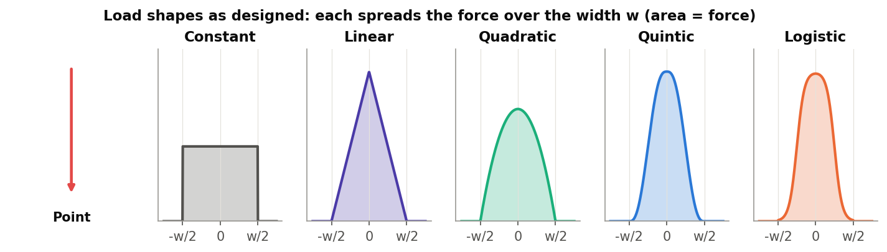
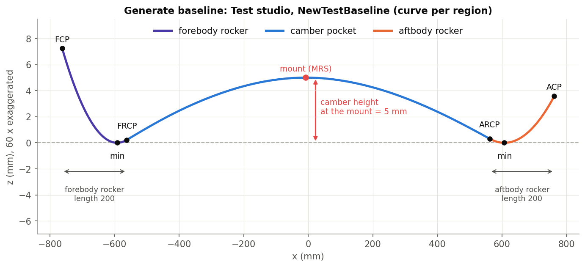
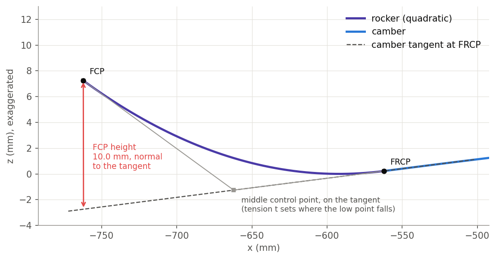
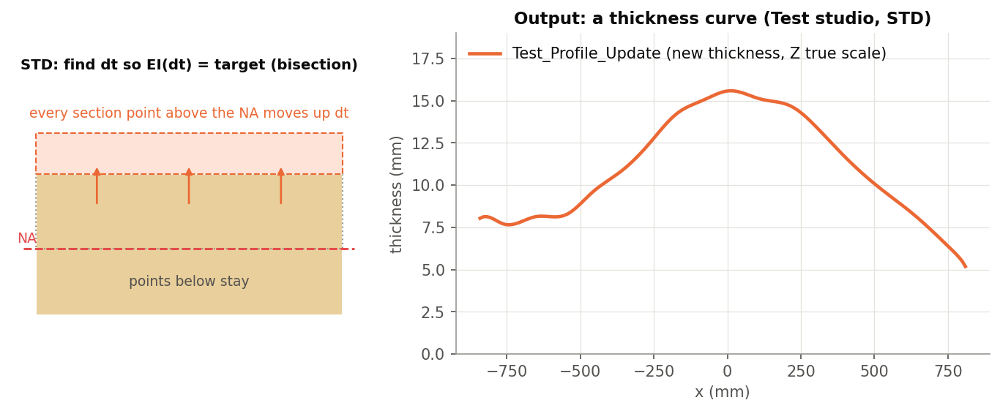

# xSection, explained

*EI and Cross Section, Solve GJ, Generate baseline, Analyze baseline, Estimate Stiffness, Estimate Deflection and
Update profile (Onshape document **xSection**, "Stiffness Tools"). Written 2026-09-25 against the code as it stands
that day. Draft for review. Numbers come from the document's own studios: ROY_Test, Test, Test2 and xSection tests.*

1. **The idea**: turn a CAD layup into a stiffness profile, then use that profile.
2. **The features**: what each one does, its dialog, and an example.
3. **The code**: files and tests.

The appendix lists bugs and unclear items. Figures are in `img/` (made by `img/src/figs.py` from data read out of
the document).

---

## Contents

- [Part 1: The idea](#part-1-the-idea)
  - [1.1 From layup to EI](#11-from-layup-to-ei)
  - [1.2 The EI curve is the interchange format](#12-the-ei-curve-is-the-interchange-format)
  - [1.3 Stations](#13-stations)
  - [1.4 EI of a laminate](#14-ei-of-a-laminate)
  - [1.5 GJ](#15-gj)
  - [1.6 Flex numbers](#16-flex-numbers)
- [Part 2: The features](#part-2-the-features)
  - [2.1 EI and Cross Section](#21-ei-and-cross-section)
  - [2.2 Solve GJ (legacy)](#22-solve-gj-legacy)
  - [2.3 Estimate Stiffness](#23-estimate-stiffness)
  - [2.4 Estimate Deflection](#24-estimate-deflection)
  - [2.5 Generate baseline](#25-generate-baseline)
  - [2.6 Analyze baseline](#26-analyze-baseline)
  - [2.7 Update profile](#27-update-profile)
- [Part 3: The code](#part-3-the-code)
- [Appendix](#appendix-bugs-and-unclear-items)

---

# Part 1: The idea

## 1.1 From layup to EI

A ski is modelled as a **layup**: one solid per layer (base, edges, laminates, core, topsheet...), each with an
Onshape material. **EI and Cross Section** cuts that layup at stations along the ski and, with each material's
modulus from a CSV table, computes at every station the bending stiffness **EI**, the torsional stiffness **GJ**, the
neutral axis, the width and thickness, and the mass per length. From those come the ski's **flex numbers** and weight.

The other features use the result:

- **Estimate Stiffness** gives the four flex numbers for any EI curve (yours, a target, a competitor's).
- **Estimate Deflection** bends the ski under a load case.
- **Generate baseline** designs the unweighted side profile (camber and rocker). It can shape the camber pocket
  from the ski's own EI.
- **Analyze baseline** measures a side profile.
- **Update profile** works backwards: from a target EI it proposes a new thickness profile.

## 1.2 The EI curve is the interchange format

Every feature after EI and Cross Section reads EI from an **edge**, not from stored data. The curve lies in the XZ
plane with x along the ski and **world Z in millimetres = EI in N m^2**. A 390 N m^2 station sits 390 mm up. So a
measured EI curve, a target drawn in a sketch, or another ski's curve all plug into the same input.

EI and Cross Section writes several such curves: `<name>_EI`, `_GJ` (Z mm = N m^2), `_neutralAxis`,
`_linealDensity` (1 kg/m = 100 mm) and `_profileHeight` (the thickness, true scale).

**Conventions.**

- The ski runs along world **+X**.
- FCP / ACP (front / aft contact points) and the mount point count only by their X.
- A planar face given as FCP or ACP must face along X.

## 1.3 Stations

With FCP and ACP given, **Number of cross sections** stations are spaced evenly from FCP to ACP, one exactly at each.
The tip and tail get up to 4 extra stations each at about the same spacing, and the outermost are pulled in slightly
so the plane still cuts material. Stations are numbered 0 at FCP; the tip gets negative numbers and the tail
continues past the ACP. Without FCP and ACP, the stations are spread evenly along the whole path.

Each body is cut by all the planes in one intersection. The outlines are cleaned (duplicate edges removed, micron
gaps closed), triangulated, and their area, centroid and second moment are integrated from the outline.

## 1.4 EI of a laminate

Each body is one ply with area A, centroid height ybar above the base edge, its own second moment I, and modulus E.
The neutral axis is the E-weighted centroid; EI is the stiffness about it:

    NA = sum(E A ybar) / sum(E A)
    EI = sum E (I + A ybar^2) - (sum E A ybar)^2 / sum(E A)

E is each body's **Young's modulus along the ski** (E_x). Plate theory's Q11 would overstate a narrow ski by
1 / (1 - nu12 nu21): about 12 % for wood and Titanal, and far more for +-45 fabrics. The full A/B/D laminate matrices
are still assembled and stored, but EI does not use them.

*Check.* A 100 x 10 mm isotropic bar with E = 10 GPa gives E b h^3 / 12 = **83.3 N m^2**. The xSection tests studio
checks cases like this against their analytic values.

## 1.5 GJ

GJ uses thin-plate Saint-Venant torsion over the triangulated section: GJ = 4 sum G Iz, where Iz is each triangle's
second moment through the thickness about the G-weighted centroid. G is each body's **Q66** (an isotropic override
uses E / 2.66). The formula is exact for a wide flat section (b/t >> 1) and about 10 % off at b/t ~ 7.

GJ is computed inside EI and Cross Section. The **Solve GJ** feature is redundant (2.2).

## 1.6 Flex numbers

The ski is treated as simply supported at FCP and ACP, with a point load at the mount (MRS). Two ways:

- **Prismatic:** delta = P L^3 / (48 EI_avg), where EI_avg is the average EI over the span.
- **Variable EI (Mohr):** delta = P * integral s(x)^2 / EI(x) dx, where s(x) is the moment per unit load.

Each is reported two ways: the load in lb for 1 inch of deflection ("lb/in"), and the deflection in mm under 30 kg.
On ROY_Test (L = 1480 mm, EI_avg = 191.8 N m^2):

- prismatic: **16.2 lb/in, 103.6 mm**;
- variable EI: **20.7 lb/in, 81.3 mm**.

The stiff middle carries most of the moment, so the variable-EI ski is stiffer than its average suggests.

---

# Part 2: The features

## 2.1 EI and Cross Section

**Parameters.**

| Parameter | Meaning |
|---|---|
| **Wire to cross section along** | One wire body along the ski; X must increase along it. |
| **Analysis name** | Prefix for the output curves (`<name>_EI` ...). |
| **FCP / ACP** | Vertex, planar face or mate connector. Optional, but the flex numbers and the station layout need both. |
| **Cross section bodies** | The layer solids (composites are unpacked). |
| **Material library** | The `materialData.csv` table: name, density, E, nu, Q11...Q66 (GPa). |
| **Refresh CSV data** | Button: re-read the table. |
| **Number of cross sections** | 3-200 (default 50). With FCP / ACP, this many from FCP to ACP. |
| **Bodies & Materials** | One row per body, filled in automatically. The Onshape material name must match a CSV name **exactly** (case and spaces). If it doesn't: Ignore (geometry only, no stiffness or mass), or Provide material data (isotropic E, or orthotropic E1, E2, G12, nu12; density). |
| **Output Options** | Create composites (one composite of the section wires per station; slowest step, on by default). Language (English / Deutsch). Material table. Body detail table (Basic / EI only / Geometry only / Full). |
| **Debug** | Draw edges, points or the mesh of chosen stations and bodies; print bodies and triangles. |

**Outputs.**

- The five curves listed in 1.2.
- An attribute `CrossSectionAnalysis` on the origin, holding everything per station: x, EI, GJ, neutral axis, width
  and thickness, lineal density, A/B/D, and the mesh. It also holds the beam summary. The Cross-Section Analysis
  table reads it: Summary (4 flex numbers + weight), Details (per station), and optionally Materials and Body
  Detail.

**Messages.**

- Info "Repaired N body section outline(s)..." when the cut left duplicate edges or micron gaps that were fixed.
- **Warning** when a body section between FCP and ACP could not be closed or has no area: EI is low there.

**Example (ROY_Test, 35 stations).** EI peaks at 390 N m^2 under the foot and falls to about 50 at the contact
points. GJ follows it (453 peak). The neutral axis sits at about half the thickness (7.1 of 14.7 mm at the centre).
The summary is 20.7 lb/in (variable EI).

## 2.2 Solve GJ (legacy)

Recomputes GJ for an existing EI and Cross Section feature and writes it back to the stored data and the table.
Its one parameter is **Cross section feature**. EI and Cross Section already computes GJ with the same solver, so
this feature changes nothing on a current model. It is kept for old documents.

Fixed 2026-09-25:

- The recomputed values were written to a copy and lost; they are now stored.
- An empty selection now gives the error "Select the cross section feature."
- Errors are no longer swallowed.

Test: SG1 in xSection tests stores GJ 125.31.

## 2.3 Estimate Stiffness

The four flex numbers for any EI curve. Parameters: **EI Edges**, **FCP**, **ACP**, then the read-only
**Stiffness estimates** (Prismatic lb/in, Prismatic mm/30 kg, Estimated lb/in, Estimated mm/30 kg), and
**Recalculate**.

Everything happens in the dialog when you press Recalculate: the numbers are not updated when the geometry changes.
If FCP is not before ACP in X, nothing is computed and no message is shown. The feature itself builds nothing.

## 2.4 Estimate Deflection

A free-beam load-case solver. It takes an EI curve, up to 3 supports and 2 applied loads, each spread over a width
with a chosen shape. Optionally it adds a binding-plate stiffness and a mounting moment. It computes the deflected
shape.

**Model.**

1. Support reactions come from moment balance. A third support takes a fixed share of the load ("support load
   balance").
2. Distributed loads integrate to their force.
3. Shear and moment are integrated along the ski.
4. Curvature = M / EI (plus the plate EI where given).
5. Curvature is integrated twice, with the deflection set to zero at supports 1 and 2.

**Parameters.**

| Parameter | Meaning |
|---|---|
| **EI Edges** | The EI curve. |
| **Number of evaluation points** | 20-500 (100); also the EI samples per edge. |
| **Show shear/moment diagrams** | Draw V and M. |
| **Alter deformed beam curvature** | Drag curvature handles; outputs the EI that would give that shape (`altered_EI`). |
| **Add plate/mounting conditions?** | Plate stiffness (an EI-format edge added over its X range), reaction moment (N m, positive only) and its x. |
| **Applied load data** | Applied load 3-600 N (80). Balance (share on load 1 when there are two). Each load: location (query or x), shape, width. |
| **Support load data** | Supports 1, 2 (optional 3), each: location, shape, width. |
| **Output Options** | Output span (full EI / support span); curve Fit or Approximate. |

**Load shapes** (as designed): Point, Constant, Linear, Quadratic, Quintic (smooth bump), Logistic.

**Bug:** every distributed shape is currently computed as **Logistic**. The shape function compares the enum to
strings ("CONSTANT"...), which is never true in FeatureScript, so it falls through to Logistic. Point loads are not
affected. See the appendix.

**Output.** `deflection_curve`, with Z = deflection at true scale; optionally `altered_EI`.

**Errors.**

- fewer than 2 EI samples;
- all EI zero;
- supports 1 and 2 at the same x;
- zero span.

**Example (Test2).**

- EI: `eiTarget`.
- Supports at x = -700 and 700 (logistic, 100 wide).
- 80 N split 0.75 / 0.25: 60 N at x = -125, 20 N at x = 250.
- Result: **14.6 mm** of deflection near the middle.

## 2.5 Generate baseline

Builds the unweighted side profile: a **camber pocket** between the rocker contact points, plus fore and aft
**rockers** out to FCP and ACP.

- **FRCP / ARCP** (fore / aft rocker contact points) sit the rocker length in from FCP / ACP toward the mount.
- **Camber pocket.** It is pinned at FRCP and ARCP.
  - With **Use EI profile**, its shape is the real bending shape of the ski: a simply supported beam with a point
    load at the mount, curvature M / EI integrated twice, scaled so the height at the mount is the target.
  - Without, it is a cubic with its peak at the mount (a parabola when the mount is centred).
- **Rocker.** A quadratic that leaves FRCP tangent to the camber and ends at FCP, **FCP height** below the camber
  tangent line, measured normal to that line.
  - Its middle control point lies on the tangent. Its position ("tension") sets where the rocker's low point falls.
  - With **Spec forebody minimum**, you give the low point's distance from FRCP and the tension is solved. If that
    distance can't be reached it is clamped, with an info message.

- **Levelling.** The profile is rotated about the mount so both rocker low points have the same Z. The camber height
  is then re-measured and corrected, up to 20 passes to within 0.001 mm.

**Parameters.**

| Parameter | Meaning |
|---|---|
| **Output type** | Curve per region (camber, fore and aft rocker as three edges of one wire) or Single curve. |
| **Output curve name** | Default "Baseline". |
| **FCP / ACP / Mount / load point** | Vertex, planar face or mate connector (X only). The mount must lie between FCP and ACP. |
| **Baseline targets** | Camber height MCH (0-15 mm), fore / aft rocker length (0 = none), Spec fore / aft minimum (+ distance), FCP height, ACP height (0-35 mm). |
| **Use EI profile** | + EI profile edges: camber shaped by the ski's EI. |
| **Spline output** | Approximation tolerance, maximum control points, degree. |
| **Add baseline sketch** | The measurement sketch Analyze baseline would draw. |
| **Create weighted baseline** | A second wire "Baseline (Weighted)": camber flattened to a straight line, rockers rotated rigidly with it. |

**Example (Test studio, NewTestBaseline).**

- Inputs: camber 5 mm, rockers 200 / 200 mm, FCP height 10, ACP height 6, Use EI profile on.
- Result: three edges. The camber reaches exactly 5.0 mm at the mount (x = 0).
- The tips end 7.2 mm and 3.6 mm above the low points: the FCP height is measured from the tangent, not from Z = 0.

**Camber height.** Generate baseline measures it **at the mount**. Analyze baseline reports the **largest
perpendicular distance** to the line between the rocker low points. With the mount off centre the two differ.

## 2.6 Analyze baseline

Measures an existing side profile, for example to compare a physical ski with its design targets.

**Parameters.**

- **Baseline edges** (a tangent chain) and **FCP / ACP**.
- The read-only **Calculated data**:
  - forebody / aftbody minimum and the max camber point;
  - camber height;
  - FRCP and its length and tangent line, and FCPH;
  - ARCP and its length and tangent line, and ACPH.
- **Output measurement sketch** and **Recalculate**.

**Method.**

1. Sample the chain.
2. Find the lowest point in each half.
3. Camber = the largest perpendicular distance from the line between those minima.
4. FRCP / ARCP = the lowest inflection in each half.
5. FCPH / ACPH = the perpendicular distance from the tip to the tangent line at FRCP / ARCP.

The optional sketch on the XZ plane draws the chords, tangent lines and normals.

**Caveats.**

- The values are computed in the dialog only, so they don't update with the geometry until you edit the feature.
- The feature name is misspelled "Analze baseline".
- On Test2, the dialog did not open within 2 minutes for these screenshots, so its deck has no dialog capture.

## 2.7 Update profile

Inverse design: from an EI and Cross Section model and a **target EI** curve, propose a new thickness curve.

**Solver types.**

- **STD** uses the full section model. At each station every section point **above the original neutral axis** moves
  up by dt; points below stay. EI is recomputed from the stored mesh, and dt is found by bisection (2 mm minimum
  thickness up to double the current). Scale delta can apply only part of the change:
  target = measured + scale x (target - measured).
- **DELTA** fits a power law EI / width = alpha t^beta over all stations (log-log regression). It then solves for the
  thickness that gives the new EI.
- **PERCENT** scales thickness by the EI ratio: t_new = (EI_target / EI_measured x t_old^beta)^(1/beta).

In every mode, a new thickness outside 0.1-200 mm is reset to the old one.

**Parameters.**

- Solver type.
- Output curve name.
- Cross section feature.
- Target EI profile.
- Measured EI from: Inherit (the model) or Query (edges).
- Measured thickness from.
- Scale delta / Delta scale factor.
- FCP / ACP: read-only stiffness estimates of the target.
- Alpha / Beta (read-only).
- Spline Output: Fit / Approximate.

**Outputs.**

- A thickness wire (Z = thickness, true scale).
- An attribute `profileUpdates`, which the Profile Updates table shows with dt and dEI columns.

**Caveats.**

- STD assumes all added thickness goes **above** the neutral axis (the core or topsheet grows).
- The target EI is read with only 11 samples per edge.
- Stations outside the target's X range are skipped.
- Tip and tail stations count in the DELTA fit.

---

# Part 3: The code

| File | What |
|---|---|
| `features/xSect.fs` | EI and Cross Section: stations, cut, properties, GJ, flex, curves, storage. |
| `core/xSectUtils.fs`, `core/xSectReferencePoints.fs` | Station layout; FCP / ACP / mount to X. |
| `section/xSectProcessing.fs`, `section/xSect_Triangulation.fs` | Batch cut, outline repair, triangulation, section properties. |
| `materials/xSectCLT.fs` | Materials, E-based EI and neutral axis (and the unused A/B/D). |
| `section/xSect_GJ.fs`, `section/gjAnalysis.fs`, `section/gjDataAccess.fs` | GJ; Solve GJ's recompute and write-back. |
| `beam/xSectBeamAnalysis.fs` | Flex numbers (prismatic, Mohr); EI-edge decoding. |
| `core/xSectStorage.fs`, `section/xSectVisualization.fs` | The stored attribute and table data; the output curves. |
| `features/generateBaseline.fs`, `beam/generateBaselineSolver.fs`, `beam/baselineCore.fs` | Generate baseline. |
| `beam/analyzeBaseline.fs` | Analyze baseline. |
| `features/estimateDeflection.fs`, `beam/estimateDeflectionSolver.fs` | Estimate Deflection. |
| `features/estimateStiffness.fs` | Estimate Stiffness. |
| `features/updateProfile.fs`, `tables/profileUpdatesTable.fs` | Update profile. |
| `features/GJ_Feature.fs` | Solve GJ. |
| `tables/xSectionAnalysisTable.fs` | Cross-Section Analysis tables (every EI feature in the document). |

**Tests.**

- `devtools/onshape/build_xsection_tests.py` / `check_xsection_tests.py` build and check the "xSection tests" studio:
  analytic EI, neutral axis and GJ for rectangles, holes and a circle, isotropic and orthotropic.
- `build_solve_gj_test.py` adds SG1.
- There are no tests for the baseline, deflection, stiffness or profile features.

**Icons.** EI and Cross Section, Generate baseline and Solve GJ have icons. The other four have deck-only drafts in
`docs/decks/_icons/`, not installed.

---

# Appendix: bugs and unclear items

1. **Estimate Deflection load shapes (bug).** `loadIntensityAt` (beam/estimateDeflectionSolver.fs:197) compares the
   shape with strings (`shape == "CONSTANT"`). Callers pass `LoadType` enum values, and in FeatureScript an enum
   never equals its name string (checked 2026-09-25: `BodyType.WIRE == "WIRE"` is false). So every distributed load
   uses the Logistic profile. Fix: compare with `LoadType.CONSTANT`... Not changed (docs-only session).
2. **Test2 "Generate baseline 1"** ("Testing!") regenerates OK, but no wire of that name exists in the studio. Not
   investigated.
3. **File headers are stale.** xSectCLT.fs still says Q11, and says GJ moved to a separate feature.
   generateBaseline.fs describes an outer bisection. The solver header lists functions that no longer exist.
4. **Stored bounding box**: `width` is the thickness and `height` is the width (xSectStorage.fs).
5. **Inert inputs**: Update profile's Measured thickness edges and its Recalculate button; the unused
   AlterMeshingPredicate.
6. **Materials**: wood cores (Aspen, Poplar) are isotropic placeholders in the CSV, so their GJ is overstated.
   Matching is exact-string.
7. **Estimate Deflection**: the deflection is zero only at supports 1 and 2, not at support 3. The reaction moment
   cannot be negative.
8. **Estimate Stiffness / Analyze baseline**: the values live in the dialog and go stale when the geometry changes.
