# Unwrap, explained

*A living explainer for the Unwrap feature family (`unwrap.fs`, `undrape_utils.fs`, `unwrap_part.fs`, and the
chart in `edge_offset_utils.fs`). Written 2026-09-25 against the code as it stands that day. Revise freely.*

The document runs in three passes, each building on the one before:

1. **Concepts**: what is geometrically going on, with pictures. No code.
2. **Our feature**: the three modes, what every parameter means physically, how to read the checks,
   what the test studios show, what is still open, and the two questions you asked.
3. **The codebase**: files, call graph, data structures, import pins, how to test, where the notes are.

The appendix lists things in the code and notes that I found unclear or contradictory.

Figures are PNGs in `img/`. The scripts that make them are in `img/src/`, and most of them use real
geometry read from the test studio. See section 3.8 for how to regenerate them.

---

## Contents

- [Part 1: Concepts](#part-1-concepts)
  - [1.1 Developable surfaces](#11-developable-surfaces-what-can-be-flattened-without-stretching)
  - [1.2 The chart](#12-the-chart-coordinates-that-make-unwrapping-a-bookkeeping-exercise)
  - [1.3 Which length is kept: s - d*theta](#13-which-length-is-kept-s---dtheta)
  - [1.4 Why a bent plate keeps its length at mid-thickness](#14-why-a-bent-plate-keeps-its-length-at-mid-thickness)
  - [1.5 Handedness](#15-handedness-why-y---v)
  - [1.6 Undrape](#16-undrape-a-plate-draped-over-something-that-is-not-developable)
  - [1.7 Unwrapping a solid](#17-unwrapping-a-solid)
  - [1.8 Recognising lines and arcs](#18-recognising-lines-and-arcs-with-a-continuity-gate)
  - [1.9 Adaptive vs fixed sampling](#19-adaptive-vs-fixed-sampling)
  - [1.10 The 0.01 mm budget](#110-tolerances-and-the-001-mm-budget)
- [Part 2: Our feature](#part-2-our-feature)
- [Part 3: The codebase](#part-3-the-codebase)
- [Appendix: unclear or contradictory items](#appendix-unclear-or-contradictory-items-found-while-writing-this)

---

# Part 1: Concepts

## 1.1 Developable surfaces: what can be flattened without stretching

A surface can be laid flat with no stretch, tear or overlap only when its **Gaussian curvature is zero
everywhere**. That means that at every point it curves in at most one direction. These are the *developable*
surfaces: planes, cylinders (any cross-section, not only circles), cones, and tangent-developables.
A sphere or a saddle cannot be flattened without deformation, which is why no map of the earth is right.

The one developable surface we care about is the simplest: **a planar curve swept straight along its
plane's normal**. For a ski, take the side profile in the XZ plane (the "reference" W) and sweep it along
Y. The result is a generalised cylinder. Bending a flat sheet around it is exactly how the flat laminate
takes on its camber and rocker, so unwrapping it is exact.

Everything in Unwrap is built on that one surface. What changes from mode to mode is **how far the real
part is from it**:

| Situation | Is the flat result exact? |
|---|---|
| A point on the swept surface | Yes: an isometry. |
| A point off the surface (height h), part moved as a solid | Yes, but only one height keeps its length (1.3, 1.4). |
| A plate that also curves ACROSS the reference plane (a topsheet draped down the sides) | No: the plate itself is not developable along W. Flattening it is a deformation. We measure the deformation and report it (1.6). |

## 1.2 The chart: coordinates that make unwrapping a bookkeeping exercise

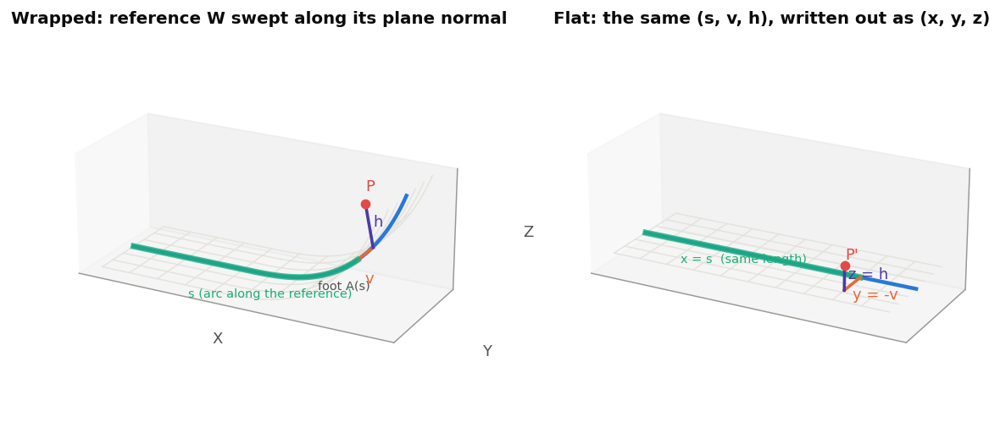

For any point P near the reference, drop a perpendicular onto the swept surface. The foot is A(s), the point
of W at arc length **s** (measured from the alignment point) shifted sideways by **v** along W's plane normal
`pn`. The distance off the surface along the surface normal N = pn x t is the height **h**:

    P = A(s) + v * pn + h * N(s)

Because the swept surface has zero Gaussian curvature, (s, v) is a **flat chart** on it. Distances measured
in s and v are true distances on the surface, and a straight line in (s, v) is a geodesic. Unwrapping is
then just writing the same three numbers out in the flat frame:

    x = s - d * theta(s)     (d = preserve-length offset, 1.3; x = s when d = 0)
    y = -v                   (the sign is explained in 1.5)
    z = h

and placing (x, y, z) in the unwrapped origin's frame, with the alignment point at the origin.

Finding the foot is a small Newton iteration on "P - A(s) is perpendicular to the tangent t(s)". Its slope is
`scale - kappa * h`, where kappa is W's curvature and `scale = 1 - kappa * d` (edge_offset_utils.fs
`chartFoot`). The slope goes to zero when h reaches the radius of curvature. **A point past W's centre of
curvature has no unique foot**, so the feature refuses it ("a point on it lies past the reference's centre
of curvature"). For ski geometry (R >= 230 mm at the tightest tip, parts within ~70 mm of W) this never
comes close.

The as-built chart also imposes three rules on the reference, each with a clear error message:

- **One tangent chain.** Joints are allowed at most 1 deg (`UNWRAP_REFERENCE_JOINT`, because real profiles
  carry 0.4 deg modelling creases). A corner's turn never enters theta, and points in the corner's wedge have
  two feet or none.
- **X rises steadily along it** (`checkedChart`). The foot search is seeded from the point's world X, so a
  reference that turns back, or runs vertical, is refused.
- **The alignment point's X lies within the reference's X span.** Its X seeds the chart's zero.

## 1.3 Which length is kept: s - d*theta

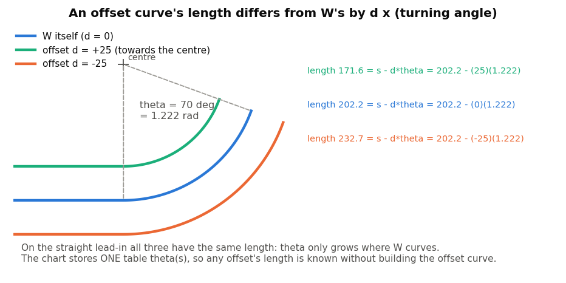

A curve offset by a constant distance d from W (towards the centre of curvature counts positive) is shorter
where W bends towards it and longer where W bends away. Exactly:

    length along the offset  =  s - d * theta(s)

Here theta(s) is W's **cumulative turning angle** (the integral of signed curvature). Two consequences carry
the whole design:

- **Only one curve keeps its length.** The chart maps arc length along *one* chosen curve (W offset by d) to
  flat X. Every other height is stretched or compressed in the flat by the factor
  `(1 - kappa*d) / (1 - kappa*h)`. The volume check in section 2.3 is this factor, averaged over the part.
- **One table serves every offset.** theta does not depend on d, so the chart stores theta(s) once and never
  builds an offset curve (`buildAlongReference`). On a straight span theta is constant, so all offsets have
  the same length there. That is why straight spans unwrap rigidly (1.7).

Scale on our test ski: REF_WIRE turns about 0.64 rad through the tip. 4802 (core tip extension) sits 1.8 to
5.8 mm above REF_WIRE, so its flat length changes by about 0.59 mm for every mm of d (see fig14 in 2.6).

## 1.4 Why a bent plate keeps its length at mid-thickness

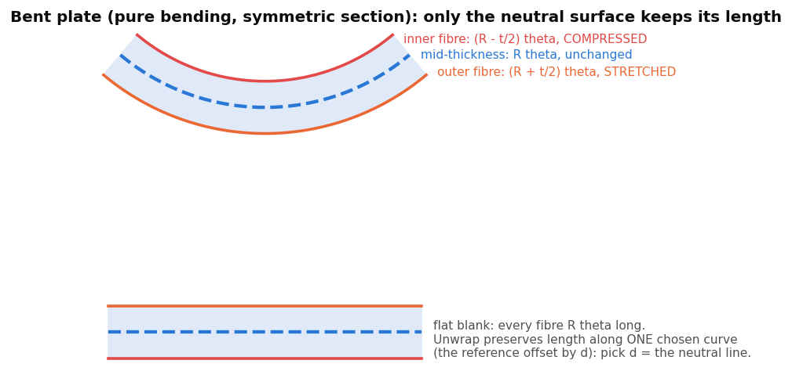

Bend a flat plate of thickness t to radius R. The outer fibre stretches to (R + t/2) theta, the inner one
compresses to (R - t/2) theta, and for a section symmetric through its thickness the **mid-thickness
(neutral) surface keeps its length**. Run backwards, the correct flat blank of a bent part is the one that
keeps its **neutral** line's length. In chart terms, that means choosing d = the neutral line's height above
W.

For a single-material plate the neutral surface is the mid-surface. For a laminate or a core it is the
stiffness-weighted neutral axis, which sits nearer the stiff layers. The code works with a *constant* d or a
plate's own *mid*-surface. A variable "neutral line" for solids is not built yet (2.6 (b)).

## 1.5 Handedness: why y = -v

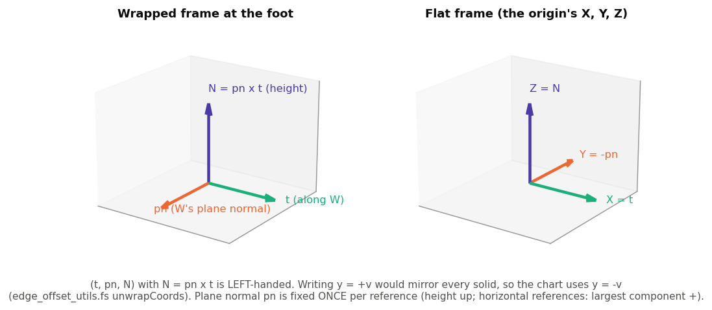

The chart's frame at a foot is (t, pn, N), with N = pn x t. Writing that directly as the flat (x, y, z) would
be a left-handed frame, so every unwrapped solid would come out **mirrored**. The code avoids that by
measuring y along -pn (`unwrapFast`).

The plane normal pn is fixed **once per reference**, from the most curved sample, and oriented so that
height (N) points up (+Z). For a reference lying in a nearly horizontal plane, "up" is undefined, so pn itself
is oriented with its largest world component positive (`referencePlaneNormal`, `REFERENCE_HANDEDNESS_Z`).
Without that rule, an S-curve edit could flip height, width and every solid.

## 1.6 Undrape: a plate draped over something that is not developable

The topsheet is the case the chart alone cannot handle. Its top face lies *on* the ski top surface (W swept
along Y) over the centre, but outside a pressed **step** its flaps drape down the sides by 2.4 to 8 mm. In the
tip and tail U-turns the step even wraps round across the ski:

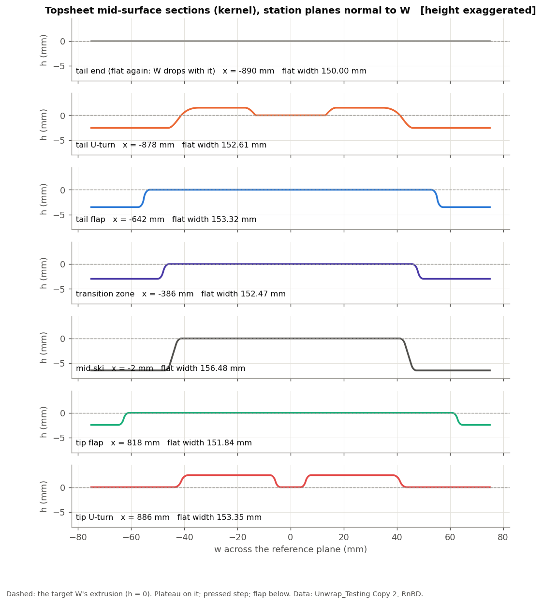

*Real kernel sections of the topsheet's mid-surface (Unwrap_Testing Copy 2, RnRD) on station planes normal
to W. W here is the mid-surface's own Front-plane section, so the centre sits at h = 0.*

A surface that bends *across* W as well as along it is not developable along W, so **no flat pattern keeps
every length**. Undrape picks one rule and applies it section by section. At each station (the plane normal to
W at arc s):

1. Take the plate's mid-surface section.
2. Unroll it: each point's flat y is its **arc length along the section** from the centreline (w = 0).
3. Its flat x is the station's length along the target: x = s - d*theta.

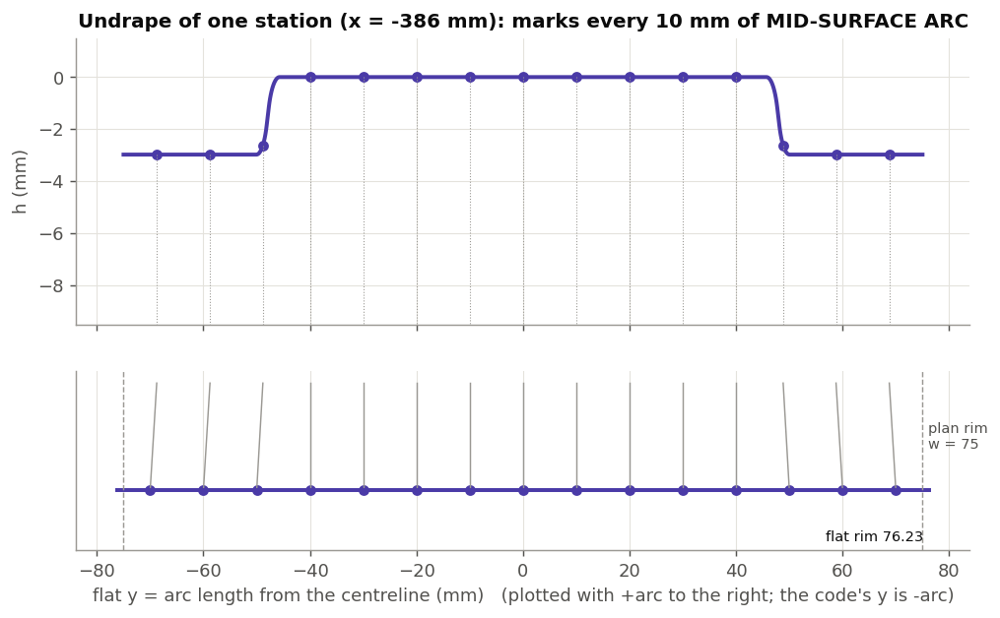

*One station in a transition zone. Points 10 mm apart along the mid-surface arc land 10 mm apart in flat y.
The flaps therefore move outwards: the flat rim is at 76.23 mm while the plan rim is at 75.*

Widths across each section are exact **by construction**. What gives is the *lengthwise* direction. Along a
flap sitting h below the target, the 3D length element is (1 - kappa*h) ds, while the flat one is
(1 - kappa*d) ds. Where the flap depth changes along the ski, the section arc (and so the flat rim) changes
too, which **shears** the flat pattern. Along the whole topsheet the flat outline is 0 to 4.3 mm wider per
side than the plan:

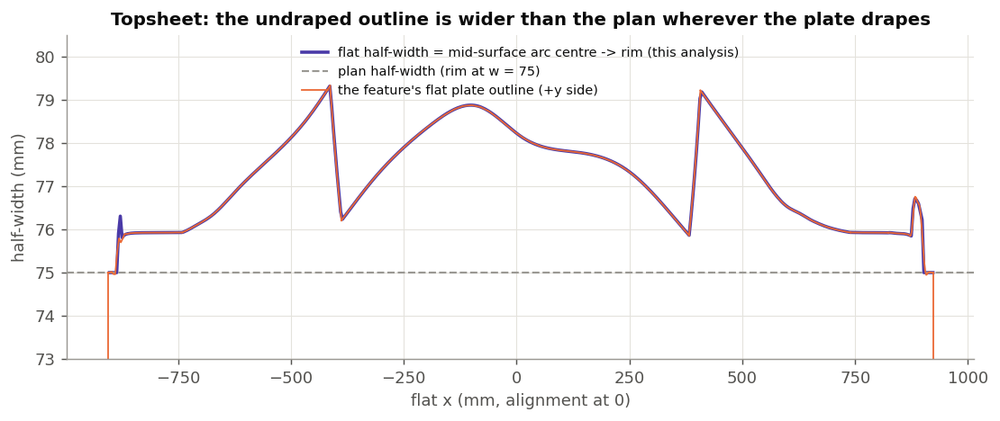

*Blue: the flat half-width from the kernel sections (my own numpy undrape, `img/src/topsheet.py`). Orange: the
outline of the flat plate that the Unwrap feature actually built. They agree to the line width: an
independent check of the production undrape.*

**Measuring the deformation.** The feature compares, between consecutive stations, the 3D mid-surface chord
along the rim and along every bend-line edge with the flat chord. It reports **stretch** (flat/3D - 1) and
**shear** (how far the chord's angle to its section changes) (`undrapeDeformation`). The same idea over the
whole plate:

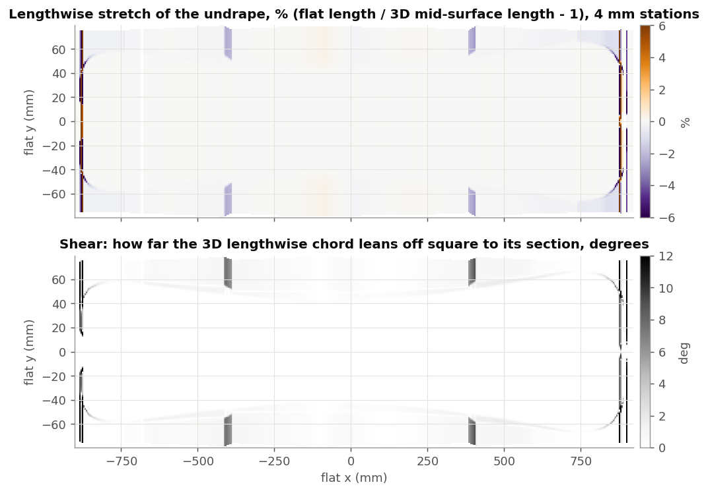

*Tracked along flat lines y = const between 4 mm stations. The plateau is isometric (|stretch| < 0.013 %).
The flaps compress by kappa(h - d), about 1 %. The transition zones (x of about -390 and +395) shear up to
about 9 deg. The tip and tail U-turns saturate the scale: tracking at constant y is not meaningful where the
section cuts the step lengthwise. The feature's own figures for this part are a stretch of -6.5 % to +7.5 %
(U-turns), -1.04 % to +0.41 % elsewhere, and shear of 22.6 deg (U-turns) and 9.5 deg elsewhere.*

How the section is measured, without a kernel call per station (research_undrape_map.md sections 0 and 4):

- The station plane is intersected with **the edges of one side** of the plate (sampled once).
- The crossings are ordered across the section (by w, or by face adjacency when a wall reaches vertical).
- Each piece between two crossings is taken as the **circular arc with the two end tangents**.
- The side's arc is converted to the mid-surface by the offset-turning correction sideSign * (t'/2) * turn.
- Stations where that model is not trusted (the plane cuts a face lengthwise, as in the U-turns) are
  **refused** and measured by a real kernel section. That is "the U-turn rule", `undrapeRefusedSection`.

The flat outline is fitted per rim edge (lines and arcs recognised, 1.8) and rebuilt as a plate: a plane sheet
is split by the outline, material is chosen by loop parity (so holes and slots cut), and the result is
extruded by +/- t/2 (`plateFromOutline`).

## 1.7 Unwrapping a solid

A solid is unwrapped **pointwise**: every point goes through the same chart map, P -> (x, y, z). The question is
how to rebuild a B-rep from that. Two facts do the work (unwrap_part.fs, research_unwrap_part.md):

- **Over a straight span of W the map is one rigid motion**, for every height and every d, because kappa = 0
  and theta is constant. A piece of the part over a line is moved by a single `opTransform`, and every native
  face (arcs, cylinders, B-splines) survives exactly.
- **Over a curved span**, a face whose normal has no component across W's plane (a "profile" face, extruded
  along Y) maps exactly to an extrusion along flat Y. A face whose normal has no component along N (a "wall",
  extruded along W's normal) maps exactly to an extrusion along flat Z. Ski parts consist of those two kinds,
  plus slightly leaning walls that are rebuilt as ruled surfaces.

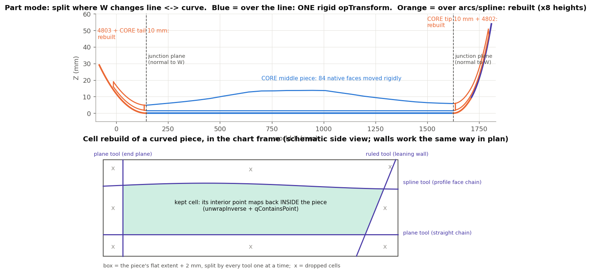

So Part mode:

1. Splits the solid with planes normal to W wherever W changes between a **line edge** and a curved edge.
2. Moves the pieces over the line rigidly.
3. **Rebuilds** each curved piece:
   - one tool sheet per chain of tangent faces;
   - a box split by every tool, one at a time;
   - the cells whose interior point maps back *inside* the original piece are kept (`unwrapInverse` +
     `qContainsPoint`);
   - the kept cells are united.

For the test CORE this means 84 native faces moved rigidly plus two 10 mm end pieces rebuilt, in about
1.6 s. Accuracy is sub-micron (8.3 um at one vertex that is already 8 um off its face in the source).

## 1.8 Recognising lines and arcs with a continuity gate

An unwrapped edge is only as good as its fit. When the unwrapped points lie within tolerance of a line or a
circle (`classifyPoints` in curve_core.fs), emitting a true line or arc gives Onshape real geometry (a radius
you can dimension, cylinders when extruded). Being "one within tolerance" is not enough, though. Replacing a
curve by an arc changes its **end tangents**, and neighbouring edges would lose G1. So `emitFlatCurve` also
requires the line's or arc's end tangents to agree with the **exactly unwrapped** end tangents
(`unwrapDirection`, the chart's exact Jacobian) within `G1_JUNCTION_ANGLE` (0.01 rad). Anything else is emitted
as a fitted spline. The per-edge report says why a line or arc was refused.

A further guard applies to the end tangents themselves. A supplied end tangent more than 2 deg away from the
parabola through the last three points is replaced (`UNWRAP_TANGENT_AGREE`). The undrape's tangent at a
pointed tip once came out 58 deg wrong, and the fit then wobbled.

## 1.9 Adaptive vs fixed sampling

Sampling at a fixed spacing spends points evenly, but the flat curve's difficulty is not even. **The unwrapped
curve's curvature is roughly the source's minus the reference's.** So it inherits every curvature *jump* at the
reference's edge joins, and every kink at the source's knots.

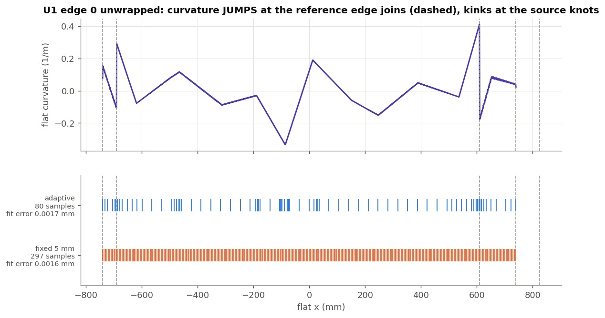

*The real U1 case (Wrapped_profile edge 0 over FULL_BASELINE), replayed in numpy with the production rule. The
adaptive rule reaches the same interpolation accuracy as a fixed 5 mm spacing with about a quarter of the
points (80 vs 297), and clusters them at the joins.*

The rule (unwrap.fs `adaptiveEdgeSamples`):

- **Seed** from the edge's own structure: a line 3 samples, an arc one per 15 deg, a B-spline 3 per control
  point, never a gap over 50 mm.
- **Refine**, up to 6 passes: map every open span's midpoint and split the span if the midpoint misses the
  cubic predicted from the neighbours by more than a quarter of the fit tolerance.

The undrape does the same on the outline, with its own tolerance (1.25 um) and with "spacing" as a
**maximum-gap cap** only (`undrapeOutline` options).

## 1.10 Tolerances and the 0.01 mm budget

The requirement is **0.01 mm** on the final geometry, and speed matters. The budget is spent like this:

| Stage | Size | Source |
|---|---|---|
| Chart map (packed Hermite tables, Newton to 1e-10 m) | < 0.01 um (0.44 um before the 2026-09-24 fixes) | research_unwrap_perf.md 1 |
| Adaptive sampling (span midpoint test) | 1.25 um (tolerance / 4) | unwrap.fs, undrape_utils.fs |
| Undrape section model (circle per piece + correction) | 1.5 um at edge stations, <= 8.8 um at the worst kernel fallback | research_undrape_map.md 12 |
| Curve fit (Unwrap's own default) | **0.005 mm**, max 60 control points | `UNWRAP_FIT_TOLERANCE_BOUNDS` |
| Line/arc recognition | same tolerance as the fit | 1.8 |
| Part rebuild tool fits | 0.1 um (arcs to 0.1 um, "snap flat" 0.001 mm) | unwrap_part.fs |
| Kernel tolerances seen in real parts | 0.5 um section overlaps, 0.6 um vertex gaps, one 8 um tolerant vertex | notes |

The fit takes half the budget on purpose: 0.005 mm leaves the other half for everything else. The known
weak spot is long freeform edges crossing reference curvature jumps. U1 edge 0 needs about 60 control points
for 5 um. A split-at-the-breaks-and-join fit (research_unwrap_perf.md 3.3) would get 2.7 um with 43 control
points, but it has not been built.

---

# Part 2: Our feature

## 2.1 The three modes

| Mode (`UnwrapType`) | Input | What happens | Output |
|---|---|---|---|
| **Edges / wires** (`EDGES`) | edges or wire bodies | Each edge is sampled adaptively, mapped through the chart, and emitted as a line, arc or spline. | one wire body per source body |
| **Constant-thickness part** (`THICKENED`) | plate-like solids (topsheet, laminates, base, mats) | Finds both sides and t. The mid-surface is mapped onto the TARGET (a wire's extrusion, offset). **Undrape** (1.6), then the plate is rebuilt t/2 each side. | one flat plate per source (several solids if the outline has several loops) |
| **Part (solid)** (`PART`) | any solid along the reference (core, core extensions, sidewalls) | Split at line/curve changes of W. Straight pieces are moved rigidly, curved pieces rebuilt (1.7). | one flat solid per source |

Every mode ends with the **length and volume check** (2.3), is named from the Outputs table (2.2), and
publishes `lengthWrapped`, `lengthFlat` and `volumeRatio` (per body), plus line, arc and spline counts, through
Variable_tools' `embedStandardOutputs`.

Not built (compared with the docstring spec): surfaces as input, composite parts, mate connectors as input,
the "neutral axis" length curve, and projection of a wire onto a plane normal to the unwrap plane.

## 2.2 Parameters and what they mean physically

| Parameter | Modes | Physical meaning |
|---|---|---|
| **Unwrap** | all | Which of the three algorithms (2.1). |
| **Edges to unwrap** / **Parts to unwrap** | E / T, P | The geometry. Edges are grouped by owner body, so one wire is output per body. |
| **Undrape target from**: Wire / Section by a face | T | Where the curve the plate is unrolled along comes from. **Section by a face** = the plate's OWN mid-surface cut by a plane (e.g. Front), so length is kept along the plate's own mid line. **Wire** = a curve you pick (e.g. REF_WIRE) plus the target offset. |
| **Wrapped reference** | E, P, T (Wire) | W: the planar tangent chain the geometry is wrapped along. Must be one chain (joints <= 1 deg), with X rising steadily. |
| **Section face** | T (Face) | The plane that cuts the mid-surface. The cut must be one piece: no hole, slot or notch on that plane. |
| **Preserve length**: Along the reference / Along an offset; **Offset**, **Flip offset** | E, P | d in x = s - d*theta. Which height above W keeps its length (1.3). Positive d is along W's surface normal (up for a normal profile). |
| **Target offset**, **Flip target offset** | T | The plate's mid-surface is mapped onto W offset by this. That offset is also the curve whose length is kept. For a Wire target, set it to the plate's mid height above the wire (topsheet on the top surface: -t/2). For a Face target, leave it at 0 (W already is the mid line). |
| **Wrapped alignment point** | all | The wrapped point that lands on the unwrapped origin. It fixes x = 0. It must lie within W's X span; a mate connector's vertex is accepted too (correction 44). |
| **Unwrapped origin** | all | The flat frame: a mate connector (implicit ones included), or a plane / planar face using its own axes. X = along W, Z = W's surface normal. |
| **Lay the part on the origin plane** | T, P | On: the flat part's lowest face sits on the origin's XY plane. Off: it keeps its height relative to the alignment point (z = h - h_align). |
| **Square walls** | P | Off: walls keep the exact mapped lean (e.g. 1.2 deg at 4802's nose, rebuilt as ruled surfaces). On: walls stand normal to the flat plane, as for a CNC blank. That costs up to 43.6 um at 4802's nose corners. |
| **Maximum sample gap** | T | The *largest gap* between outline samples; the density comes from the fit **Tolerance** / 4 (as in Edges mode). |
| **Recognise lines and arcs**, **Target degree**, **Tolerance**, **Maximum control points** | all (not the Part rebuild) | Section 1.8 and 1.10. Defaults: degree 3, 0.005 mm, 60 control points. |
| **Name suffix**, **Read names and properties** (button), **Outputs** table, **Copy attributes** | all | Names, material and appearance are copied ONLY when you press the button (getProperty cannot run in the feature body, correction 36). Rows pair with source bodies by index. If the row count no longer matches the body count, the table is skipped and a warning says so. |
| **Print edge table** | debug | Prints per-edge kind, radius, samples and gate reasons (plus undrape and part lines). |
| **Keep length curves** | debug | Leaves two wires in the model: the wrapped preserved curve over the part's extent, and its flat image. A good unwrap leaves their lengths equal. |
| **Measure deformation** | T, debug | Computes the undrape's stretch and shear report. Off saves about 0.2 s. |

## 2.3 The length and volume check: how to read it

`lengthAndVolume` (unwrap.fs) prints, per body:

    Length along the preserved curve: <wrapped> mm wrapped -> <flat> mm flat (<diff> mm); volume x<ratio>.

- **wrapped**: the preserved curve (W offset by d), measured in 3D between the stations of the source's
  extreme points. For a plate the undrape's own outline stations give the extremes; otherwise they come from
  vertices, plus edges sampled within 30 mm of either end.
- **flat**: the flat result's bounding-box extent along the unwrapped X.

The unwrap maps length along exactly that curve to X, so **the two agree for a good unwrap**. A difference
means the ends moved: a leaning end wall, undrape stretch at the ends, a rebuild error, or a measurement miss
(appendix item 6, now fixed).

**volume x** is flat volume / source volume, for solids only. It is **not** expected to be 1. It measures the
average of (1 - kappa*d)/(1 - kappa*h) over the part: how far the part sits from the preserved height where W
curves. It is 1.000059 on the CORE (over the line almost everywhere), **1.0125 on 4802** (1.8 to 5.8 mm above
REF_WIRE on the R406 arc and the tip spline, with d = 0), and 1.0001 on 4802 with d = 3.8 mm. For a plate, a
ratio off 1 by more than a few 1e-4 means the undrape's area changed (the stretch report tells you where).

## 2.4 The test studios and what each case shows

Document f61d2c000ab2d1240776342e, workspace 5b11f323ab31b04cba8b36ef.

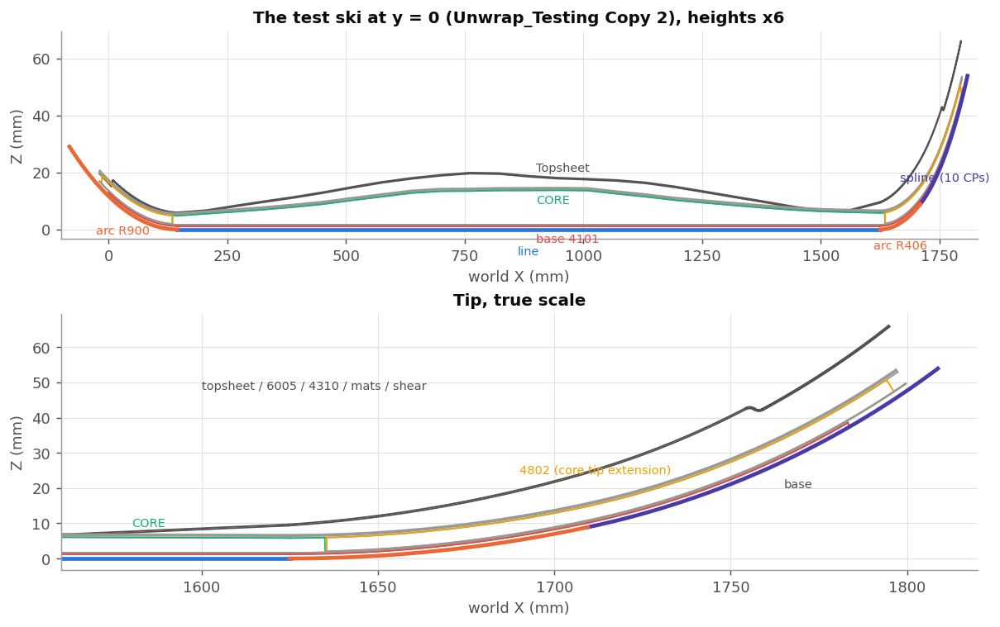

*REF_WIRE (thick; blue = line, orange = arcs R900 / R406, violet = 10-CP spline) and the parts' y = 0
sections, read from "Unwrap_Testing Copy 2".*

**"Unwrap_Testing Copy 1"** (80c1e329f99a05e224058526), built by `devtools/onshape/build_unwrap_tests.py`:

| Feature | Shows |
|---|---|
| U1 Wrapped_profile over FULL_BASELINE (edges) | Edges mode on a 3-spline wire 5.95 mm above a 6-edge baseline. The tip/tail stretches come out straight at constant height (185.000 / 165.000, equal to FLAT_PROFILE's). |
| U2 Topsheet, Wire target (Wrapped_profile, offset -0.2 mm) | Undrape against an external wire: volume -0.13 %, stretch -6.6 to +7.7 % (U-turns), shear 22.5 deg, 11 kernel fallbacks. |
| U3 Topsheet, Section by the Front plane | Undrape along its own mid line. Flat length 1827.69 = the section's length. |

**"Unwrap_Testing Copy 2"** (681a5825e353d376c88224eb), a copy of the user's Unwrap_Testing including the CORE
boolean, built by `devtools/onshape/build_unwrap_parts.py`. The origin is the Top plane and the alignment is
the MC StjLB at (885, 0, 0). Latest measured, wrapped -> flat:

| Case | Mode / length curve | Wrapped -> flat (mm) | Volume x | Reading |
|---|---|---|---|---|
| 4101 base (RtjP) | plate, own section | 1789.587 -> 1789.589 | 0.999992 | exact |
| 4305 (RtjT), wings bent up 90 deg | plate, own section | 1788.848 -> 1788.850 | 0.999863 | face-ordered sections unfold the wings (half-width 83-84 mm) |
| 6005 (Rtjf) | plate, own section | 1825.164 -> 1825.159 | 0.999992 | top laminate kept along ITS OWN mid line |
| 4310 (Rtjj) | plate, own section | 1825.538 -> 1825.532 | 0.999991 | same |
| Topsheet (RnRD) | plate, own section | 1827.693 -> 1827.693 | 1.000218 | was 1826.574 -> 1827.693: the check was short, not the flat (appendix item 6, fixed) |
| Tip-Mat / Tail-Mat / Tip-Shear / Tail-Shear | plate, REF_WIRE + 1.88 / 1.8 / 1.96 / 1.9 mm | within 0.001 | 0.9996-0.9999 | These don't reach X = 885, so they cannot use their own section (2.5). A fixed offset at their mid height is used instead. |
| CORE (Rtjn) | part, d = 0 | 1500.000 -> 1500.000 | 1.000059 | 1 rigid + 2 rebuilt pieces |
| 4802 tip extension (Rtj7) | part, d = 0 | 180.710 -> 180.709 | **1.0125** | length kept along REF_WIRE, but the part sits 1.8-5.8 mm above it on the tip curve |
| 4803 tail extension (Rtj3) | part, d = 0 | 160.120 -> 160.120 | 1.0037 | same effect, flatter tail |
| 4103 L/R sidewalls, 4401 L/R | part, d = 0 | 1700.000 -> 1700.001, 1500.196 -> 1500.196 | 1.0003, 1.00004 | mostly over the line |

The regression check (`devtools/onshape/check_unwrap_regression.py` + `devtools/onshape/fingerprints/unwrap_baseline.json`)
compares exactly these three numbers per feature and the Copy 1 statuses. See 3.5.

## 2.5 Known limits and open decisions

Limits of the chart and inputs:

- W must be one tangent chain, planar, with **X rising steadily**. A tip reaching vertical is refused, and the
  seeding is by X. The 09-10 research planned arc-keyed seeding to allow that; it was not built.
- The alignment X must lie within W's X span. **So "Section by a face" only works for plates that cross the
  alignment station.** The tip and tail mats and shears cannot use it.
- A Face target must give **one** section piece: no hole, slot or notch on the section plane.

Undrape open decisions (research_undrape_map.md 9):

1. **U-turn rule.** The literal section-by-section unroll gives up to 15 % principal strain and a rim bulge of
   about 0.8 mm at the tip. The alternatives are a blend to sections normal to the step's plan direction, or a
   least-distortion fill. The rule lives in one function, `undrapeRefusedSection`.
2. **Transition-zone shear** (about 9 deg on the flaps): accept it or spread it.
3. **Kernel fallbacks** cost about 65 ms each (11 on the topsheet).
4. Parts not reaching the centreline are measured from their innermost node.
5. Gaps are bridged by a G1 circle vs a chord.
6. Fits near transition vertices: a 5-10 um feature within 0.2 mm of the vertex (finding c). An in-progress
   refactor adds end-of-edge checks (`UNDRAPE_END_CHECK`, uncommitted today).

Part mode limits (research_unwrap_part.md 7, 8b):

- **FAIL faces** (neither profile nor wall over a *curved* span, e.g. a fillet between a wall and a profile
  face, or a draped top) are reported, not handled.
- **Degenerate cell contact** (groove floors running out onto another face) makes the union fail. This is why
  the whole CORE cannot be rebuilt in one piece.
- Chains turning more than 180 deg are not split. The grazing-extension hazard is guarded, not removed.
- "Straight" is decided by the **edge type** (`CurveType.LINE`), not by geometry.

Also open:

- The **preserve-length curve for parts** is one constant d.
- **Split-and-join fitting** (research_unwrap_perf.md 3.3).
- A tighter continuity gate than 0.57 deg (perf note 3.4 recommends 1e-3 rad).

## 2.6 Your two questions

### (a) "Our first big test will be a reference curved along its whole length (a baseline). How will that affect evaluation times?"

**Edges and plate modes: about the same cost.** Both map every sample or station through the chart
individually, with a Newton foot that converges in 1-3 steps whether W is straight or curved (0.12 ms per
point on the packed tables). What does change:

- **Edges:** the flat curves inherit every curvature jump at the baseline's edge joins (1.9). Refinement adds a
  few samples there, and long freeform edges need more control points (about 60 for 5 um on U1's 1480 mm
  edge). Time barely moves; curve weight goes up.
- **Plates with a Face target** do not use the baseline at all. Their W is their own section.
- **Plates with a Wire target**: the mid-surface of a plate far above a curved baseline no longer sits at a
  constant offset. Every region away from d gets kappa*(h - d) lengthwise strain. That is question (b)
  territory, not a speed issue.

**Part mode: a big cost as built, and likely failures.** Part mode gets its speed from moving the pieces over
STRAIGHT spans of W rigidly and rebuilding only the curved spans. Today's CORE is 1480 of 1500 mm rigid, so
only two 10 mm ends are rebuilt (1.6 s). With a baseline curved everywhere:

- `referenceSpans` finds **no line edge**, so the whole part is one curved piece and goes through the cell
  rebuild. Straightness is decided by edge type, so even a geometrically straight *spline* span counts as
  curved.
- The measured whole-core rebuild was **31 tools, about 650 cells, 32 s, and then `BOOLEAN_NON_MANIFOLD_RESULT`**.
  The groove floors run out onto the bottom face and the cells touch degenerately (research_unwrap_part.md 3,
  C). So the CORE would most likely *fail*, not just be slow.
- Faces that are only approximately profile faces pass today because they lie over the line (4401's top
  faces, b up to 1.3e-3). Over a curve they would be classified **FAIL**.

**The piecewise-rigid hypothesis: I tested it and it does not hold as stated.** The idea was to cut the part
where W turns little and move each piece rigidly, with an error of about 0.5*h*dtheta^2. I computed the exact
error: the best least-squares rigid placement of a 14 mm-thick piece over a circular span, against the exact
chart map. It is **first order** in dtheta. Two terms add up:

- **A length wedge.** A rigid piece keeps *every* fibre's length, while the chart keeps only d's. At the piece
  ends, the fibres at h are off by about (h - d) * dtheta / 2. Adjacent pieces then gap or overlap in a wedge.
- **W's own sagitta** L^2 / (8R). A rigid piece stays curved: it is never flattened.

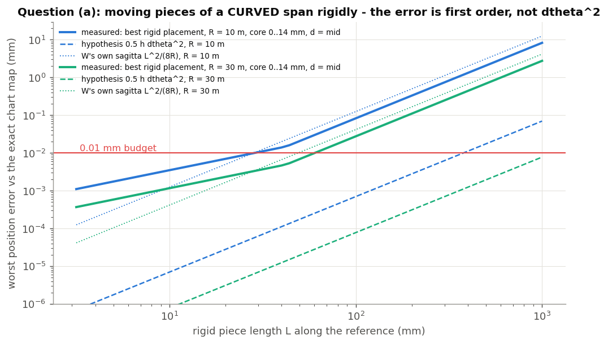

For 0.01 mm, the longest rigid piece is:

| Camber radius R | d = 0 (length on W) | d = core mid (7 mm) |
|---|---|---|
| 10 m | **14 mm** | **29 mm** |
| 30 m | 43 mm | 60 mm |

The hypothesis predicts about 400 mm (dashed lines in the figure). It leaves out both terms above. Pieces of
15-60 mm would mean 25-100 splits, rigid moves and a faceted union per part. Neither fast nor clean (the flat
faces become facets kinked by dtheta at every joint). **Hypothesis rejected at 0.01 mm**, unless the numerical
check in `img/src/fig_concepts.py` (`rigid_error`) has a flaw. Please check the setup: a circle of radius R, a
rectangle 0..14 mm high, and a least-squares rigid fit.

**What I would test instead** (all hypotheses, in order of promise):

1. **Piecewise *rebuild*.** Cut the part by station planes into pieces of about 150-300 mm and cell-rebuild
   each piece separately. Cost grows with tools x cells *per piece*, and one piece of 4802's size (180 mm,
   12 tools, 108 cells) takes 2.7 s. **Estimate: 20-40 s for a 1.5 m core**, to be measured. Risk: a piece
   containing a groove run-out still hits the degenerate union. Cut *through* run-outs, or test it.
2. **Geometric straightness.** Treat a span as straight when its turning over the piece is below the rigid
   limit above, not when its edge type is LINE. This only helps if the baseline has really straight stretches.
3. **Build the flat core from its design inputs.** Thickness profile, plan outline and groove layout are
   usually defined flat anyway; unwrapping would then only be the *check*.

### (b) "Top parts (6005, 4310) should be unwrapped along the top surface, not the ref curve, otherwise offset differences are all over the map. Does our code account for that?"

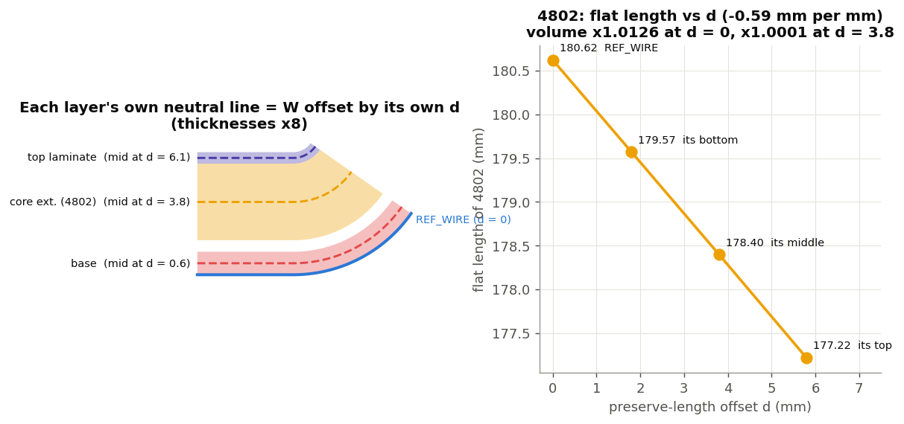

Mostly yes for plates, not yet for solids.

- **Plates in the test studio use "Section by a face"** (base, 4305, 6005, 4310, topsheet). Each plate's W is
  *its own mid-surface's* Front-plane section, so each keeps **its own mid-line length**. That is the neutral
  surface of a symmetric laminate (1.4), and the reason for the 0.002-0.006 mm length agreement. The physically
  right choice is its *own* surface, in fact its mid-surface, rather than literally the top face. For a 0.6 mm
  laminate, top vs mid differs by 0.3 mm x (total turning), which is a few tenths of a millimetre over a ski.
- **Mats and shears** do not reach the alignment X, so they cannot use their own section (2.5). They use
  REF_WIRE plus a fixed target offset at their near-constant mid height (1.8-1.96 mm): lengths within 0.001 mm.
  This is correct only because they are thin and sit at nearly constant height.
- **Part mode keeps length along REF_WIRE offset by ONE constant d.** 4802 sits 1.8-5.8 mm above REF_WIRE on
  the tip curve, so with d = 0 its fibres are stretched by kappa*h: +1.25 % volume. The flat length changes by
  0.59 mm per mm of d, from 180.62 at d = 0 to 178.40 at d = 3.8 (its middle). **With d = 3.8 mm its volume is
  within 0.01 %.** So set Preserve length = Offset, 3.8 mm for 4802 today.
- **Natural next step** (the docstring's "preserve length profile {MIDDLE, NEUTRAL_AXIS, QUERY}").
  research_unwrap_part.md 6.2 has the maths already: for a length curve at variable height g(s),
  `X(s) = s - integral(kappa * g ds)`, which reduces to s - d*theta for constant g. Nothing else changes:
  profile and wall classes, rigid spans, and the inverse (a 1-D Newton on X) all carry over. MIDDLE = the
  part's own y = 0 section mid-line (the `profileFromFace` machinery already exists). QUERY = any curve.
- **Trade-off to decide.** With each part on its own curve, **joints between layers no longer coincide in the
  flat**: they are offset by (delta d) x theta, about 2 mm between the base (d = 0.6) and 4802 (d = 3.8). That is
  right for cutting blanks, and wrong if the flat set is used together (a flat assembly, press tooling, nesting
  that relies on relative positions). Composite-part unwrap should force one choice for all its members.

---

# Part 3: The codebase

## 3.1 File map and call graph

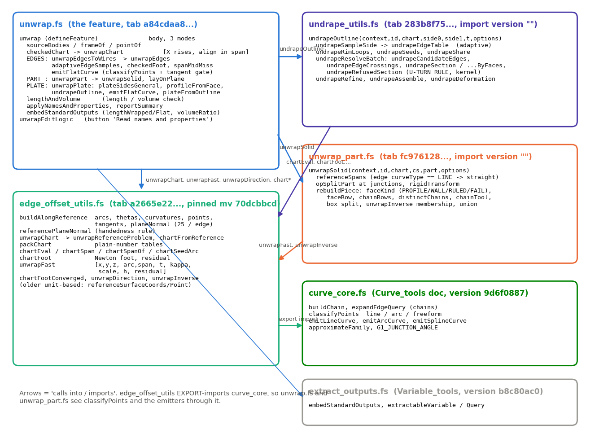

| File (tab) | Role |
|---|---|
| `driven_offset/unwrap.fs` (a84cdaa8963f2a55db1c016b) | The feature: dialog, three modes, edge sampling and emission, plate side finding / section face / plate rebuild, length check, names, report, editing logic. The user's docstring spec is at the top; the AS BUILT block follows it. |
| `driven_offset/undrape_utils.fs` (283b8f7562a16e9c9ccc01b7) | The undrape map: `undrapeOutline` and everything under it. Plain-number inner loops. |
| `driven_offset/unwrap_part.fs` (fc976128871c5b4b2d33a91c) | Solid unwrap: `unwrapSolid`. Needs `extendendtype.gen.fs` and `extendsheetshapetype.gen.fs` imported explicitly (correction 17). |
| `driven_offset/edge_offset_utils.fs` (a2665e22c07b7a6929ce4e80) | The chart ("The reference surface as a chart", "Unwrapping through the chart", "Packed chart" sections, lines ~931-1760), shared with Driven edge offset / surface. |
| `curve_tools/curve_core.fs` (Curve_tools document) | Chains, `classifyPoints`, `emitLineCurve` / `emitArcCurve` / `emitSplineCurve`, `approximateFamily`, `G1_JUNCTION_ANGLE`. |
| Variable_tools `extract_outputs.fs` | `embedStandardOutputs`, `extractableVariable`, `extractableQuery`. |

Key entry points (line numbers as of 2026-09-25; they drift):

- unwrap.fs: `unwrap` :199, `checkedChart` :557, `unwrapEdges` :657, `adaptiveEdgeSamples` :720,
  `spanMidMiss` :835, `unwrapPart` :860, `lengthAndVolume` :907, `emitFlatCurve` :1126,
  `plateSidesGeneral` :1225, `profileFromFace` :1382, `plateFromOutline` :1432, `unwrapPlate` :1502,
  `unwrapEditLogic` :1642, `applyNamesAndProperties` :1775, `reportSummary` :1829.
- edge_offset_utils.fs: `buildAlongReference` :953, `referenceSurfaceCoords` :1265 (unit-based, older),
  `unwrapChart` :1330, `chartFromReference` :1341, `unwrapFast` :1368, `chartFootConverged` :1384,
  `unwrapInverse` :1454, `unwrapReferenceProblem` :1485, `unwrapDirection` :1514, `packChart` :1541,
  `chartEval` :1591, `chartFoot` :1634, `referencePlaneNormal` :1718.
- undrape_utils.fs: `undrapeOutline` :2508, `undrapeResolveBatch` :2754, `undrapeSection` :1329,
  `undrapeSectionMid` :1407, `undrapeSectionByFaces` :1494, `undrapeRefusedSection` :2320 (THE U-TURN RULE),
  `undrapeRefine` :3191, `undrapeAssemble` :3588, `undrapeDeformation` :3684.
- unwrap_part.fs: `unwrapSolid` :116, `referenceSpans` :231, `rigidTransform` :274, `flatNormal` :361,
  `rebuildPiece` :384, `faceKind` :646, `chainRows` :783, `chainTool` :1149.

## 3.2 Key data structures

**The chart** (`unwrapChart` -> `chartFromReference`):

    chart = { alongRef,                       // unit-based tables (buildAlongReference)
              packed,                         // the same, plain numbers (packChart)
              alignX, alignV, alignHeight }       // the alignment point's x (arc - delta*theta), v, height; metres

    alongRef = { chain, arcs[], thetas[], curvatures[], xs[], arcSlopes[], points[], tangents[], delta, planeNormal }
      25 samples per reference edge (TURNING_SAMPLES); duplicate samples at joins, each carrying its own edge's
      curvature (essential: research_unwrap_perf 1.2). theta is trapezoid-integrated signed curvature.
      points / tangents / xs are of the reference OFFSET BY delta.

    packed = { count, arcs[], px[], py[], pz[], rx[], ry[], rz[], kappa[], theta[], delta, nx, ny, nz }
      r = (1 - delta*kappa) * t  (d(offset point)/d(wire arc)); n = planeNormal.
      chartEval(c, a, span) -> [ax, ay, az, tx, ty, tz, theta, kappa, scale]: position by cubic Hermite, tangent =
      that cubic's derivative (so the foot is the foot of ONE consistent curve), theta Hermite with kappa as its
      slope. Straight run-on past either end.

Plain numbers are used because FeatureScript unit arithmetic is operator overloading, which costs about 40x
plain arithmetic. The per-point map went from 5.4 ms to 0.117 ms.

**The per-point result** (`unwrapFast(chart, point, previous)`), an array indexed:

    0 x (flat, = arc - delta*theta - alignX)   1 y (= alignV - v)   2 z (= height - alignHeight)
    3 arc (on the wire)   4 span   5-7 tangent t   8 kappa   9 scale   10 height   11 residual
    y is measured along -pn so (x, y, z) is right-handed (1.5; the note is on unwrapFast's docstring).
    chartFootConverged(u): |residual| <= 1e-7 m.  Pass `previous` to warm-start along an edge.

`unwrapDirection(chart, cs, u, d)` maps a unit direction exactly: the along-component is scaled by
scale/(scale - kappa*h). `unwrapInverse(chart, x, y, z)` is the exact inverse on the same tables (used for Part
mode cell membership).

**The undrape** (`undrapeOutline(context, id, chart, side0, side1, thickness, {spacing, deformation})`):

- It returns `edges[]`, one per rim edge: `{ loop, index, points [[x, y]], startTangent, endTangent, arcs }`.
  Loop 0 is the outer loop (counter-clockwise); holes run clockwise. Shared vertices are exact.
- The `report` holds stations, samples, passes, fallbacks, failed / failedArcs / droppedPoints / shifted,
  stretchMin / Max / Where, shearMax, rim3d / rimFlat, plus `lines` for printing.
- The crossing record (a 25-number array: w, h, tangents either side, inPlane, cosCross, rim, edge, normal, ...)
  is documented at the top of undrape_utils.fs.

**Part mode** (`unwrapSolid(context, id, chart, cs, part, {squareWalls, flatTolerance})`) returns
`{ bodies, report {pieces, rigidPieces, rebuiltPieces, cells, keptCells, tools, planeTools, arcTools,
splineTools, ruledTools, snappedTools, squaredWalls, maxLean}, lines }`.

## 3.3 Walkthrough per mode

- **Edges:** `checkedChart` -> `unwrapChart(W, align, d)`. Then per source body `unwrapEdgesToWires` ->
  per edge `adaptiveEdgeSamples` (seed from evCurveDefinition, then refine by `spanMidMiss`; feet by
  `checkedFoot` = `unwrapFast` warm, cold retry) -> points in cs -> `unwrapDirection` end tangents ->
  `emitFlatCurve`. Finally `opExtractWires`, and the curves are deleted.
- **Plate:** `plateSidesGeneral` (evOffsetDetection pairs grown by 45 deg tangency, largest area wins;
  raycast fallback). For a Face target, `opExtractSurface(side, -t/2, trimmed)` gives the mid-surface
  (retrying with the other side), then `profileFromFace` gives W. Then `checkedChart(W, offset)` ->
  `undrapeOutline` -> `emitFlatCurve` per outline edge -> `plateFromOutline` (sheet split, parity, extrude
  +/- t/2).
- **Part:** `unwrapSolid`: copy -> junction splits -> rigid `opTransform` / `rebuildPiece` -> union ->
  fuse check -> place in cs. Then `layOnPlane` translates it.
- **All modes:** `lengthAndVolume`, `applyNamesAndProperties`, `reportSummary` (info, or a warning when rows
  are stale or undrape stations failed), `embedStandardOutputs`.
- **Editing logic** `unwrapEditLogic`: only on the button (`clickedButton == "readProperties"`). It rebuilds
  the rows by source name and keeps an edited output name and copy choice where the name still matches.

## 3.4 Import pins

| Importer | Imports | Pin | Meaning |
|---|---|---|---|
| unwrap.fs | edge_offset_utils.fs | `70dcbbcd66e91d6405084776` | a same-document **microversion** pin: frozen until someone re-pins it |
| unwrap.fs | undrape_utils.fs, unwrap_part.fs | `""` | same document, **always the current workspace** tab: edits there are live immediately |
| undrape_utils.fs, unwrap_part.fs | edge_offset_utils.fs | `70dcbbcd...` | the same microversion as unwrap.fs (**keep all three identical**, or two different chart versions meet) |
| edge_offset_utils.fs | curve_core.fs (Curve_tools) | version `9d6f0887...` (export import) | a cross-document **version**: only the user creates versions |
| unwrap.fs | extract_outputs.fs (Variable_tools) | version `b8c80ac0...` | same |
| DEO / DOS / ORT / debug | edge_offset_utils.fs | `904e3070...` (older) | the later utils changes only ADD functions; re-pin when the chain is next walked |

Rules learned the hard way:

- **Never push a placeholder import path.** The whole unwrap tab failed to compile for minutes.
- A change to edge_offset_utils.fs reaches unwrap only after a re-pin. Re-run the Design_Master fingerprint
  (`devtools/onshape/fingerprint.py`) whenever the shared chart changes.
- Procedure and the full pin table: `driven_offset/DOCUMENT_MAP.md` ("Import chain").

## 3.5 How to test

1. `python fscheck.py driven_offset/*.fs` (all tabs of the document together) before any push.
2. Push with `python -m sync.main pushproject driven_offset --files <f.fs> --check`. Only when asked.
3. **Test features live in the studios' feature trees**, named by case and expected result:
   - `devtools/onshape/build_unwrap_tests.py` (Copy 1: U1-U3)
   - `devtools/onshape/build_unwrap_parts.py` (Copy 2: 9 plates + 7 parts; `ONLY=<bodyId>` and
     `DEBUG=<bodyId>` env vars)
   These upsert features by name.
4. **Regression:** `FS_SYNC_TIMEOUT=300 PYTHONPATH=. python devtools/onshape/check_unwrap_regression.py [--save]`
   reads every Unwrap feature's status in Copy 1 and Copy 2 and its published `lengthWrapped` / `lengthFlat` /
   `volumeRatio` through the eval API (`getVariable` on the feature id), and compares them with
   `devtools/onshape/fingerprints/unwrap_baseline.json` (`--save` rewrites the baseline). Evaluate offset:
   `PYTHONPATH=. python devtools/onshape/check_evaluate_offset.py`; the Design_Master fingerprint
   (`devtools/onshape/fingerprint.py`) whenever edge_offset_utils changes.
5. **Runtime notices:** `python -m sync.main notices driven_offset --monitor "Unwrap_Testing Copy 2"`.
6. **Read-only geometry probes:** the FS eval API (one anonymous function, std only, `qTransient("<id>")`).
   The scripts in `img/src/*.fs` are examples. They run ops in a throwaway context and never change the
   studio.

## 3.6 Where the design and research notes are

| Note | What is in it |
|---|---|
| unwrap.fs header | The user's spec (docstring), then the AS BUILT summary. |
| `driven_offset/research_unwrap.md` | The 09-10 pre-build plan (chart reuse, circularity test). **Partly superseded**; a note at its top says where the as-built record is. |
| `driven_offset/research_unwrap_perf.md` | Chart accuracy (weak links, fixes), the packed evaluator (46x), fitting: the chord-squared tangent bug, CP counts, split-and-join, defaults 0.005 mm / 60. |
| `driven_offset/research_undrape_ops.md` | Which Onshape ops: finding sides and t, mid-surface, W from a face, rebuilding the plate (sheet split + parity). |
| `driven_offset/research_undrape_map.md` | THE undrape design: map, measured part, costs, algorithm, accuracy, deformation, edge cases, open decisions (9), as built (12), 4305 wings (13), robustness pass (14). |
| `driven_offset/research_unwrap_part.md` | Part mode: face classes, strategies A-D, measured accuracy and time, decisions, variable length curve (6.2), as built (8, 8b). |
| `driven_offset/DOCUMENT_MAP.md` | Tabs, pins, test studios of the driven_offset document. |
| `.claude/featurescript-corrections.md` | Especially 17 (gen.fs imports), 22 (opLoft), 25 (defaults migrate into saved features), 27 (buttons), 36 (getProperty), 44 (MC as vertex). |
| memory `unwrap-undrape.md`, `evaluate-offset.md` | Session history and decisions. |

## 3.7 Glossary

- **W**: the wrapped reference. **d**: the preserve-length (or target) offset. **s / arc**: arc length along
  W. **theta**: cumulative turning. **kappa**: signed curvature (T' = kappa N).
- **pn**: W's plane normal. **N = pn x t**: the surface normal (height). **v**: across; **h**: height.
- **Station**: the plane normal to W at an arc. **Section**: the part cut by a station.
- **Rim**: the plate's outline edges. **Bend line**: an interior edge running along the plate.
- **Refused station**: a station measured by a kernel section. **U-turn**: where the pressed step runs across
  the stations.
- **Profile face / wall / ruled / FAIL**: Part mode face classes. **Cell**: a piece of the split box.

## 3.8 Regenerating the figures

From `driven_offset/docs/img/src/`, and only the fetch scripts touch Onshape (read-only eval API):

    # data (repo root; about 1.5 min for the sections)
    FS_SYNC_TIMEOUT=240 PYTHONPATH=. python driven_offset/docs/img/src/fetch_topsheet.py 4 80
    FS_SYNC_TIMEOUT=240 PYTHONPATH=. python driven_offset/docs/img/src/fetch_layup.py
    FS_SYNC_TIMEOUT=240 PYTHONPATH=. python driven_offset/docs/img/src/fetch_wires.py
    # figures (from img/src)
    python fig_concepts.py     # fig01-05, 10, 12, 13, 14
    python fig_topsheet.py     # fig06-09 (topsheet.py does the numpy undrape)
    python fig_adaptive.py     # fig11

The data files are in `img/src/data/`. fig05, fig08 and fig10 read the Copy 2 body ids (RtjD, RnRD, RIpD
= the flat topsheet output, ...). Transient ids can change if the studio is rebuilt; update them in
`layup.fs`.

---

# Appendix: unclear or contradictory items found while writing this

Status after the 2026-09-25 cleanup pass: **RESOLVED** items say what changed; the rest are still open.

1. **RESOLVED** (unwrap.fs' AS BUILT block now points to this document and the perf / part / undrape notes;
   research_unwrap.md carries a "superseded in part" note at its top). **research_unwrap.md "section 0" does not exist.** unwrap.fs' AS BUILT block points to it. The file is the
   09-10 pre-build plan and differs from the build. It proposed arc-keyed tables so a *vertical tip* could be a
   reference, seeding by projection, and Greville-abscissa sampling. The build seeds by X, **requires X to
   rise**, and samples adaptively.
2. **RESOLVED** (section 15, "As built: adaptive sampling", now exists). **undrape_utils.fs cites "research_undrape_map.md 15"** for adaptive edge sampling. The note ends at
   section 14.
3. **RESOLVED** (DOCUMENT_MAP.md now has the pins read from the code, the unwrap family with tab ids, the four
   test studios and the regression scripts). **DOCUMENT_MAP.md is stale for unwrap.** It says unwrap / undrape_utils pin edge_offset_utils at mv
   `941e620c`, while the code pins `70dcbbcd`. It does not list unwrap_part.fs or Copy 2. Its table still calls
   unwrap a "stub".
4. **RESOLVED** (docstring rewritten to what the code does; the dead branch removed, no behaviour change).
   **`unwrapEditLogic`'s docstring disagrees with its code.** The docstring says the table is also rebuilt when
   the source bodies change and that a name-suffix change renames automatic rows. The code returns at once
   unless the button was pressed, so neither happens (the feature header's "only this button" rule is what the
   code does). Also, `(pressed || previous == undefined)` is always true after that early return, so the
   "keep the material read before" branch is dead code.
5. **RESOLVED** before this pass (the parameter is now "Maximum sample gap" with accurate text, and unwrap.fs
   passes `tolerance : approximationTolerance / 4` to the undrape). **"Outline sample spacing" dialog text is stale.** It says "6 mm holds the outline within 0.005 mm; wider is
   faster". The undrape now sets density by its own tolerance (1.25 um) and uses spacing only as a max-gap cap.
   Also, unwrap.fs passes no `tolerance` option, so in plate mode the user's **Tolerance** parameter does not
   affect undrape sampling, unlike Edges mode (tolerance / 4).
6. **RESOLVED** (confirmed a check artifact: `lengthAndVolume` now takes a plate's extent from the undrape's
   own outline stations, `outlineArcRange`; the baseline reads 1827.693 -> 1827.693).
   **Topsheet +1.12 mm is probably a check artifact, not a wrong flat.** I checked this independently:
   - W (the topsheet's own mid-surface Front section) is 1827.695 mm long.
   - All 428 topsheet vertices have station arcs spanning **1827.696 mm**, even with every other vertex dropped
     (the check strides at 400 vertices).
   - The flat plate's X extent is 1827.693.

   So the *flat* matches, and it is `lengthAndVolume`'s **wrapped** value (1826.574) that is short by 1.12 mm.
   Hypothesis: feet of extreme vertices that do not converge from a cold seed are *silently skipped* (`continue`
   when `!chartFootConverged`), so arcLo / arcHi fall short. Test: print arcLo / arcHi and the number of
   skipped vertices. The memory note attributes this to the U-turn ends. The check, not the undrape, is the
   first suspect.
7. The **question (a) hypothesis** (0.5*h*dtheta^2, 400 mm pieces) disagrees with the exact computation by more
   than an order of magnitude in allowed length (2.6 (a), fig12). Worth a second pair of eyes on my setup.
8. **Straightness by edge type** (`referenceSpans`: `curveType == LINE`). A spline reference that is
   geometrically straight is rebuilt everywhere, and Clean-wire outputs are usually splines. This is not
   documented as a limit in the as-built notes.
9. **NOTED, not determined** (a dated note under research_unwrap_part.md 6, item 2, records both numbers and
   the most likely cause: how the prototype took the extent). **4802's flat length**: research_unwrap_part.md 6 gives 180.62 mm at d = 0, while the live check reports
   180.709 flat. That is 0.09 mm, possibly a different measure (the prototype vs the bbox extent of the
   production result) or the square/exact-wall difference. Worth one line of clarification in the note.
10. **RESOLVED** (not every file is 3070: `std/` and `tools/` are 2878, xSection 2892, fillet_wire 3083; CLAUDE.md
    now says the 2878 target is the std mirror and the active documents are on 3070). **Header version**: the .fs files are `FeatureScript 3070` while CLAUDE.md says the target is 2878.
    CLAUDE.md is likely stale.
11. **The continuity gate** `G1_JUNCTION_ANGLE` (0.57 deg) is looser than the perf note's recommendation
    (1e-3 rad) for Unwrap. Split-and-join fitting (3.3) is also deferred. Both are fine but undocumented
    trade-offs.
12. **RESOLVED** (`devtools/onshape/check_unwrap_regression.py` + `devtools/onshape/fingerprints/unwrap_baseline.json`).
    **The regression harness (`regress.py`, `regress2.py`, baselines) lives only in a session scratchpad.** It
    will disappear with the session. The in-tree test rule suggests `devtools/onshape/check_unwrap.py` plus a
    committed baseline.
13. **RESOLVED** (committed; the line numbers in 3.1 are exact again as of this pass). **undrape_utils.fs has uncommitted edits** today (`UNDRAPE_END_SPAN` -> `UNDRAPE_END_CHECK`, `undrapeMiss`
    replacing `undrapePredict` in `undrapeRefine`). Line numbers above for that file are approximate.
14. The Copy 2 outputs are named "Part 17".."Part 32" because the names button has not been pressed there.
    That is harmless, but it makes the studio harder to read.
