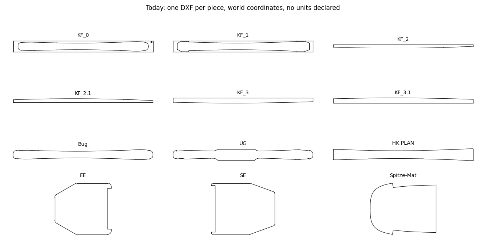
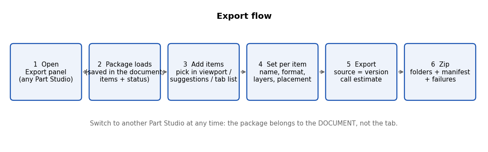
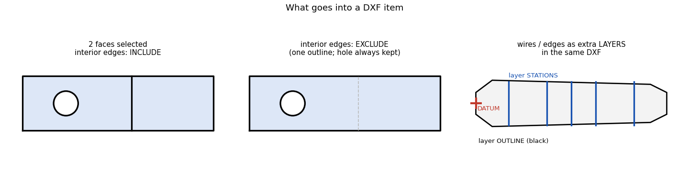
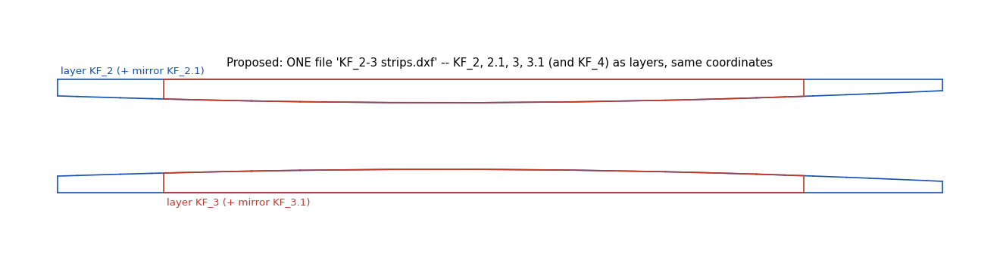
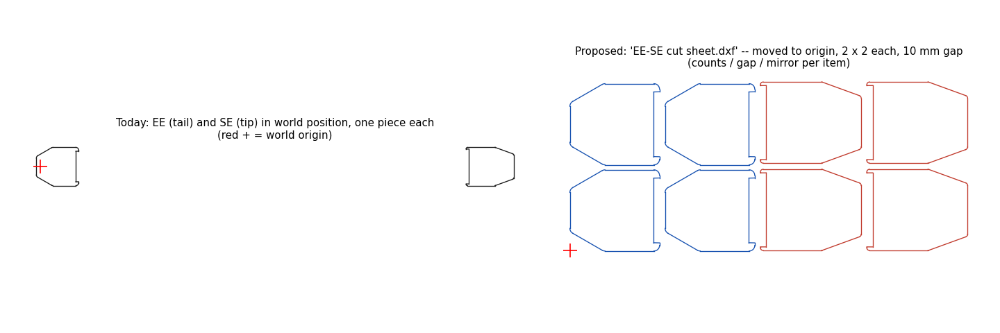
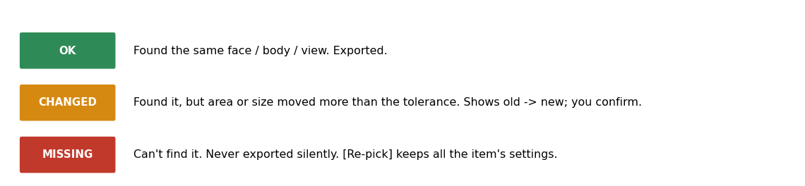
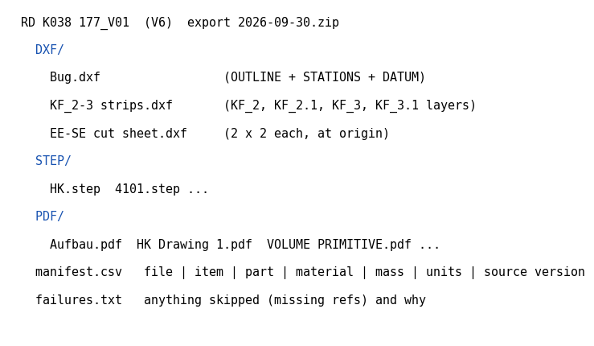

# Export v2 -- how it would flow

Based on your publication **RD K038 177_V01** (28 files: 11 drawing PDFs, 17 DXFs from RD 20FOU).
Proposal only -- nothing built yet.

---

## 1. Today

- One DXF per piece, exported by hand, one at a time.
- Pieces sit where they are in the model (EE near x = 0, SE near x = 1700) -- not where the factory cuts them.
- No units in the files (`$INSUNITS` missing) -- the factory has to assume mm.
- Mirror pairs are separate files (KF_2 + KF_2.1, KF_3 + KF_3.1).

---

## 2. The flow

1. **Open** EOC Data Tools > Export in any Part Studio.
2. The **package** loads. It's saved *inside the document* (a small JSON tab), so it travels with copies and
   versions. Every item shows a status.
3. **Add items** -- three ways:
   - **pick** faces / edges / bodies in the viewport (as BeamBuilder already does),
   - **suggestions**: every Station geometry view appears ready-made ("4101 PLAN: outline + stations + datum"),
   - **tab list** for drawings and assemblies.
4. **Set each item**: name, format(s), layers, placement.
5. **Export**: source = a released version (default) or the workspace. You see the API-call estimate first.
6. You get **one zip** (section 6).

Switch to another Part Studio whenever you like -- the package belongs to the document, not the tab.

---

## 3. What an item can be

| You pick | You get | Options |
|---|---|---|
| **Solid** | 3D file(s) and/or its TOP / BOTTOM face as DXF | STEP, IGES, Parasolid, STL (tick any). Top = largest flat face facing +Z, found at export time. |
| **Faces** (1 or many, any bodies) | **one** DXF | interior edges include / exclude; holes always kept |
| **Wires / edges** | DXF, or a layer inside another DXF | layer name |
| **Station geometry view** | one DXF with layers | OUTLINE / STATIONS / DATUM on-off |
| **Drawing** | PDF | selectable text |

**Holes:** an edge that borders only *one* of the selected faces is a boundary -- so holes are always there.
**Interior edges:** edges shared by two selected faces -- your choice.

**Curves:** exact (arcs, lines, splines as they are) or **convert splines** to arcs + lines within a tolerance,
fewest pieces possible (our arc-fitting from Curve_tools; real arcs and lines are kept as they are).

---

## 4. Combining and patterning -- your two examples

**KF_2, 2.1, 3, 3.1 (and KF_4) in one file** -- one item, several face picks, each on its own layer:

**EE and SE as a cut sheet** -- placement per item: move to origin, rotate, mirror, **pattern** (rows x columns,
gap). Example: 2 x 2 of each, 10 mm apart:

Placement only changes the *file*. The model stays as it is.

---

## 5. Names and broken references

**Names** come from what the item points at (body name, drawing name, Station geometry view). Type over it any time;
**Restore from reference** brings the current name back (and follows renames if you never overrode it).

**References** are checked every time the package loads:

- Solids and Station geometry views are found **by role** ("top face of body X", "view 4101 PLAN") -- normal edits
  don't break them.
- Hand-picked faces / edges are stored by Onshape id **plus** a fallback description (body name, area, direction).
- A missing item is **never exported silently** -- it's listed in `failures.txt` and you confirm before exporting.

**Is saving the setup risky?** Only if it guessed. It doesn't: it re-checks, shows the status, and keeps the
package in the document so a version re-exports exactly what the factory got.

---

## 6. What you get

- DXF in **mm** (units declared), R2004 by default, layers named.
- STEP is always in **metres** (Onshape limitation); IGES / Parasolid / STL can be mm.
- `manifest.csv` = the single record of what went to the factory: file, item, part, material, mass, units,
  source version, date, user.

---

## 7. Decisions still needed

| # | Question | My recommendation |
|---|---|---|
| 1 | Format choice | Rules by body type + saved presets + per-item override (incl. None) |
| 2 | Patterning needs | Rows x columns + gap + mirror now; **nesting on a stock sheet later** (much bigger) |
| 3 | Spline tolerance default | 0.01 mm |
| 4 | Factory cutting software | Tell me which -- decides DXF version and whether splines are OK |
| 5 | Package lives in a document tab | Yes |
| 6 | Default source | Latest released version |
| 7 | STEP in metres OK for suppliers? | If not, default 3D to Parasolid or IGES (mm) |
| 8 | Presets | e.g. "Factory 2D" (DXF + drawing PDFs), "Tooling 3D" (STEP + IGES) |
