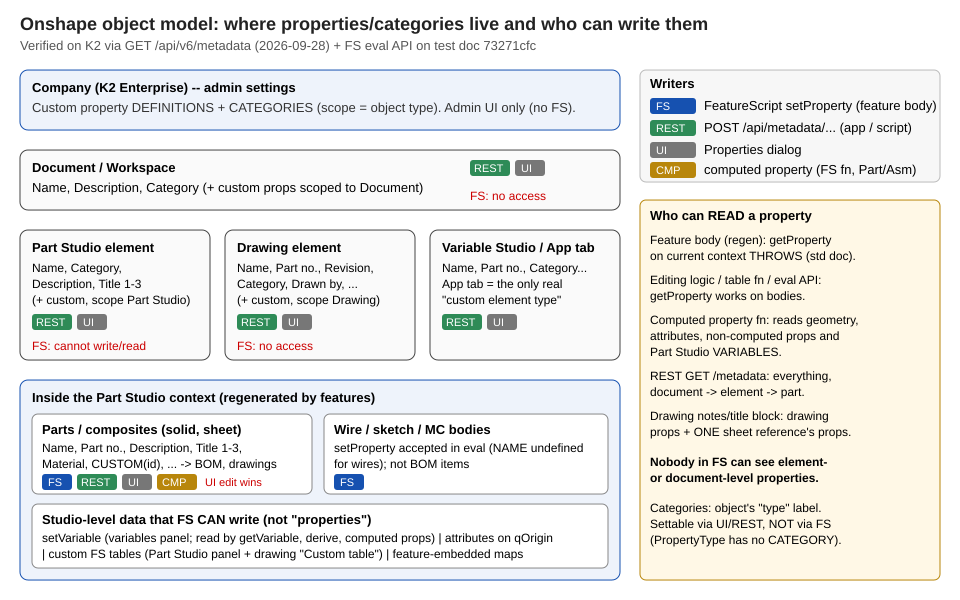
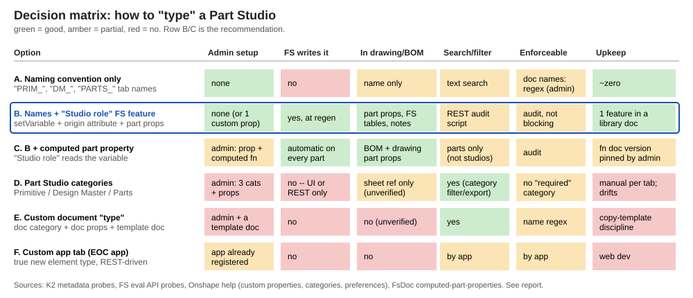
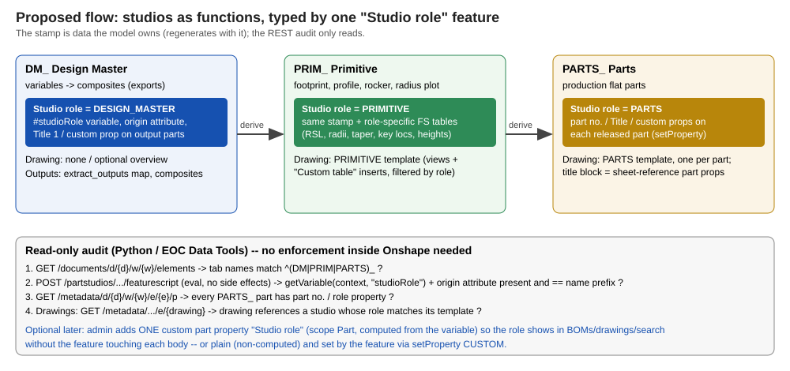

# Custom document / Part Studio "types" in Onshape -- can we, should we?

Research 2026-09-28 for the K2 ski team. Tags: **[V]** = VERIFIED (K2 read-only probe, FS eval API probe, or
quoted doc); **[U]** = UNVERIFIED (inferred / not tested). Nothing was written to Onshape.

## TL;DR

1. Onshape has no "custom document type" or "custom Part Studio type" with fields. The nearest thing is a
   **Category** (a label per object) plus **custom properties** scoped to it -- admin-defined, and **FeatureScript
   cannot write either one on a Part Studio or a document**. Only REST or the UI can.
2. FeatureScript *can* write properties on **bodies** (parts, composites, sheets, wires) and can write studio-level
   **data** (variables, origin attributes, custom tables). That is enough to type a studio from inside the model.
3. Recommendation: **don't create Part Studio categories.** Use a tab-name prefix (`DM_`, `PRIM_`, `PARTS_`) plus one
   small "Studio role" feature that stamps a variable and an origin attribute and sets part properties, plus one
   drawing template per role and a read-only REST audit. Add a single computed/custom part property later only if
   BOM or search needs it.

## Capability matrix

| Mechanism | Scope | FS write | FS read (feature body) | REST read / write | Shows in drawing | Plan / admin |
|---|---|---|---|---|---|---|
| Built-in part props (Name, Part no., Description, Title 1-3, Material...) | bodies | yes, `setProperty` [V] | no, throws in body; yes in editing logic, tables, eval [V] | yes / yes (`/metadata/.../e/{e}/{iden}/{pid}`) [V] | yes, via sheet reference [V] | all plans |
| Company **custom property** | Part, Assembly, Drawing, Part Studio, Document, File, Application, Item, Folder, Project [V] | **Part only**, via `PropertyType.CUSTOM` + 24-hex id [V] | same as above [V] | yes / yes [V] | part props: yes. Part Studio or document props: [U] | Professional / Enterprise; admin defines [V] |
| **Computed** custom property (FS function) | Part and Assembly only [V] | computed automatically; reads geometry, attributes, non-computed props, **Part Studio variables** [V] | n/a | read [V] | yes, "wherever Part properties are available, like BOMs and drawings" [V] | admin picks the function's document/version [V] |
| **Category** | per object type: Part, Assembly, Drawing, Part Studio, File, App, Version, Workspace, Item, Global [V] | **no** (`PropertyType` has no CATEGORY) [V] | no | yes / yes (it is the `Category` property) [V] | [U] | Professional / Enterprise; admin [V] |
| Part Studio element properties (Name, Category, Description) | element | **no**, no std function targets an element [V] | no | yes / yes (`/metadata/d/{d}/w/{w}/e/{e}`) [V] | as a sheet reference, [U] | all |
| Document / workspace properties | document | no [V] (forum + std) | no | yes / yes (`/metadata/d/{d}/w/{w}`) [V] | [U], probably not | all |
| Variables (`setVariable`) | Part Studio | yes [V] | yes, `getVariable` [V] | through the eval API only [V] | not directly; through FS tables [U] | all |
| Attributes (e.g. on `qOrigin`) | Part Studio entities | yes [V] | yes [V] | through the eval API only [V] | no | all |
| Custom FS tables | Part Studio | yes [V] | n/a | through the eval API | **yes**, drawing "Custom table" insert (verified in-project: publish_tools/README.md "Station table") [V] | all |
| Drawing templates | drawing | no | no | template docs [U] | this is the title block | admin can require approved templates [V] |
| Document-name regex | document name | no | no | n/a | n/a | enterprise setting [V] |
| Export rules by scope + **category** | Part / Asm / Drawing / Part Studio / File | no | no | n/a | n/a | enterprise setting [V] |
| Application element (custom tab) | new element type | no | no | yes (app's own API) | no | app registration (EOC app exists) [V] |
| Configurations / Variable Studios | inputs, not types | read-only in FS | yes | yes | configured values [U] | all |

### What FS can and cannot do (evidence)

- `setProperty` targets **bodies/faces only**: "Sets a property on a set of bodies and/or faces" (std
  `properties.fs`, local mirror line 17). `PropertyType` = NAME, MATERIAL, APPEARANCE, DESCRIPTION, PART_NUMBER,
  VENDOR, PROJECT, PRODUCT_LINE, TITLE_1-3, EXCLUDE_FROM_BOM, CUSTOM, MASS_OVERRIDE, REVISION. It has **no CATEGORY**
  and no element or document target. [V]
- Eval API probe on test doc 73271cfc (transient): `setProperty` CUSTOM / DESCRIPTION / TITLE_1 on a **solid, a sheet,
  a wire, a composite, a mate connector and the origin body** was accepted and read back by `getProperty` in the same
  context. A made-up id `0123...4567` was accepted: "this call performs no checks as to whether the custom property
  value is valid" (std doc). A non-hex id fails the precondition. [V] It is not known whether values on origin, MC or
  wire bodies ever reach metadata, BOM or drawings [U]. Assume parts and composites only.
- `getProperty` "cannot be called on the current context inside custom features... since features are regenerated
  before any user-set properties are applied" (std doc). It works in editing logic, table functions and the eval
  API. [V]
- A property set by a UI edit shadows the FS value for **all configurations** until "Reset" (std doc; Onshape VP
  ilya_baran on the forum (Aug 21, thread 31594): "manually set properties are applied via queries to bodies post-regen"). [V]
- FS-set values follow regeneration, so they can differ per configuration. Computed properties show "Computed" in
  multi-configuration tables (FsDoc). [V]
- Forum consensus (Caden_Armstrong, 2024): "Workspace, Partstudio, document (etc) properties are not accessible"
  from FS. Use the REST API. [V, forum]

## K2's current configuration (probed 2026-09-28, GET only)

- Company "K2 Sports - Elevate Outdoor Collective" `65a7e7b5...9561`, Enterprise. **The user is a company admin**
  (`sessioninfo.company.admin = true`). [V]
- **Categories:** only the auto-created defaults, one per object type ("Default category for object type X", each
  a member of Onshape's "Onshape X" category "created by upgrade"): Part, Assembly, Drawing, Part Studio, File,
  Application, Workspace, Variable Studio. **No custom categories.** The drawing "Category" / `memberCategoryIds`
  seen before is just this default "Drawing" category. It does not mean anyone set up categories. [V]
- **Custom properties:** exactly one company-owned definition: `Material_<Chinese for "deprecated">` (id
  `672b2686230f3d028ac170d6`), an enum list, scope Part. Its description says to contact Michael Yin for missing
  materials. publishState = 2 and it does not appear in part metadata, so it is effectively retired and appears to
  be inherited from another EOC division. [V probe; "retired" is an inference]
- The Part Studio element metadata in the ski doc (6212b76f "Parts" and "Design Master") has only Name, Category,
  Description and Not revision managed. Part metadata has the standard set, with Part number and Description empty on
  the sampled parts. [V]
- Object-type codes (useful for the `categoryproperties` endpoint): 2 Part, 3 Assembly, 4 Drawing, 5 Part Studio,
  6 File, 7 Application, 9 Workspace, 17 Variable Studio, 1 and 19 Document / Folder. [V, from probe responses]
- Useful endpoints: `GET /api/v6/metadatacategory/categoryproperties?ownerId={cid}&objectType={n}&strict=false&includeObjectTypeDefaults=true`,
  `GET|POST /api/v6/metadata/d/{d}/w/{w}` (workspace), `.../e/{e}` (element), `.../e/{e}/p` (all parts),
  `.../e/{e}/{iden}/{pid}` (one part). POST is not allowed on microversions. [V, OpenAPI 1.221]

## Options

| Option | Benefit | Cost / limit |
|---|---|---|
| **A. Naming only** (`DM_`, `PRIM_`, `PARTS_` tab prefixes) | Zero setup. Visible everywhere, including drawing sheet references. | Not machine-checked unless audited. The regex name rule exists for **documents** only, not tabs. [V] |
| **B. A + "Studio role" feature** | Set at regen and versioned with the model. `setVariable("studioRole")` is readable downstream (`getVariable`, derive, computed props). An origin attribute can be read by the eval-API audit. Part props (Title 1 / Description / custom) reach BOM and drawings. Role-specific FS tables feed standard drawings. Reuses what is already built (extract_outputs, station table). | One more feature per studio. It can't block a wrong use; the audit only reports. |
| **C. B + one custom part property "Studio role"** (plain, set by FS, or computed from the variable) | Role appears in BOM columns, part search and drawings without editing each feature. The computed version needs no per-body code. | Admin defines 1 property. The computed function lives in a versioned doc that the admin re-points. Parts/assemblies only, so the studio itself is still untyped. |
| **D. Part Studio categories** (Primitive / Design Master / Parts + Part-Studio-scoped props) | Native label on the tab. Can drive **export rules by category** [V] and category-filtered properties. | FS can't set it [V]. Each tab must be set by hand or by a REST script, and it drifts on copy/new tab. Title block visibility is [U]. No "required category" setting was found [U]. Most maintenance for the least model-driven value. |
| **E. Document "type"** (doc category + doc props + copy-from-template doc) | Good for search/filter in the document list. | Docs mix roles (the ski doc has DM + Parts + drawings in one), so a doc type is the wrong grain. Not writable from FS. |
| **F. Custom app tab** | The only true new element type. | Web development. Not geometry. Overkill for this. |

What typing would buy:
- Standard drawings per role: yes, but this comes from **drawing templates + FS tables**, not from a type field.
  Admins can require approved templates. [V]
- Search/filter: categories and custom props are searchable [U for element-level search UI]. The REST audit can
  filter anything. [V]
- Release rules / BOM: release and BOM act on **parts, assemblies and drawings**, not on Part Studios. Typing a studio
  changes nothing there. Part-level properties do. [U, consistent with the probe: Part Studio elements carry no Part
  number/Revision/State]
- Export naming: export rules can key on category. This is the one real payoff of D. [V]

## Recommendation and next steps

**Do B now. Keep C in reserve. Skip D and E** unless export-rule automation per role becomes a requirement.

1. Convention: tab prefixes `DM_`, `PRIM_`, `PARTS_`, drawings `<role> <item>`. Write it down in the team wiki.
2. Build a "Studio role" feature (publish_tools or variable_tools) with an enum `DESIGN_MASTER | PRIMITIVE | PARTS`.
   It does `setVariable(context, "studioRole", ...)`, sets an attribute on `qOrigin(EntityType.BODY)` with
   `{schema, role, version}`, and optionally sets `TITLE_1`/`DESCRIPTION` on output parts or composites. Emit role
   keys through extract_outputs so VT consumers can check the role they receive.
3. One drawing template per role. PRIMITIVE = views + "Custom table" inserts (RSL, radii, taper, key locations,
   baseline heights, scale factors) filtered by role, the same pattern as the Station table.
4. Read-only audit script / EOC Data Tools check. Steps: list elements (name prefix), eval `getVariable` + origin
   attribute, read part metadata for PARTS_ part numbers, check drawing template against role.
5. Only if BOM/search needs the role on parts: the admin (the user is one) creates **one** Part-scoped custom
   property "Studio role". Either set it from the feature (`PropertyType.CUSTOM`, id from company settings) or make it
   computed from `studioRole`. Test first in the test doc that the FS-set value appears in `/metadata/.../p`.

## Open questions

- Does a drawing sheet whose reference is a **whole Part Studio** expose that element's Category / Description /
  custom Part-Studio props in title-block notes? [U] Check with a screenshot of an existing drawing's
  "Insert sheet reference property" list, or one test in the test doc.
- Do FS-set CUSTOM values on composites, sheets or wires persist into REST metadata and BOM? The eval probe only
  proves in-context acceptance. [U]
- If a custom property is scoped to a non-default category and FS sets it on a default-category part, does it
  display? FS cannot change the category. [U] Scoping to the default "Part" category avoids this.
- Is there a "required category" or default-category-per-new-element setting on K2's plan? None found in the help
  pages. [U]
- Should the retired `Material_...` property be cleaned up? Coordinate with the EOC admin who owns it.

## Sources

- Local std mirror: `std/properties.fs`, `std/propertytype.gen.fs` (FS 2878) [V]
- Probes (GET): `/api/v6/users/sessioninfo`, `/api/v6/metadatacategory/categoryproperties`, `/api/v6/metadata/d/6212b76f.../w/dd937e89...` (+ `/e`, `/e/{Parts}/p`), `/api/openapi` [V]
- Eval API probes (transient) on 73271cfc / fea83d30 / bb2cddb2 via `devtools/onshape/fseval.py` [V]
- Custom properties: https://cad.onshape.com/help/Content/Plans/enterprise_settings_custom_properties.htm
- Categories: https://cad.onshape.com/help/Content/Plans/categories.htm ; blog https://www.onshape.com/en/blog/introducing-categories-in-onshape (Aug 2020, "Onshape Professional or Onshape Enterprise")
- Preferences (approved drawing templates, doc-name regex, export rules by category): https://cad.onshape.com/help/Content/Plans/enterprise_settings_preferences.htm
- Computed part properties: https://cad.onshape.com/FsDoc/computed-part-properties.html
- Forum, FS property limits: https://forum.onshape.com/discussion/31594/its-time-to-update-how-featurescript-can-control-properties ; https://forum.onshape.com/discussion/24984/setting-custom-properties-using-workspace-properties
- Drawing property links: https://www.onshape.com/en/resource-center/tech-tips/tech-tip-how-to-link-to-properties-in-onshape-drawings
- Metadata API guide: https://onshape-public.github.io/docs/api-adv/metadata/
