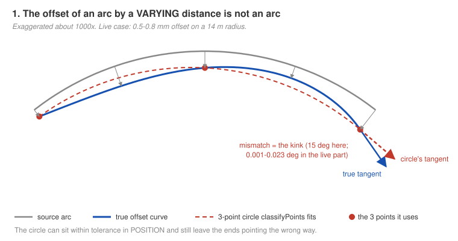
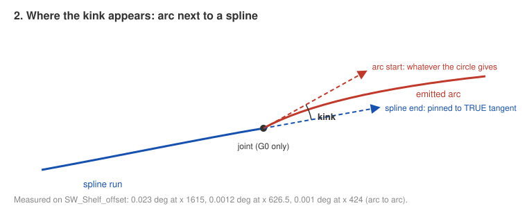
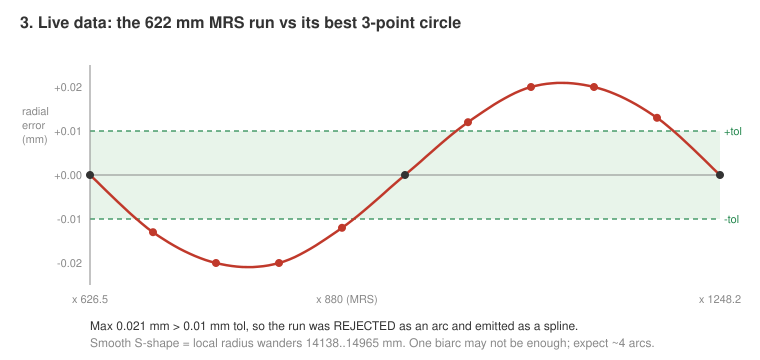
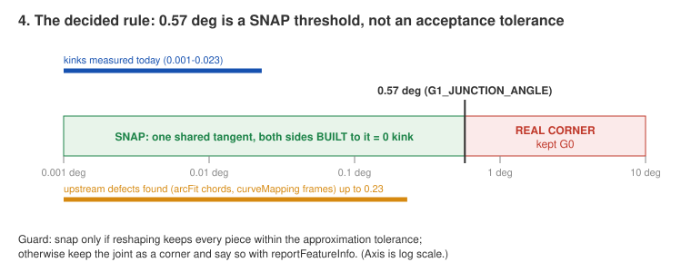
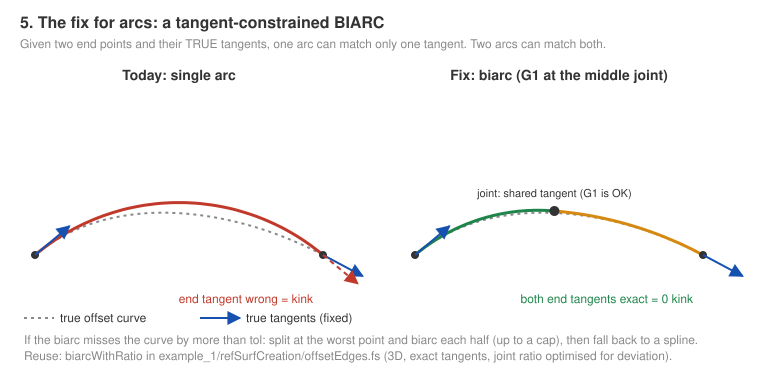
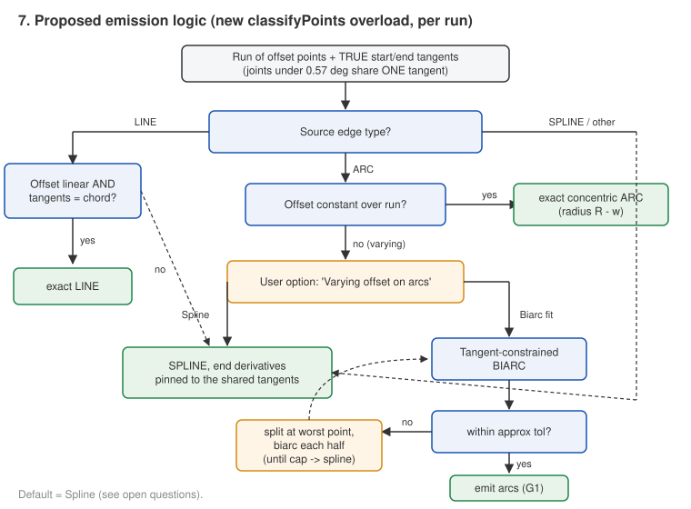
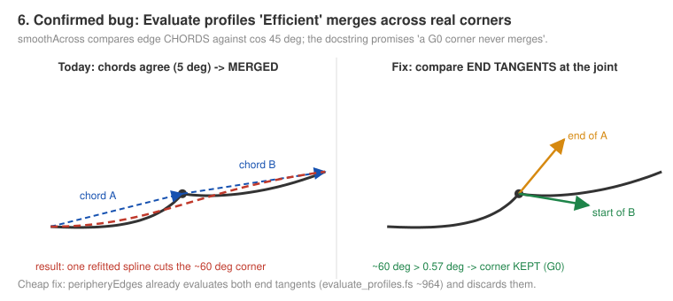
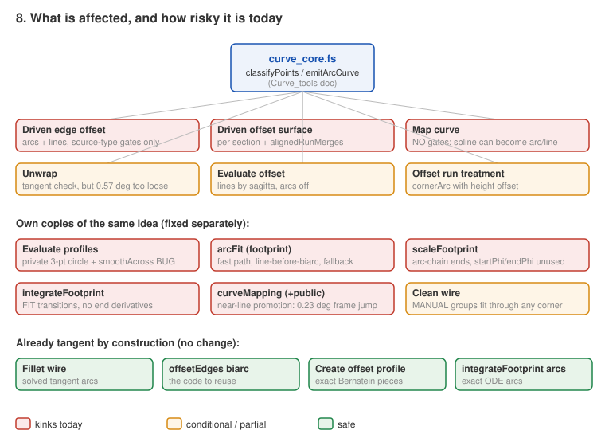

# Arc / line tangency -- illustrated summary (2026-09-25)

## Status 2026-09-29: IMPLEMENTED (2026-09-25/26)

The text below is the pre-implementation walkthrough (it still says "nothing is implemented"); this section
records what was built. Checked against the code on 2026-09-29.

- **curve_core** (Curve_tools V9; `curve_tools/curve_core.fs`): `shapeRuns` decides all runs of a chain
  together -- pass 1 exact line / arc / freeform per run, pass 2 one shared tangent at every joint under the
  snap angle -- and emits each run as a line, an arc, a **tangent biarc chain** (`bestTangentBiarc`, ported
  from offsetEdges.fs) or a spline pinned to the joint tangents. Option enum `ArcSourceFit` (Spline / Biarc fit).
- **Callers on shapeRuns:** Driven edge offset (`driven_edge_offset.fs`, option "Varying offset on arcs",
  default **Spline**, Biarc opt-in -- defined in `edge_offset_utils.fs`), Driven offset surface section plan
  (`sectionPlan`: line / arc / pinned spline, never a biarc chain, one curve per run so the loft pairs
  sections), Map curve (`map_curve.fs`), Unwrap (`unwrap.fs`, joints found by coinciding ends), Evaluate
  offset (`evaluate_offset.fs`).
- **Evaluate profiles** `smoothAcross` compares end tangents against the weld angle (the chord bug, section 3).
- **Footprint / curveMapping:** arcFit (a neighbouring spline pinned to a preserved arc's tangent; line chord
  checked against the source tangents, biarc first), scaleFootprint (splines turned to the G1 arc chain's
  tangent at the seam), curveMappingCore (smooth frame near a line reference edge).
- **Tests:** "Arc tangency tests" studio in Curve_tools, 9/9 (R1-R5 Recognize arcs, P12/P13 Evaluate
  profiles Efficient, M1/M2 Map curve; `devtools/onshape/build_arc_tangency_tests.py` /
  `check_arc_tangency_tests.py`); "Arc tangency DEO tests" in driven_offset, D1-D4
  (`build_arc_tangency_deo_tests.py` / `check_arc_tangency_deo_tests.py`).

**Loose ends (2026-09-29):**
- Driven offset surface `curveThrough` (the seed curve) and Evaluate offset's line fit: FIXED 2026-09-29 (shapeRuns pinned to source tangents / shared joint tangents; connected-offset mode still fails at the loft on Cavity_Depth's inputs, mode unused)
  (both already call shapeRuns in the working copy; not yet re-verified).
- Clean wire: README items #16 (joints touching an exact line / arc always break, `forceTangency` never repairs
  them) and #17 (curved plan-view sliver -> chord) are open.
- Unwrap (solid) `unwrap_part.fs` still calls `classifyPoints` directly (two places), not shapeRuns.

---

A picture-first walkthrough of `README.md` in this folder (the full research handoff). Nothing here
is implemented yet. Figures are generated SVGs in `figures/`; geometry in figures 1, 2, 5 and 6 is
exaggerated so the effect is visible. Figure 3 is real measured data.

---

## 1. The problem in one sentence

When a run of offset points is "close enough" to an arc or a line, `classifyPoints`
(`curve_tools/curve_core.fs:252`) emits that arc/line -- but it only checks **position**, never
**direction**, so the arc's ends point slightly the wrong way and the spline next to it (which *is*
pinned to the true direction) meets it at a small angle: a kink.

### Why it happens: offsetting an arc by a varying amount does not give an arc

- Grey: the exact source arc. Blue: the true offset (offset changes along the arc, like the live
  profile -0.8 -> -0.5 -> -0.8 mm).
- Red dashed: the circle `classifyPoints` fits through 3 points (start, middle, end).
- If that circle is within tolerance *in position*, it is accepted. Its end tangents are whatever
  the circle gives -- not the blue curve's.

### What it looks like at a joint

The joint is only G0 (touching), not G1 (tangent). Today's measured kinks on SW_Shelf_offset are
tiny -- 0.001 to 0.023 deg -- but they are real corners to the kernel and to anything downstream
(tangent-chain selection, fillets, lofts, curvature combs).

### The live case (real data)

The 622 mm run across MRS missed its best circle by 0.021 mm (tol 0.01), so it fell back to a
spline. The shorter 77-101 mm runs had the same effect but under 0.01 mm, so they were accepted as
arcs -- with kinked ends. Note the smooth S-shape: the local radius wanders 14138..14965 mm, so a
single biarc will probably not be enough for this run (expect about 4 arcs after splitting).

Second, smaller flaw with the same root: `sourceShapeGates` (`driven_offset/edge_offset_utils.fs:85`)
allows an arc whenever the SOURCE edge is an arc. It never asks whether the offset is constant.
Lines have the same flaw: a chord is accepted on a slightly curved run, and its tangent is off by
about 4 x sagitta / length.

---

## 2. What you decided

| Decision | Meaning |
|---|---|
| **0.57 deg is a SNAP threshold** (one threshold, the existing `G1_JUNCTION_ANGLE`) | A joint under it is *defined* tangent: both sides share one tangent and are BUILT to it, so the kink is zero by construction. Above it = a real corner, kept G0. |
| **Guard** | Snap only if the reshaped pieces stay within the approximation tolerance; otherwise keep the corner and say so with `reportFeatureInfo`. |
| **Arc source + varying offset** | User option: **Biarc fit** or **Spline**. Nothing else. |
| **G1 between arcs is fine** | Curvature may jump at a biarc joint; direction may not. |
| Rejected | "Accept an arc if its tangent is within X" -- that leaves up to X of kink in the output. |

Why 0.57 and not 0.1 deg: every defect the audit found (0.001-0.23 deg) falls under 0.57, so all
of them heal; 0.57 is already the weld value in DEO / Map curve / Unwrap, so existing welds do not
change.

---

## 3. The fix

### The key tool: a tangent-constrained biarc

One arc has three degrees of freedom -- it can hit both end points and match ONE end tangent.
Two arcs meeting tangentially (a biarc) can hit both points and match BOTH tangents. A working 3D
implementation already exists: `biarcWithRatio` in `example_1/refSurfCreation/offsetEdges.fs:1979`
(joint ratio optimised for deviation). Plan: port it into `curve_core.fs`, and when a biarc misses
the curve by more than the tolerance, split at the worst point and biarc each half, up to a cap,
then give up to a spline.

### The new decision logic (per run)

In words:
1. Joints under 0.57 deg get one shared tangent first.
2. Source LINE: exact line only if the offset is linear and the tangents are the chord; else a
   spline pinned to the tangents.
3. Source ARC with constant offset: exact concentric arc (radius R - w). No change from today.
4. Source ARC with varying offset: the user option -- Spline (pinned) or Biarc fit (with split).
5. Everything else: spline with pinned end derivatives (as today).

This lives in a NEW `classifyPoints` overload that takes the true start/end tangents; the old
signatures stay so nothing breaks while callers migrate.

### A separate, confirmed bug: Evaluate profiles "Efficient"

`smoothAcross` (`curve_tools/evaluate_profiles.fs:1627`) decides "these two edges are smooth" by
comparing their **chords** against cos 45 deg. Two edges can meet at a sharp corner while their
chords point almost the same way, so the corner gets merged and refitted -- contradicting its own
docstring ("a G0 corner never merges"). Fix: compare the end tangents at the joint against 0.57 deg.
`peripheryEdges` (~964) already evaluates those tangents and throws them away, so this is small.

---

## 4. Which features are affected

### Before / after

| Case | Today | After the fix |
|---|---|---|
| Constant offset on an arc chain | exact arcs, R - w | **unchanged** |
| Varying offset, short arc runs (77-101 mm) | single arcs, kinks 0.001-0.023 deg | Biarc: 2+ arcs per run, 0 deg joints. Spline: pinned splines, 0 deg joints |
| Varying offset, 622 mm MRS run | spline, 0.0012 deg kink at x 626 | Biarc: ~4 arcs within 0.01 mm, 0 deg joints. Spline: same spline, kink gone |
| Varying offset on a LINE source | chord line, kinked ends | pinned spline (exact line only if the offset is linear) |
| Source corner 0.3 / 1 / 5 deg (DEO) | welded / kept / kept | **unchanged** |
| Evaluate profiles Efficient, 1-45 deg freeform corner | merged, smoothed | kept as a corner |
| Map curve on a nearly circular spline | can become an arc or line | stays a spline |
| arcFit near-straight segment | chord line with kinked ends | biarc or tangent-checked line |
| curveMapping near-line reference edge | frame jumps up to 0.23 deg, mapped curves kink | smooth frame |

### Suggested order

1. **curve_core** (Curve_tools doc): biarc port, recursive split, tangent-aware `classifyPoints`
   overload. *Needs a Curve_tools version from you before the driven_offset re-pin.*
2. **Driven edge offset / surface**: "offset constant over run?" test + the new
   "Varying offset on arcs: Spline / Biarc fit" option; pass true tangents.
3. **Other curve_core callers**: Map curve (add gates), Unwrap, Evaluate offset; Evaluate profiles
   drops its private copy.
4. **`smoothAcross` bug** -- independent, could go first.
5. **Footprint + curveMapping**: arcFit (biarc before line test), scaleFootprint (use the unused
   `startPhi`/`endPhi`), integrateFootprint FIT (pass derivatives), curveMapping near-line frame,
   `cornerArc` tangency check.

---

## 5. Open questions (need your call)

1. **Default of the new option.** Onshape migrates a new parameter's default INTO saved features
   (correction 25), so the default should reproduce today. But today is neither pure Spline nor
   pure Biarc -- it is "arc if the 3-point circle happens to fit, else spline". Also the tangent
   snap itself changes every existing feature slightly (kinks -> 0, geometry moves by ~microns).
   Recommendation: default **Spline** (smallest geometric change), Biarc opt-in.
2. **Edge counts change.** A biarc turns 1 edge into 2+. Anything referencing SW_Shelf_offset
   edges by index (Extract variables `ends` / `seams` / `regions` keys, downstream surfaces,
   fillets) may shift. Another reason to make Biarc opt-in.
3. **Clean wire MANUAL groups** fit through ANY corner silently today. Break at > 0.57 deg instead?
4. **Test B in README.md expects "2 arcs"** for the MRS run -- figure 3 suggests ~4. Update the
   expectation before writing the test.

## 6. Tests to build (in the feature tree)

A constant offset on arcs (no change) - B live case with Biarc (every non-corner joint 0 deg,
deviation <= 0.01 mm) - C live case with Spline - D varying offset on a line source - E corners
0.3 / 1 / 5 deg through DEO and Evaluate profiles Efficient - F a reusable devtools joint-angle
checker that measures every joint of an emitted wire.
